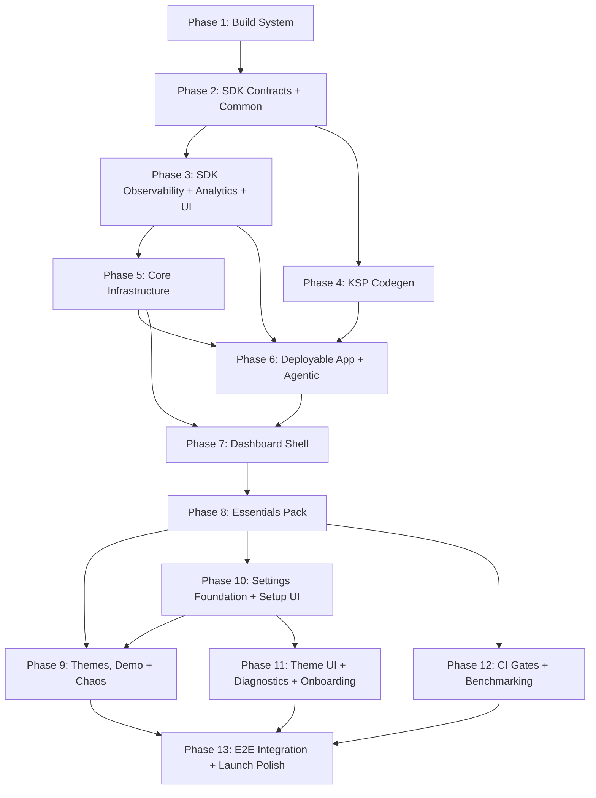

# Migration Plan: dqxn.old → dqxn

Incremental migration of the old codebase into the new architecture. Bottom-up, compile-verified, with observability, autonomous debugging, and tests concurrent at every phase.

## Assessment

**Old codebase:** ~369 Kotlin files, working app. 15 widgets, 15 providers, 24 themes (2 free + 22 premium), full dashboard shell, agentic framework, observability, tests.

**New codebase:** Zero implementation code. 10 architecture docs defining a significantly different target architecture.

**The gap is not "copy and adapt" — it's a structural transformation.** The old code has fundamental architectural debt that the new design explicitly fixes:

| Problem in Old | New Design Fix | Migration Impact |
|---|---|---|
| God-object `DashboardState` | Per-coordinator `StateFlow` slices | Dashboard must be decomposed, not ported |
| `Map<String, Any?>` snapshots | Typed `@DashboardSnapshot` subtypes (KSP-validated) | Every provider + widget changes |
| String-keyed `WidgetData` | `KClass`-keyed `snapshot<T>()` | Every widget data access changes |
| Data passed to `Render()` param | `LocalWidgetData` CompositionLocal | Every widget signature changes |
| Regular `List`/`Map` in UI | `ImmutableList`/`ImmutableMap` | Every UI state surface changes |
| No binding isolation | `SupervisorJob` + `WidgetCoroutineScope` | Binder rewritten from scratch |
| Dashboard imports packs | Shell is pack-blind | Module graph inverted |
| BroadcastReceiver agentic | ContentProvider agentic | Transport layer rewritten |
| `app.dqxn.android` namespace | `app.dqxn.android` (retained) | No change needed |
| Monolithic `core/plugin-api` | Split `sdk/{contracts,common,ui,observability,analytics}` | API surface redistributed |
| No Proto DataStore | Proto for structured data | Persistence layer rewritten |
| JUnit4 only | JUnit5 + contract test fixtures | Test infrastructure rebuilt |

~80% of old code needs structural modification, not just renaming. The remaining ~20% (rendering logic inside widgets, sensor flows in providers, theme JSON, state machine) can be ported with lighter adaptation.

## Guiding Principles

1. **Bottom-up, compile-verified.** Each phase must produce a compiling, tested module before the next starts. No forward references to unbuilt modules.
2. **Old code is reference, not source.** Read `dqxn.old` to understand intent and logic, but write to `dqxn`'s architecture. Don't port-then-refactor — build correctly the first time against the new contracts.
3. **Observability and tests are concurrent, not deferred.** Each phase includes its own test fixtures, logging integration, and metrics hooks. No "add tests later" phase.
4. **Debug infrastructure before debuggable code.** The agentic framework and observability land early so every subsequent phase benefits from on-device autonomous debugging. You don't build the debugger after the thing you need to debug.
5. **One pack proves the architecture.** The Essentials pack migrates first as validation. If the contracts are wrong, fix them before touching other packs.

## Dependency Graph

Phases 3+4 concurrent after Phase 2. Phase 6 gates on-device work. Phase 8 is the architecture validation gate. After Phase 8, three streams run concurrently: Phase 10 (settings/setup — unblocks Phase 9's sg-erp2 dependency), Phase 9 (themes/demo/chaos — runs after Phase 10 delivers SetupSheet), and Phase 12 (CI/benchmarks — no overlay dependency). Phase 11 (theme UI, diagnostics, onboarding) follows Phase 10's settings row system. Phase 13 (E2E + polish) is the convergence point requiring all prior phases.

## Phase Index

| Phase | Title | File |
|---|---|---|
| 1 | Build System Foundation | [phase-01.md](migration/phase-01.md) |
| 2 | SDK Contracts + Common | [phase-02.md](migration/phase-02.md) |
| 3 | SDK Observability + Analytics + UI | [phase-03.md](migration/phase-03.md) |
| 4 | KSP Codegen | [phase-04.md](migration/phase-04.md) |
| 5 | Core Infrastructure | [phase-05.md](migration/phase-05.md) |
| 6 | Deployable App + Agentic Framework | [phase-06.md](migration/phase-06.md) |
| 7 | Dashboard Shell | [phase-07.md](migration/phase-07.md) |
| 8 | Essentials Pack (Architecture Validation Gate) | [phase-08.md](migration/phase-08.md) |
| 9 | Themes, Demo + Chaos | [phase-09.md](migration/phase-09.md) |
| 10 | Settings Foundation + Setup UI | [phase-10.md](migration/phase-10.md) |
| 11 | Theme UI + Diagnostics + Onboarding | [phase-11.md](migration/phase-11.md) |
| 12 | CI Gates + Benchmarking | [phase-12.md](migration/phase-12.md) |
| 13 | E2E Integration + Launch Polish | [phase-13.md](migration/phase-13.md) |

## Cross-Phase Policies

- [Integration Policy](migration/integration-policy.md)
- [TDD Policy](migration/tdd-policy.md)
- [What NOT to Port](migration/exclusions.md)
- [Risk Flags](migration/risk-flags.md)
- [Replication Advisory](migration/replication-advisory.md) — 7 areas of nuanced old-codebase UX logic (preview mode, navigation, themes, transitions, design system, drag/resize, widget setup architecture) with exact state machines, animation specs, and edge cases to replicate. Each section is cross-referenced directly in affected phase files as "Replication Advisory References" callouts. Phases 7 and 10 have the densest coverage (5 of 7 sections each)
