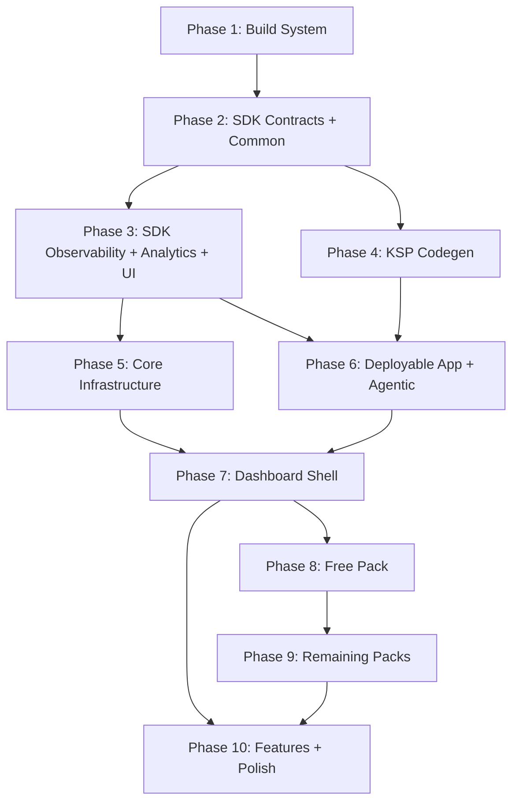

# Migration Plan: dqxn.old → dqxn

Incremental migration of the old codebase into the new architecture. Bottom-up, compile-verified, with observability, autonomous debugging, and tests concurrent at every phase.

## Assessment

**Old codebase:** ~369 Kotlin files, working app. 15 widgets, 15 providers, 28 themes, full dashboard shell, agentic framework, observability, tests.

**New codebase:** Zero implementation code. 10 architecture docs defining a significantly different target architecture.

**The gap is not "copy and adapt" — it's a structural transformation.** The old code has fundamental architectural debt that the new design explicitly fixes:

| Problem in Old | New Design Fix | Migration Impact |
|---|---|---|
| God-object `DashboardState` | Per-coordinator `StateFlow` slices | Dashboard must be decomposed, not ported |
| `Map<String, Any?>` snapshots | Typed `@DashboardSnapshot` subtypes (KSP-validated) | Every provider + widget changes |
| String-keyed `WidgetData` | `KClass`-keyed `snapshot<T>()` | Every widget data access changes |
| Data passed to `Render()` param | `LocalWidgetData` CompositionLocal | Every widget signature changes |
| Regular `List`/`Map` in UI | `ImmutableList`/`ImmutableMap` | Every UI state surface changes |
| No binding isolation | `SupervisorJob` + `WidgetCoroutineScope` | Binder rewritten from scratch |
| Dashboard imports packs | Shell is pack-blind | Module graph inverted |
| BroadcastReceiver agentic | ContentProvider agentic | Transport layer rewritten |
| `app.dqxn.android` namespace | `app.dqxn.android` (retained) | No change needed |
| Monolithic `core/plugin-api` | Split `sdk/{contracts,common,ui,observability,analytics}` | API surface redistributed |
| No Proto DataStore | Proto for structured data | Persistence layer rewritten |
| JUnit4 only | JUnit5 + contract test fixtures | Test infrastructure rebuilt |

~80% of old code needs structural modification, not just renaming. The remaining ~20% (rendering logic inside widgets, sensor flows in providers, theme JSON, state machine) can be ported with lighter adaptation.

## Guiding Principles

1. **Bottom-up, compile-verified.** Each phase must produce a compiling, tested module before the next starts. No forward references to unbuilt modules.
2. **Old code is reference, not source.** Read `dqxn.old` to understand intent and logic, but write to `dqxn`'s architecture. Don't port-then-refactor — build correctly the first time against the new contracts.
3. **Observability and tests are concurrent, not deferred.** Each phase includes its own test fixtures, logging integration, and metrics hooks. No "add tests later" phase.
4. **Debug infrastructure before debuggable code.** The agentic framework and observability land early so every subsequent phase benefits from on-device autonomous debugging. You don't build the debugger after the thing you need to debug.
5. **One pack proves the architecture.** The free pack migrates first as validation. If the contracts are wrong, fix them before touching other packs.

## Dependency Graph

Phases 3, 4 can run concurrently after Phase 2. Phase 6 (first deployable APK + agentic) gates all subsequent on-device work. Phase 7 (dashboard) is the highest-risk phase and benefits from full agentic debug infrastructure. Phase 8 is the architecture validation gate.

---

## Phase 1: Build System Foundation

**What:** Gradle infrastructure that all modules depend on. Nothing compiles without this.

**Deliverables:**

- `android/settings.gradle.kts` — module includes, version catalog, `build-logic` includeBuild
- `android/build.gradle.kts` — root project
- `android/gradle/libs.versions.toml` — full version catalog (AGP 9.0.1, Kotlin 2.3+, JDK 25, Compose BOM, Hilt, KSP, kotlinx-collections-immutable, kotlinx.serialization, Proto DataStore, JUnit5, MockK, Turbine, Truth, jqwik, Robolectric)
- `android/gradle.properties` — configuration cache, KSP incremental, Compose compiler flags
- `android/build-logic/convention/` — all convention plugins:
  - `dqxn.android.application`
  - `dqxn.android.library`
  - `dqxn.android.compose` (separate from library — controls which modules get Compose compiler)
  - `dqxn.android.hilt`
  - `dqxn.android.test` (JUnit5 + MockK + Truth + Turbine)
  - `dqxn.pack` (auto-wires all `:sdk:*` dependencies — packs never manually add them)
  - `dqxn.android.feature`
- `AgenticMainThreadBan` lint rule (enforced from Phase 6 onward when first handler lands)
- Gradle wrapper (9.3.1)

**Ported from old:** Convention plugin structure (4 plugins → 7+, significantly expanded). Version catalog (updated versions, added missing deps like kotlinx-collections-immutable, Proto DataStore, JUnit5, jqwik).

**Toolchain compatibility checks** (binary go/no-go before Phase 2 starts):

- Proto DataStore: add a stub `.proto` file, verify `protobuf` Gradle plugin compiles with AGP 9.0.1 / Gradle 9.3.1 / JDK 25. If it doesn't, investigate before Phase 5 designs around it.
- EXTOL SDK: add `implementation("sg.gov.lta:extol:X.Y.Z")` to a throwaway module, run `compileDebugKotlin`. Record result. If incompatible, remove `:pack:sg-erp2` from Phase 9 scope immediately — don't waste design effort on connection state machine and 8 provider contracts for a pack that can't ship.

Delete throwaway modules after checks. These are 10-minute verifications that prevent Phase 5/9 scope surprises.

**Validation:** `./gradlew tasks --console=plain` succeeds. No modules to compile yet, but plugin resolution works.

---

## Phase 2: SDK Contracts + Common

**What:** The API surface that every pack and feature module depends on. This is where the biggest architectural transformation lands — old untyped contracts become typed.

### `:sdk:common` (pure Kotlin, no Android, no Compose)

- Utility extensions migrated from `core:common` (flow extensions, etc.)
- `ConnectionStateMachine` + states + events (direct port, already well-structured)
- `Result`/error types shared across modules

### `:sdk:contracts` (pure Kotlin + coroutines, `@Composable` only in `WidgetRenderer.Render()` signature)

- `WidgetRenderer` — new signature with `ImmutableMap<String, Any>` settings, no `widgetData` param
- `DataProvider<T : DataSnapshot>` — new generic contract, `provideState(): Flow<T>` compiler-enforced to match `snapshotType: KClass<T>`
- `DataProviderInterceptor` — interface for chaos/debug interception of provider flows, registered via Hilt multibinding
- `DataSnapshot` non-sealed interface (base only — no concrete subtypes here). `@DashboardSnapshot` annotation for KSP validation. Concrete subtypes live with their producing module: free pack snapshots in `:pack:free`, OBU snapshots in `:pack:sg-erp2`. If a second pack needs a snapshot from another pack, extract it to a snapshot sub-module (`:pack:{id}:snapshots`) — never promote to `:sdk:contracts`
- `WidgetData` with `KClass`-keyed multi-slot: `snapshot<T : DataSnapshot>()`
- `WidgetContext`, `WidgetDefaults`, `WidgetStyle`
- `SettingDefinition<T>` sealed interface (port + tighten types)
- `DashboardPackManifest`, `DataTypeDescriptor`
- `ThemeDefinition`, `ThemeProvider`
- `EntitlementManager`, `Gated` interface
- `DashboardWidget` / `DashboardDataProvider` / `@AgenticCommand` KSP annotations

### `:sdk:contracts` testFixtures

- `WidgetRendererContractTest` — abstract test base every widget extends
- `DataProviderContractTest` — abstract test base every provider extends
- `ProviderFault` sealed interface — shared fault primitives for both `ChaosProviderInterceptor` (E2E) and `TestDataProvider` (unit tests). Includes: `Delay`, `Error`, `Corrupt`, `Stall`, `Flap`, `EmitNull`
- `TestDataProvider` — configurable fake that applies `ProviderFault` transformations to a base flow
- `testWidget()`, `testTheme()`, `testDataSnapshot()` factories

**Ported from old:** `core/plugin-api/*` — but every interface changes signature. The `DataSnapshot` transformation from `Map<String, Any?>` to typed `@DashboardSnapshot` subtypes is new design work informed by old data shapes. `SettingDefinition` ports cleanly. `ConnectionStateMachine` ports nearly verbatim.

**Tests:** Contract test abstract classes (in testFixtures), `ConnectionStateMachineTest` (port from old + expand to jqwik property-based). `ProviderFault` transformation tests.

**Validation:** Module compiles. Contract tests pass. `testFixtures` jar produces.

---

## Phase 3: SDK Observability + Analytics + UI

**What:** Remaining SDK modules that packs and features import. Observability is the foundation for all autonomous debugging — it must be solid before the agentic framework wires to it in Phase 6.

### `:sdk:observability`

- `DqxnLogger` with inline extensions (migrate from `core:common`, adapt to zero-allocation when disabled)
- `LogTag` as `@JvmInline value class`
- `DqxnTracer` — structured tracing with span IDs, `agenticTraceId` field for causal correlation
- `MetricsCollector` — `AtomicLongArray(6)` frame histogram, `ConcurrentHashMap` + `LongArrayRingBuffer(64)` per-widget draw time and per-provider latency. Pre-populated from registries at construction. Performance budget: record < 25ns (`System.nanoTime()` + ring buffer write)
- `JankDetector` — wired between `FrameMetrics` callbacks and `MetricsCollector`. Fires `DiagnosticSnapshotCapture` at exponential thresholds (5, 20, 100 consecutive janky frames). Distinct class, not folded into MetricsCollector
- `DiagnosticSnapshotCapture` — anomaly auto-capture with `AtomicBoolean` capture guard (drops concurrent captures). `AnomalyTrigger` sealed hierarchy: `WidgetCrash`, `AnrDetected`, `ThermalEscalation`, `JankSpike`, `ProviderTimeout`, `EscalatedStaleness`, `BindingStalled`, `DataStoreCorruption`. Three separate rotation pools (crash: 20, thermal: 10, perf: 10) — prevents thermal churn evicting crash snapshots. `StatFs` storage pressure check (skip if <10MB free). `capture()` accepts `agenticTraceId`. Release build: only trigger type + timestamp forwarded to `CrashReporter`, no full dump
- `CrashEvidenceWriter` — sync `SharedPreferences.commit()` in `UncaughtExceptionHandler`. Captures: `last_crash_type_id`, `last_crash_exception`, `last_crash_stack_top5`, `last_crash_timestamp`. `extractWidgetTypeId()` to pull widget type from exception chain. Fallback for `diagnose-crash` when no snapshot file exists
- `AnrWatchdog` — dedicated daemon thread with `CountDownLatch`, 2.5s timeout, 2-consecutive-miss trigger. `Thread.getAllStackTraces()` + fdCount in ANR file. `writeAnrFile()` via direct `FileOutputStream` on watchdog thread (no `Dispatchers.IO` — process may die before coroutine dispatches). `Debug.isDebuggerConnected()` guard. Exposed via lock-free `query()` path in `AgenticContentProvider` (`/anr`)
- `WidgetHealthMonitor` — periodic liveness checks (10s), stale data detection (last data timestamp > staleness threshold), stalled render detection (last draw timestamp > 2x target frame interval). Reports to `CrashContextProvider`. Exposed via lock-free `query()` path (`/health`) with `cachedHealthMonitor` pattern

### `:sdk:analytics`

- Event tracking contracts (new — old codebase has none)
- Domain-free API surface

### `:sdk:ui` (has Compose compiler)

- `LocalWidgetData` CompositionLocal
- `LocalWidgetScope` CompositionLocal (supervised `WidgetCoroutineScope`)
- `WidgetScaffold` (migrate from `core:widget-primitives`)
- Shared Compose widget components
- Theme-aware drawing utilities

**Ported from old:** `core:common/observability/*` (Logger, Metrics, CrashEvidence, AnrWatchdog — adapt to new module boundaries and add missing capabilities: JankDetector, rotation pools, storage pressure, trace IDs). `core:widget-primitives/*` → `sdk:ui`. Analytics is entirely new.

**Tests:**
- `DqxnLogger`: disabled-path zero-allocation test, tag filtering test
- `MetricsCollector`: ring buffer overflow, histogram bucket boundaries, concurrent write correctness
- `JankDetector`: exponential threshold firing (5th, 20th, 100th frame triggers capture; 4th, 19th, 99th do not)
- `CrashEvidenceWriter`: simulated uncaught exception → verify `prefs.getString(...)` persisted. `extractWidgetTypeId()` from nested exception chain
- `AnrWatchdog`: single miss → no capture; two consecutive misses → capture + file written; debugger attached → no capture
- `DiagnosticSnapshotCapture`: concurrent capture guard (second capture dropped), rotation pool eviction (thermal doesn't evict crash), storage pressure skip
- `WidgetHealthMonitor`: stale vs stalled distinction, liveness check period
- `WidgetScaffold`: composition tests

---

## Phase 4: KSP Codegen

**What:** Build-time code generation that packs and agentic depend on.

### `:codegen:plugin`

- KSP processor for `@DashboardWidget` / `@DashboardDataProvider` / `@DashboardSnapshot`
- Generates `PackManifest` implementations
- Generates Hilt multibinding modules (replaces old manual `@Binds @IntoSet`)
- Generates Compose stability config file listing all `@DashboardSnapshot`-annotated types (wired into Compose compiler by `dqxn.pack` convention plugin)
- `typeId` format validation: `{packId}:{widget-name}`
- `@DashboardSnapshot` validation: no duplicate `dataType` strings across modules, `@Immutable` required, only `val` properties, implements `DataSnapshot`

### `:codegen:agentic`

- KSP processor for `@AgenticCommand` annotations
- Generates `AgenticCommandRouter` with command dispatch wiring
- Generates param validation from annotation schema
- Generates `list-commands` schema output (self-describing command registry)
- Compilation error on missing handler (annotated command with no implementation)

**Ported from old:** `core:plugin-processor` → `:codegen:plugin` (adapt for new annotation shapes, add manifest generation). `core:agentic-processor` → `:codegen:agentic` (expand from simple dispatch to full schema generation).

**Convention plugin wiring check:** Apply `dqxn.pack` to a stub module (no source, just the plugin application). Verify the resolved dependency graph includes all expected `:sdk:*` modules with `implementation` scope and that the KSP-generated Compose stability config file path is wired into the Compose compiler options. This is a 7-phase gap between the plugin (Phase 1) and its first real consumer (Phase 8) — misconfigured auto-wiring would silently propagate to every pack.

**Tests:** KSP processor tests with compile-testing. Verify generated `list-commands` output. Verify compilation failure on malformed `typeId`. Verify `@DashboardSnapshot` rejects: duplicate `dataType`, mutable properties, missing `@Immutable`, non-`DataSnapshot` class.

---

## Phase 5: Core Infrastructure

**What:** Shell internals that features depend on but packs never touch.

### `:core:design` (has Compose)

- Material 3 theme wiring
- Color system, typography
- Theme resolution (free → custom → premium ordering)
- Ambient light auto-switch logic (migrate from old theme system)

### `:core:thermal`

- `ThermalManager` → `RenderConfig` (extract from old `feature:dashboard/thermal/`)
- `Window.setFrameRate()` API 34+, emission throttling API 31-33
- `FakeThermalManager` for chaos injection — controllable `MutableStateFlow<ThermalLevel>`

### `:data`

- Proto DataStore schemas (`.proto` files for layouts, paired devices, custom themes)
- Preferences DataStore for simple settings
- `ReplaceFileCorruptionHandler` on ALL instances
- Pack-namespaced provider settings: `{packId}:{providerId}:{key}`
- Layout save debouncing (500ms)
- Migration from old Preferences-JSON-blob approach to Proto

### `:core:firebase`

- Firebase SDK isolation module
- Implements observability + analytics interfaces
- Only imported by `:app`

**Ported from old:** `ThermalManager`, `RenderConfig`, `UserPreferencesRepository` (rewritten for Proto), `LayoutDataStore` (rewritten from JSON-in-Preferences to Proto DataStore). Theme JSON loading.

**Port inventory:**

| Old artifact | Target | Notes |
|---|---|---|
| `DashboardThemeExtensions.kt` — spacing scale (`SpaceXXS`–`SpaceXXL`, 4dp grid) + 10 semantic aliases (`ScreenEdgePadding`, `SectionGap`, `ItemGap`, `InGroupGap`, `ButtonGap`, `IconTextGap`, `LabelInputGap`, `CardInternalPadding`, `NestedIndent`, `MinTouchTarget`) | `:core:design` | Port values; extension target changes from `DashboardThemeDefinition` to new `ThemeDefinition` |
| `DashboardTypography` — 8 named styles (`title`, `sectionHeader`, `itemTitle`, `label`, `description`, `buttonLabel`, `primaryButtonLabel`, `caption`) + `getTightTextStyle` helper | `:core:design` | Port; verify against Material 3 type scale |
| `TextEmphasis` — 4 alpha constants (`High=1.0f`, `Medium=0.7f`, `Disabled=0.4f`, `Pressed=0.12f`) | `:core:design` | Port verbatim |
| `CardSize` enum — `SMALL(8dp)`, `MEDIUM(12dp)`, `LARGE(16dp)` corner radii | `:core:design` | Port verbatim |

**Tests:** Thermal state transition tests, DataStore corruption recovery tests, layout serialization round-trip tests. `FakeThermalManager` flow emission tests.

---

## Phase 6: Deployable App + Agentic Framework

**What:** First deployable APK with the agentic debug framework. Every subsequent phase can deploy to a device and use structured `adb shell content call` queries for autonomous debugging. This is debugging infrastructure — it lands before the code it will debug.

### `:app` (minimal shell)

- `MainActivity` — single activity, `enableEdgeToEdge()`, `WindowInsetsControllerCompat`
- `DqxnApplication` — Hilt application
- `AppModule` — DI assembly with empty `Set<WidgetRenderer>` and `Set<DataProvider<*>>` (packs not yet migrated)
- Blank dashboard canvas (placeholder composable — real dashboard lands in Phase 7)
- ProGuard/R8 rules

**Asset migration checklist:**

- [ ] Adaptive launcher icon: `ic_launcher_foreground.xml`, `ic_launcher_background.xml` → `app/src/main/res/drawable/`
- [ ] Monochrome launcher icon (API 33+): `ic_launcher_monochrome.xml` → `app/src/main/res/drawable/`
- [ ] Adaptive icon manifests: `ic_launcher.xml`, `ic_launcher_round.xml` → `app/src/main/res/mipmap-anydpi-v26/`
- [ ] Vector logo: `ic_logo_letterform.xml` → `app/src/main/res/drawable/`
- [ ] Logo asset: `dqxn_logo_cyber_dog.webp` → decide: `:app` or `:core:design` res (needed by onboarding in Phase 10)

### `:core:agentic`

- `AgenticEngine` — command dispatch (migrate from old, adapt to coordinator APIs as they land)
- `AgenticContentProvider` — ContentProvider transport on binder thread:
  - `call()` with `runBlocking(Dispatchers.Default)` + `withTimeout(8_000)`
  - `query()` lock-free read paths (`/health`, `/anr`) — deadlock-safe escape hatches when main thread is blocked
  - `@EntryPoint` + Hilt cold-start race handling with retry-after-ping contract
  - Response file protocol (file path in Bundle, not inline JSON)
  - `onCreate()` cleanup of previous session response files
  - 8-second timeout with error envelope semantics
  - `Binder.getCallingUid()` security validation
- Agentic trace ID generation and propagation into `DashboardCommand` (wired when coordinators land in Phase 7)
- `SemanticsOwnerHolder` — debug-only `@Singleton` for Compose semantics tree access. Registered by `DashboardLayer` via `RootForTest.semanticsOwner`. Enables `dump-semantics`/`query-semantics` commands for pixel-accurate UI verification

**Starter diagnostic handlers (read-only — query state, don't mutate it):**

| Handler | Queries | Available from |
|---|---|---|
| `dump-health` | `WidgetHealthMonitor` | Phase 6 (empty initially, populates as widgets land) |
| `diagnose-crash` | `CrashEvidenceWriter` SharedPrefs, `DiagnosticSnapshotCapture` files | Phase 6 |
| `diagnose-performance` | `MetricsCollector` snapshot | Phase 6 |
| `list-diagnostics` | Diagnostic snapshot files with metadata, stale file filtering | Phase 6 |
| `get-metrics` | `MetricsCollector` frame histogram + per-widget draw times | Phase 6 |
| `dump-layout` | `:data` layout repository | Phase 6 |
| `list-widgets` | `Set<WidgetRenderer>` from Hilt | Phase 6 (empty until Phase 8) |
| `list-providers` | `Set<DataProvider<*>>` from Hilt | Phase 6 (empty until Phase 8) |
| `list-themes` | `ThemeRegistry` | Phase 6 |
| `list-commands` | KSP-generated schema from `:codegen:agentic` | Phase 6 |
| `dump-semantics` | `SemanticsOwnerHolder` — full Compose semantics tree (bounds, test tags, text, actions) | Phase 6 (empty until DashboardLayer registers in Phase 7) |
| `query-semantics` | `SemanticsOwnerHolder` — filtered semantics query by test tag, text, bounds | Phase 6 (empty until Phase 7) |
| `trigger-anomaly` | Fires `DiagnosticSnapshotCapture` for pipeline self-testing | Phase 6 |

**Mutation handlers (land incrementally as their targets are built):**

| Handler | Target | Available from |
|---|---|---|
| `add-widget`, `remove-widget`, `move-widget`, `resize-widget` | `LayoutCoordinator` | Phase 7 |
| `set-theme` | `ThemeCoordinator` | Phase 7 |
| `set-data-source` | `BindingCoordinator` | Phase 7 |
| `set-setting` | Per-widget settings | Phase 7 |
| `get-layout` | `LayoutCoordinator` | Phase 7 |
| `get-widget-status` | `WidgetStatusCoordinator` | Phase 7 |
| `get-entitlements` | `EntitlementRegistry` | Phase 7 |
| `reset-layout` | `LayoutCoordinator` | Phase 7 |
| `import-preset` | `:data` preset system | Phase 7 |
| `inject-fault` | `ChaosProviderInterceptor` | Phase 9 |
| `capture-snapshot` | `DiagnosticSnapshotCapture` | Phase 6 |

**Debug overlays (`:app:src/debug/`):**

- Frame Stats overlay
- Widget Health overlay
- Thermal Trending overlay

**Ported from old:** `AgenticEngine`, `CommandDispatcher`, handler structure (adapt from BroadcastReceiver to ContentProvider transport). `AgenticReceiver` deleted — replaced by `AgenticContentProvider`. Old handlers adapted to new coordinator APIs incrementally. Debug overlays ported with UI adaptation.

**Tests:**
- `AgenticContentProvider`: cold-start race (ping before Hilt ready → retry), timeout (8s exceeded → error envelope), concurrent calls, `query()` lock-free path works when `call()` would block
- `AgenticEngine`: command routing, unknown command error, trace ID propagation
- Handler tests for all starter diagnostic handlers against faked observability state
- `SemanticsOwnerHolder`: registration/deregistration, `snapshot()` returns tree when owner set, `query()` filter matching
- `dump-semantics`/`query-semantics` handlers: empty response when no owner registered, tree serialization correctness
- E2E: `adb shell content call` round-trip on connected device
- App startup: blank canvas renders without crash

**Validation:** `./gradlew :app:installDebug` succeeds. `adb shell content call --uri content://app.dqxn.android.debug.agentic --method list-commands` returns handler schema. `trigger-anomaly` creates a diagnostic snapshot file. `diagnose-crash` returns crash evidence (or empty state). `dump-semantics` returns a tree with at least the blank canvas root node. Debug overlays toggle on/off. `./gradlew assembleRelease` succeeds and R8-processed APK installs without `ClassNotFoundException` — validates ProGuard rules don't strip KSP-generated classes or proto-generated code.

**CI pipeline deliverable:** Configure CI (GitHub Actions or equivalent) running `./gradlew assembleDebug test lintDebug --console=plain`. From this phase forward, every phase must pass all prior-phase tests before merging. This is the regression gate — not just "current phase tests pass" but "nothing broke."

### Autonomous debug bootstrapping

From this point forward, the agent can autonomously debug on a connected device:

1. **Deploy:** `./gradlew :app:installDebug`
2. **Detect:** `adb logcat` for crashes/ANRs, `diagnose-crash` for structured crash evidence, `list-diagnostics since=<timestamp>` for anomaly snapshots
3. **Investigate:** `dump-health` for widget liveness, `get-metrics` for frame timing, `diagnose-performance` for jank analysis, `query-semantics` for visual verification (is the widget actually rendered? correct text? visible?)
4. **Fix:** Edit source code
5. **Verify:** Rebuild, redeploy, re-query — confirm anomaly resolved
6. **Fallback:** If main thread is deadlocked and `call()` stalls, `query()` paths (`/health`, `/anr`) still work. If binder pool is exhausted, `adb pull` the `anr_latest.json` written by `AnrWatchdog`'s dedicated thread

---

## Phase 7: Dashboard Shell

**What:** The hardest phase. The 1040-line god-ViewModel and god-state must be decomposed into coordinators. This is structural transformation, not porting. Full agentic debug infrastructure is available on-device — use it.

### `:feature:dashboard`

**State decomposition** — break `DashboardState` into coordinator-owned slices:

- `LayoutCoordinator` — widget positions, grid state
- `EditModeCoordinator` — edit toggle, drag/resize state
- `ThemeCoordinator` — current theme, theme switching
- `BindingCoordinator` — widget↔provider bindings, `SupervisorJob` isolation
- `WidgetStatusCoordinator` — health tracking, error counts, safe mode

**Core components:**

- `DashboardCommand` sealed interface + `Channel` routing to coordinators, with `agenticTraceId` propagation from agentic commands
- `WidgetDataBinder` — rewrite with `SupervisorJob`, `CoroutineExceptionHandler`, `widgetStatus` reporting. Applies `DataProviderInterceptor` chain (for chaos injection)
- `DashboardGrid` — migrate layout logic (custom `MeasurePolicy` ports well), swap data delivery to `LocalWidgetData`, add `graphicsLayer` isolation per widget. Wire `MetricsCollector.recordWidgetDrawTime()` in draw modifier (not `LaunchedEffect`) and `MetricsCollector.recordRecomposition()` in widget container. Apply `Modifier.testTag()` to all key elements per test tag convention (see build-system.md): `dashboard_grid`, `widget_{id}`, `bottom_bar`, `banner_{id}`, etc. — required for agentic `dump-semantics`/`query-semantics` UI verification
- `DashboardCanvas` — Layer 0 + Layer 1 overlay structure (ports with adaptation). `DashboardLayer` registers `SemanticsOwnerHolder` (debug only) — semantics commands start returning real data from this point
- `OverlayNavHost` — Layer 1 navigation
- Widget error boundary — `WidgetCoroutineScope` via CompositionLocal, crash count → safe mode

**`DashboardTestHarness`** — rebuild DSL for new coordinator architecture:

- DSL surface: `dashboardTest { dispatch(...); assertThat(...) }` with `layoutState()`, `bindingJobs()`, `safeMode()`, `editModeState()`, `widgetPickerAvailable()`, `settingsAccessible()`, `widgetStatuses()`, `ringBufferTail()`
- Default configuration uses **real coordinator implementations**, not fakes. Fakes available for isolation tests via `dashboardTest(fakeLayout = true) { ... }` but the primary integration path exercises real coordinator-to-coordinator interactions
- `FakeLayoutRepository`, `FakeWidgetDataBinder` for persistence/binding isolation
- Uses `TestDataProvider` and `ProviderFault` from `:sdk:contracts:testFixtures` for fault injection in unit tests

**`HarnessStateOnFailure`** — JUnit5 `TestWatcher`:

- Auto-dumps harness state as JSON on test failure
- Format: `layout`, `theme`, `widgetStatuses`, `bindingJobs`, `ringBufferTail(20)`
- JSON structure matches `diagnose-*` response format — agent parses both with the same logic
- No `DiagnosticSnapshotCapture` dependency (no observability graph in unit tests)

**Mutation handlers wired:** All mutation handlers listed in Phase 6 table become functional as coordinators land. Agent can now `add-widget`, `set-theme`, `inject-fault` etc. on device.

**Ported from old:** Grid layout geometry, viewport filtering, gesture handling, drag offset animation — these port with moderate adaptation. The ViewModel, state management, and data binding are rewritten from scratch against the new coordinator pattern. Overlay composables (WidgetPicker, Settings, ThemeSelector, Diagnostics) port with UI adaptation. Theme studio overlays include `InlineColorPicker` (HSL + hex editor), `GradientTypeSelector`, `GradientStopRow`. Settings overlays include `SettingRowDispatcher` with 10+ row types and shared building blocks (`SelectionChip`, `PreviewSelectionCard`, `SelectionBox`, `CornerRadiusPreview`). Timezone, DateFormat, AppPicker, and Sound pickers are full sub-overlays, not single composables.

**Port inventory:**

| Old artifact | Target | Notes |
|---|---|---|
| `DashboardMotion` — 3 spring profiles (`standard` 0.65/300, `hub` 0.5/300, `preview` 0.75/380) + all enter/exit transitions | `:feature:dashboard` | Port; springs are tuned — do not re-guess values |
| `DashboardHaptics` — 6 semantic methods with API 30+ branching (`editModeEnter`, `editModeExit`, `dragStart`, `snapToGrid`, `boundaryHit`, `resizeStart`) | `:feature:dashboard` | Port; `REJECT`/`CONFIRM` constants API 30+ with fallbacks |
| `GridPlacementEngine` — auto-placement algorithm for new widgets | `:feature:dashboard` (inside or alongside `LayoutCoordinator`) | Port; has existing `GridPlacementEngineTest` — port tests too |
| `WidgetContainer` — glow rendering with `drawWithCache`, responsive sizing (3 tiers), border overlay, rim padding | `:sdk:ui` as `WidgetScaffold` | Redesign required — old uses `BlurMaskFilter` (forbidden); new uses `RenderEffect.createBlurEffect()` API 31+. Responsive sizing logic worth porting |
| `ConfirmationDialog` — reusable modal with scrim + animation | `:feature:dashboard` or `:core:design` | Port verbatim |
| `OverlayScaffold` — scaffold wrapping overlay content with title bar | `:feature:dashboard` | Port + adapt |
| `UnknownWidgetPlaceholder` — fallback UI for deregistered/missing widget types | `:feature:dashboard` or `:sdk:ui` | Port; required by F2.13 (Must) and F7.10 (backup/restore with missing packs) |
| `InlineColorPicker` — HSL sliders + hex editor (412 lines, `WindowInsets.ime` keyboard handling) | `:feature:dashboard` (moves to `:feature:settings` in Phase 10) | Port; non-trivial — do not rebuild from scratch or pull in third-party lib. Extract `colorToHsl`/`colorToHex`/`parseHexToColor` to a testable utility |
| `GradientTypeSelector` + `GradientStopRow` + `ThemeSwatchRow` (5-slot swatch selector with `parseHexColor`/`gradientSpecToBrush` utils) | `:feature:dashboard` | Port + adapt |
| `SetupSheetContent` + setup UI system — `SetupDefinitionRenderer`, `SetupNavigationBar`, `SetupPermissionCard`, `SetupToggleCard`, `DeviceScanCard`, `PairedDeviceCard`, `DeviceLimitCounter`, `InstructionCard` | `:feature:dashboard` (moves to `:feature:settings` in Phase 10) | Port; required by F3.3/F3.4/F3.5/F3.14 (all Must). sg-erp2 pack (Phase 9) depends on this UI for BLE device pairing |
| `AutoSwitchModeContent` + `IlluminanceThresholdControl` — theme auto-switch mode selector + logarithmic Canvas-drawn lux meter (~280 lines) with drag-to-set | `:feature:dashboard` (moves to `:feature:settings` in Phase 10) | Port; non-trivial custom Canvas drawing in lux meter — do not rebuild from scratch. Domain logic (`ThemeAutoSwitchEngine`) covered in Phase 5 |
| `SettingRowDispatcher` + 10 row types (`Boolean`, `Enum`, `Int`, `Float`, `String`, `Info`, `Instruction`, `AppPicker`, `DateFormat`, `Timezone`, `Sound`) + `SettingComponents.kt` building blocks | `:feature:dashboard` (moves to `:feature:settings` in Phase 10) | Port; `FeatureSettingsContent` renders full settings schema with collapsible groups |
| `DashboardCustomLayout` — `Layout` composable with `layoutId`-based matching, grid-unit coordinate system | `:feature:dashboard` | Port + adapt for new coordinator-owned state |

**Tests:**
- Coordinator unit tests for each of the five coordinators
- Safety-critical tests: 4-crash/60s → safe mode trigger, entitlement revocation → auto-revert
- `NotificationCoordinator` re-derivation: kill ViewModel, recreate coordinator, assert all condition-based banners (safe mode, BLE adapter off, storage pressure) re-derive from current singleton state — no lost banners after process death
- `DashboardTestHarness` DSL tests with `HarnessStateOnFailure` watcher — default path uses real coordinators, proving coordinator-to-coordinator interactions (e.g., `AddWidget` → `BindingCoordinator` creates job → `WidgetStatusCoordinator` reports ACTIVE)
- Grid layout tests (compose-ui-test + Robolectric): widget placement, overlap rejection, viewport filtering
- Drag/resize interaction tests: `graphicsLayer` offset animation, snap-to-grid. **Decide resize preview strategy:** old codebase passes target dimensions to widgets via `LocalWidgetScale`/`LocalWidgetPreviewUnits` so widgets re-layout at target size during resize gesture (8 widgets read this). New architecture says `graphicsLayer` for drag animation — clarify whether resize is visual-only scaling or content-aware relayout. If content-aware (needed for `InfoCardLayout` STACK/COMPACT/GRID mode switching), port `WidgetScale` CompositionLocal
- `WidgetDataBinder`: `SupervisorJob` isolation (one provider crash doesn't cancel siblings), `CoroutineExceptionHandler` routes to `widgetStatus`
- Thermal throttle wiring: inject `FakeThermalManager`, escalate to DEGRADED, verify emission rate drops in `WidgetDataBinder`
- `ProviderFault`-based fault injection via `TestDataProvider`: `Delay`, `Error`, `Stall` → verify widget shows fallback UI, not crash
- `InlineColorPicker` color conversion tests — `colorToHsl`/`colorToHex`/`parseHexToColor` with known values (black, white, pure RGB, achromatic grays, hue boundary 0/120/240/360)
- On-device validation: deploy, `dump-layout` confirms grid state, `dump-health` confirms widget liveness, `get-metrics` confirms frame timing, `query-semantics {"testTagPattern":"widget_.*"}` confirms all widgets rendered with correct test tags and non-zero bounds

---

## Phase 8: Free Pack (Architecture Validation Gate)

**What:** First pack migration. Proves the entire SDK→Pack contract works end-to-end.

### `:pack:free`

**Convention plugin validation** — `dqxn.pack` auto-wires deps, no manual `:sdk:*` imports.

**Snapshot types defined in `:pack:free`** — `SpeedSnapshot`, `TimeSnapshot`, `DateSnapshot`, `OrientationSnapshot`, `SolarSnapshot`, `AmbientLightSnapshot`, `SpeedLimitSnapshot`, `AccelerationSnapshot`, `BatterySnapshot`. Each annotated with `@DashboardSnapshot`, validated by KSP. This is the first real test of the non-sealed `DataSnapshot` + KSP validation approach.

**11 widgets** migrated to new contracts:

| Widget | Snapshot Type | Notes |
|---|---|---|
| `SpeedometerRenderer` | `SpeedSnapshot` | `derivedStateOf` + `drawWithCache` for high-frequency data |
| `ClockDigitalRenderer` | `TimeSnapshot` | |
| `ClockAnalogRenderer` | `TimeSnapshot` | |
| `DateSimpleRenderer` | `DateSnapshot` | |
| `DateStackRenderer` | `DateSnapshot` | |
| `DateGridRenderer` | `DateSnapshot` | |
| `CompassRenderer` | `OrientationSnapshot` | `drawWithCache` for needle rotation |
| `SpeedLimitCircleRenderer` | `SpeedLimitSnapshot` | |
| `SpeedLimitRectRenderer` | `SpeedLimitSnapshot` | |
| `SolarRenderer` | `SolarSnapshot` | |
| `AmbientLightRenderer` | `AmbientLightSnapshot` | |
| `ShortcutsRenderer` | (none — tap actions) | `AppPickerSetting` |

All widgets: `ImmutableMap` settings, `LocalWidgetData.current` data access, `accessibilityDescription()` implemented.

**7 providers** migrated to typed emission:

| Provider | Emits | Notes |
|---|---|---|
| `TimeDataProvider` | `TimeSnapshot` | |
| `DateDataProvider` | `DateSnapshot` | |
| `OrientationDataProvider` | `OrientationSnapshot` | callbackFlow + awaitClose preserved |
| `SolarTimezoneDataProvider` | `SolarSnapshot` | |
| `SolarLocationDataProvider` | `SolarSnapshot` | |
| `AmbientLightDataProvider` | `AmbientLightSnapshot` | callbackFlow |
| `CallActionProvider` | (tap action) | |

**2 free themes** — `slate.theme.json`, `minimalist.theme.json` (port verbatim).

**Ported from old:** Widget rendering logic (Canvas drawing, Compose layouts) ports with moderate adaptation. Provider sensor flows port cleanly (callbackFlow pattern already correct). Theme JSON files port verbatim. Every widget's `Render()` signature changes (no `widgetData` param, add `ImmutableMap`, read from `LocalWidgetData`).

**Port inventory:**

| Old artifact | Target | Notes |
|---|---|---|
| `SolarCalculator` — Meeus/NOAA solar algorithm, pure Kotlin, ±1min accuracy | `:pack:free` alongside providers | Port verbatim; no Android deps. Regeneration task (`updateIanaTimezones`) needs equivalent. **Add `SolarCalculatorTest`** — pure algorithm with known NOAA reference data; bugs produce plausible-but-wrong sunrise times affecting theme auto-switch app-wide |
| `IanaTimezoneCoordinates` — 312-entry IANA zone → lat/lon lookup table | `:pack:free` alongside providers | Port verbatim; pure Kotlin. Spot-check 3–5 known cities to verify table integrity after port |
| `RegionDetector` — timezone-first MPH country detection + `MPH_COUNTRIES` set | `:pack:free` | Port; only speed widgets use it — keep in pack unless second consumer appears. **Add `RegionDetectorTest`** — verify 3-step fallback chain (timezone→locale→"US") and `MPH_COUNTRIES` correctness (wrong entry = wrong speed unit for entire country) |
| `TimezoneCountryMap` — IANA timezone → country code + city name | `:pack:free` | Port; co-located with `RegionDetector` |
| `InfoCardLayout` — deterministic weighted normalization for STACK/COMPACT/GRID modes | `:sdk:ui` | Port if widget designs retain layout modes; includes `getTightTextStyle` (font padding elimination). If ported, add test for `SizeOption.toMultiplier()` mapping and normalization calc per layout mode — wrong weights cause text clipping in 5+ widgets |
| `WidgetPreviewData` — `PREVIEW_WIDGET_DATA` static data for picker previews | `:pack:free` | Port + adapt to typed snapshots |
| `CornerRadius` presets enum + `styleSettingsSchema` | `:pack:free` (shared widget style settings) | Port verbatim |

**Tests:** Every widget extends `WidgetRendererContractTest`. Every provider extends `DataProviderContractTest`. Widget-specific rendering tests. On-device semantics verification via `assertWidgetRendered` + `assertWidgetText` for each widget type. `SolarCalculatorTest` — known reference data: summer/winter solstice at known cities (e.g., London 51.5°N), equatorial location, `minutesToLocalTime` edge cases (0, 1439, fractional), `toJulianDay` against NOAA reference. `RegionDetectorTest` — 3-step fallback chain + `MPH_COUNTRIES` set correctness.

**Phase 8 gate — all four criteria must pass before Phase 9 starts:**

1. **Contract tests green.** All 11 widgets pass `WidgetRendererContractTest`, all 7 providers pass `DataProviderContractTest`.
2. **End-to-end wiring.** On-device: `add-widget` + `dump-health` for each of the 11 widget types shows ACTIVE status (provider bound, data flowing). `query-semantics` confirms each widget's semantics node is visible with non-empty `contentDescription`.
3. **Stability soak.** 60-second soak with all 11 widgets placed — safe mode not triggered (no 4-crash/60s event). `dump-semantics` at end confirms all 11 widget nodes visible with correct bounds.
4. **Regression gate.** All Phase 2-7 tests pass with `:pack:free` in the `:app` dependency graph. Adding a pack must not cause Hilt binding conflicts, KSP annotation processing errors, or R8 rule collisions.

First real E2E test class (`AgenticTestClient`) starts here — wrapping `adb shell content call` with assertion helpers including semantics helpers (`querySemanticsOne`, `assertWidgetRendered`, `assertWidgetText`, `awaitSemanticsNode`). Test: `add-widget` for each type → `dump-health` → assert all ACTIVE → `assertWidgetRendered` for each → `get-metrics` → assert draw times within budget. This test grows in Phase 9 (chaos correlation + semantics verification of fallback UI) and Phase 10 (full user journey).

If contracts feel wrong, fix them in Phase 2 before proceeding.

---

## Phase 9: Remaining Packs + Chaos

### `:pack:themes`

- 22 premium theme JSON files (port verbatim)
- `ThemeProvider` implementation
- Entitlement gating (`themes` entitlement)

### `:pack:demo`

- Stub providers mirroring all data types
- Used for screenshots, testing, development without real hardware

### `:pack:sg-erp2` (contingent on EXTOL SDK compatibility)

- `ObuConnectionManager` wrapping EXTOL SDK
- `ObuConnectionStateMachine` (port — already uses `ConnectionStateMachine` base)
- 8 providers → typed snapshots
- 4 widgets → new contracts
- `CompanionDeviceHandler`

### Chaos infrastructure

- `ChaosProviderInterceptor` in `:core:agentic` (debug only) — implements `DataProviderInterceptor`, applies `ProviderFault` from `:sdk:contracts:testFixtures`
- `StubEntitlementManager` with `simulateRevocation()` / `simulateGrant()`
- Chaos profiles: `provider-stress`, `provider-flap`, `thermal-ramp`, `entitlement-churn`, `widget-storm`, `process-death`, `combined`
- `ChaosEngine` with seed-based deterministic reproduction (`seed: Long`)
- `inject-fault` handler wired to `ChaosProviderInterceptor`
- `chaos-stop` session summary with `injected_faults` + `system_responses` + `resultingSnapshots`
- Chaos ↔ diagnostic temporal correlation via `list-diagnostics since=<timestamp>`

### `AgenticTestClient`

- Programmatic wrapper around `adb shell content call` for instrumented tests
- `assertChaosCorrelation()` — validates every injected fault produced an expected downstream diagnostic snapshot
- Used in CI chaos gate (deterministic `seed = 42`)

**Tests:** Contract tests for all pack widgets/providers. Connection state machine exhaustive tests. Chaos E2E: `inject-fault` → `list-diagnostics since=` → verify correlated snapshot. `assertChaosCorrelation()` integration test. Seed determinism: same seed → same fault sequence → same diagnostics.

---

## Phase 10: Remaining Features + Polish

### `:feature:settings`

- Schema-driven settings UI
- Per-widget settings via `SettingDefinition` schema

### `:feature:diagnostics`

- Diagnostic snapshot viewer
- Observability data display

### `:feature:onboarding`

- First-run flow

### CI Gates

All nine gates enforced:

| Gate | Threshold |
|---|---|
| P50 frame time | < 8ms |
| P95 frame time | < 12ms |
| P99 frame time | < 16ms |
| Jank rate | < 2% |
| Cold startup | < 1.5s |
| Compose stability | max 0 unstable classes |
| Non-skippable composables | max 5 |
| Unit coverage (coordinators) | > 90% line |
| Release smoke test | Dashboard renders with data |

P50 trend detection: alert when P50 increases > 20% from 7-day rolling average.

Mutation kill rate > 80% for critical modules (deferred to post-launch — tracked, not gated).

### Integration Testing

- Full E2E: launch → load layout → bind data → render widgets → edit mode → add/remove/resize → theme switch. Semantics verification at each step: `assertWidgetRendered` after add, `assertWidgetNotRendered` after remove, bounds change after resize
- CI chaos gate: deterministic `seed = 42` chaos profile → `assertChaosCorrelation()` passes. Semantics verification: fallback UI rendered for failed providers, no "NaN" text in widget subtrees
- CI diagnostic artifact collection: `adb pull` diagnostic snapshots + `list-diagnostics` + `dump-health` + `dump-semantics` as CI artifacts on failure
- Agentic debug loop validation: inject fault → detect via `list-diagnostics` → investigate via `diagnose-crash` + `query-semantics` → verify via `dump-health` + `assertWidgetRendered` after fix

---

## Integration Policy

Each phase must prove its output actually connects — compilation alone is insufficient for integration seams with silent failure modes.

### Regression invariant

From Phase 2 onward, every phase runs `./gradlew test` across all modules before merging. CI pipeline established in Phase 6 automates this, but the rule applies even before CI exists (manual `./gradlew test` gate). Adding a new module must not break existing tests.

### Phase-specific integration checks

| Phase | Integration check | What it catches |
|---|---|---|
| 1 | Proto toolchain + EXTOL SDK compat (throwaway modules) | Toolchain incompatibility discovered in Phase 5/9 instead of Phase 1 |
| 4 | `dqxn.pack` applied to stub module, resolved dependency graph verified | Convention plugin misconfiguration accumulating silently for 7 phases |
| 6 | `./gradlew assembleRelease` + install + dashboard renders | R8 stripping KSP-generated or proto-generated classes (passes all debug tests, crashes in release) |
| 6 | `trigger-anomaly` → `diagnose-crash` round-trip in CI | Observability pipeline broken with no signal |
| 7 | `DashboardTestHarness` with real coordinators (not fakes) | Coordinator-to-coordinator interactions (the decomposition actually works) |
| 7 | `FakeThermalManager` → DEGRADED → verify emission rate drops | Thermal throttle wiring to binding system |
| 7 | `NotificationCoordinator` re-derivation after ViewModel kill | CRITICAL banners silently lost on process death |
| 7 | `dump-semantics` returns widget nodes with test tags after `DashboardLayer` registration | `SemanticsOwnerHolder` not wired — semantics commands return empty, all UI verification silently fails |
| 8 | 4-criteria gate (contract tests, on-device wiring, stability soak, regression) | Architecture validation — contracts are usable, not just compilable |

### Silent failure seams

These seams produce no error on failure — they degrade to empty/default state. Automated checks are mandatory because manual testing won't surface them:

- **KClass equality for snapshot binding.** Widget declares `compatibleSnapshots = setOf(SpeedSnapshot::class)`, provider declares `snapshotType = SpeedSnapshot::class`. If they reference different class objects (different modules, duplicated type), the KClass won't match and the widget silently gets `WidgetData.Empty`. Caught by on-device `dump-health` showing widget as INACTIVE despite provider running.
- **`dqxn.pack` auto-wiring.** Convention plugin wires `:sdk:*` dependencies. If it uses wrong scope or misses a module, the pack compiles (transitive deps may satisfy it) but runtime behavior differs. Caught by Phase 4 stub module check.
- **`DataProviderInterceptor` chain.** `WidgetDataBinder` must apply all registered interceptors. If it skips them on fallback paths, chaos testing gives wrong results. Caught by `ProviderFault` tests using `TestDataProvider` that asserts interceptor invocation.
- **`merge()+scan()` vs `combine()`.** If someone "simplifies" the binder to `combine()`, any widget with a slow or missing provider silently receives no data (combine waits for all upstreams). Caught by test-first multi-slot delivery test (TDD Policy).
- **`SemanticsOwnerHolder` registration.** If `DashboardLayer` doesn't register (or registers too late), `dump-semantics`/`query-semantics` return empty results — all semantics-based E2E assertions silently pass with "no match found" instead of failing meaningfully. Caught by Phase 7 integration check: `dump-semantics` must return nodeCount > 0 after `DashboardLayer` composition.

## TDD Policy

Not all code benefits equally from test-first. Mandatory TDD for code where the test IS the specification and getting it wrong has silent or safety-critical consequences. Test-concurrent for everything else — tests land in the same phase, same PR, but don't need to exist before the first line of implementation.

### TDD mandatory (test-first)

| Category | Why test-first | Phase |
|---|---|---|
| Contract interfaces (`WidgetRenderer`, `DataProvider<T>`, `WidgetData`) | Writing `WidgetRendererContractTest` before the interface forces the contract to be testable. If the test is hard to write, the interface is wrong. Highest-leverage TDD in the project. | 2 |
| State machines (`ConnectionStateMachine`, coordinator transitions) | Property-based testing (jqwik) defines valid transition sequences before implementation. Missing transitions and illegal states caught at design time. | 2, 7 |
| Banner derivation logic (`NotificationCoordinator` observer blocks) | Maps `(safeModeActive, bleAdapterOff, storageLow, ...)` → prioritized banner list. Incorrect derivation = CRITICAL banners invisible. Effectively a state machine — same rationale applies. | 7 |
| `merge()+scan()` accumulation in `WidgetDataBinder` | Test: "widget with 3 slots renders correctly when slot 2 is delayed." Prevents accidental `combine()` starvation — the architecture's most critical flow invariant. | 7 |
| Safe mode trigger logic | Boundary condition: 4 crashes (not 3) in 60s rolling window (not total), cross-widget counting (4 different widgets each crashing once triggers it). Easy to get subtly wrong. | 7 |
| KSP validation rules | Compile-testing assertions for invalid `typeId`, missing `@Immutable`, duplicate `dataType` before writing the processor. The test IS the specification. | 4 |

### TDD not required (test-concurrent)

| Category | Why not test-first | Phase |
|---|---|---|
| Build system / convention plugins | Configuration, not logic. `./gradlew tasks` is the test. | 1 |
| UI rendering (widget `Render()` bodies) | Visual output verified via on-device semantics (text content, bounds, visibility) and draw-math unit tests. Contract tests (null data handling, accessibility) are test-first via `WidgetRendererContractTest` inheritance, but rendering itself isn't. | 8-9 |
| Observability plumbing (`DqxnLogger`, `CrashEvidenceWriter`, `AnrWatchdog`) | Well-understood patterns ported from old codebase. Unit tests verify behavior but writing them first doesn't improve design. | 3 |
| `SupervisorJob` / `CoroutineExceptionHandler` error boundaries | Established boilerplate, not discovery work. The pattern is known before the test is written. Test-concurrent — verify isolation works, but test-first adds ceremony without catching real bugs. | 7 |
| Proto DataStore schemas | Declarative `.proto` files. Round-trip serialization tests should exist but don't benefit from being written first. | 5 |
| Theme JSON porting | Pure data, no logic. | 8-9 |
| Agentic handlers | Request-response adapters over coordinator APIs. Coordinator tests (test-first) already validate the logic. Handler tests verify serialization/routing — test-concurrent. | 6-7 |

### Policy enforcement

"Test-concurrent" means: the phase is not considered done until tests pass. Tests land in the same PR as implementation — no "add tests later" tracking issues. Every widget extends `WidgetRendererContractTest`, every provider extends `DataProviderContractTest` — this is non-negotiable regardless of TDD-mandatory classification.

---

## What NOT to Port

- Old manual `@Binds @IntoSet` DI wiring (replaced by KSP codegen)
- `DashboardState` god object (decomposed, not migrated)
- `Map<String, Any?>` DataSnapshot (replaced by typed `@DashboardSnapshot` subtypes, KSP-validated)
- String-keyed `WidgetData` (replaced by `KClass`-keyed)
- BroadcastReceiver transport (replaced by ContentProvider)
- JSON-in-Preferences layout storage (replaced by Proto DataStore)
- ~~`app.dqxn.android` package namespace~~ — **retained**, no namespace migration
- Dashboard's direct pack imports (inverted — shell is pack-blind)
- `:feature:driving` (Android Auto cruft — not applicable to general-purpose dashboard)
- Any `var` in data classes, any `GlobalScope`, any `runBlocking` outside tests/debug-CP

---

## Risk Flags

1. **Phase 7 is the bottleneck.** The dashboard decomposition is the highest-risk, highest-effort phase. The old 1040-line ViewModel carries implicit coupling that won't surface until you try to split it. Full agentic debug infrastructure is available to help — use it.

2. **Typed DataSnapshot design may need iteration.** The `@DashboardSnapshot` + KSP approach is designed in docs but untested. The free pack migration (Phase 8) will pressure-test it — be ready to revise contracts. Cross-pack snapshot promotion (from pack to `:sdk:contracts`) is the escape hatch if a snapshot type needs sharing.

3. **sg-erp2 pack depends on a proprietary SDK** (`sg.gov.lta:extol`). Compatibility check runs in Phase 1 (see toolchain checks). If incompatible, remove from Phase 9 scope immediately.

4. **Proto DataStore migration needs a data migration story.** Users of the old app (if any) would lose saved layouts. Given this is pre-launch, probably fine — but confirm.
