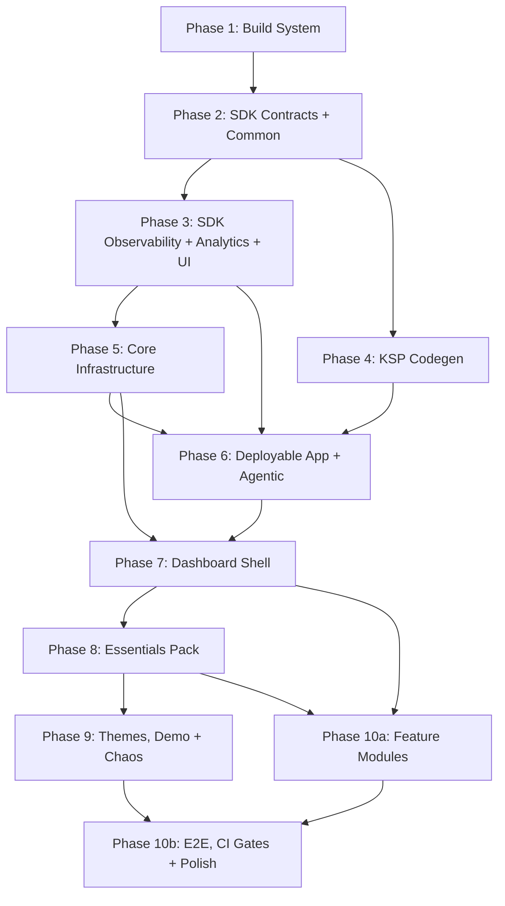

# Migration Plan: dqxn.old → dqxn

Incremental migration of the old codebase into the new architecture. Bottom-up, compile-verified, with observability, autonomous debugging, and tests concurrent at every phase.

## Assessment

**Old codebase:** ~369 Kotlin files, working app. 15 widgets, 15 providers, 24 themes (2 free + 22 premium), full dashboard shell, agentic framework, observability, tests.

**New codebase:** Zero implementation code. 10 architecture docs defining a significantly different target architecture.

**The gap is not "copy and adapt" — it's a structural transformation.** The old code has fundamental architectural debt that the new design explicitly fixes:

| Problem in Old | New Design Fix | Migration Impact |
|---|---|---|
| God-object `DashboardState` | Per-coordinator `StateFlow` slices | Dashboard must be decomposed, not ported |
| `Map<String, Any?>` snapshots | Typed `@DashboardSnapshot` subtypes (KSP-validated) | Every provider + widget changes |
| String-keyed `WidgetData` | `KClass`-keyed `snapshot<T>()` | Every widget data access changes |
| Data passed to `Render()` param | `LocalWidgetData` CompositionLocal | Every widget signature changes |
| Regular `List`/`Map` in UI | `ImmutableList`/`ImmutableMap` | Every UI state surface changes |
| No binding isolation | `SupervisorJob` + `WidgetCoroutineScope` | Binder rewritten from scratch |
| Dashboard imports packs | Shell is pack-blind | Module graph inverted |
| BroadcastReceiver agentic | ContentProvider agentic | Transport layer rewritten |
| `app.dqxn.android` namespace | `app.dqxn.android` (retained) | No change needed |
| Monolithic `core/plugin-api` | Split `sdk/{contracts,common,ui,observability,analytics}` | API surface redistributed |
| No Proto DataStore | Proto for structured data | Persistence layer rewritten |
| JUnit4 only | JUnit5 + contract test fixtures | Test infrastructure rebuilt |

~80% of old code needs structural modification, not just renaming. The remaining ~20% (rendering logic inside widgets, sensor flows in providers, theme JSON, state machine) can be ported with lighter adaptation.

## Guiding Principles

1. **Bottom-up, compile-verified.** Each phase must produce a compiling, tested module before the next starts. No forward references to unbuilt modules.
2. **Old code is reference, not source.** Read `dqxn.old` to understand intent and logic, but write to `dqxn`'s architecture. Don't port-then-refactor — build correctly the first time against the new contracts.
3. **Observability and tests are concurrent, not deferred.** Each phase includes its own test fixtures, logging integration, and metrics hooks. No "add tests later" phase.
4. **Debug infrastructure before debuggable code.** The agentic framework and observability land early so every subsequent phase benefits from on-device autonomous debugging. You don't build the debugger after the thing you need to debug.
5. **One pack proves the architecture.** The Essentials pack migrates first as validation. If the contracts are wrong, fix them before touching other packs.

## Dependency Graph



Phases 3, 4 can run concurrently after Phase 2. Phase 6 (first deployable APK + agentic) gates all subsequent on-device work. Phase 7 (dashboard) is the highest-risk phase and benefits from full agentic debug infrastructure. Phase 8 is the architecture validation gate. Phase 10a (feature modules) starts after Phase 8 — settings/diagnostics/onboarding have no dependency on Phase 9's theme/demo/chaos work. Phase 10b (E2E integration, CI gates, polish) needs Phase 9 for chaos correlation tests and multi-pack validation. Phase 7 defers overlay composables (widget picker, theme selector, settings, setup UI) to Phase 10a — agentic commands provide mutation paths for Phase 7/8 validation without UI overlays.

---

## Phase 1: Build System Foundation

**What:** Gradle infrastructure that all modules depend on. Nothing compiles without this.

**Pre-requisites:**

- JDK 25 installed (or Gradle toolchain auto-download configured via `org.gradle.java.installations.auto-download=true`)
- Any recent Gradle installation for bootstrapping (`gradle wrapper --gradle-version 9.3.1`)
- Android SDK platform 36 installed

**Deliverables:**

- `android/settings.gradle.kts` — module includes for ALL modules (stub `build.gradle.kts` for modules not yet implemented — see Module Include Strategy), version catalog, `build-logic` includeBuild
- `android/build.gradle.kts` — root project
- `android/gradle/libs.versions.toml` — complete version catalog (see Version Catalog)
- `android/gradle.properties` — configuration cache, KSP incremental, Compose compiler flags, `jvmToolchain(25)` in convention plugins (no hardcoded `org.gradle.java.home`)
- `android/build-logic/convention/` — all convention plugins with Gradle TestKit tests (see Convention Plugin Specs)
- `android/lint-rules/` — `:lint-rules` module with custom lint checks and unit tests (see Lint Rules)
- JUnit5 test tags (`fast`, `compose`, `integration`, `benchmark`) and convention plugin `fastTest`/`composeTest` Gradle tasks (F13.10) — available from Phase 2 onward so every module benefits
- Code formatting: ktfmt (Google style) via Spotless Gradle plugin, `.editorconfig`, enforced in pre-commit hook
- Gradle wrapper (9.3.1)

### Module Include Strategy

`settings.gradle.kts` includes ALL modules from Phase 1 onward. Modules not yet implemented get a stub `build.gradle.kts` containing only the plugin application:

```kotlin
// sdk/contracts/build.gradle.kts (stub — source added in Phase 2)
plugins {
    id("dqxn.android.library")
}
```

Benefits:

- `./gradlew tasks` validates all plugin resolution against actual module targets
- `./gradlew :pack:essentials:dependencies` validates `dqxn.pack` auto-wiring from Phase 1 (closes 7-phase gap)
- `settings.gradle.kts` is stable — no modifications per phase
- Phases 3+4 (concurrent) don't create merge conflicts on settings

Subsequent phases fill in source files; they do not modify `settings.gradle.kts` or stub build files (only `:app/build.gradle.kts` gains `implementation(project(...))` entries as packs land).

### Convention Plugin Specs

**`dqxn.android.application`**

- Applies `com.android.application`
- Sets compileSdk 36, minSdk 31, targetSdk 36, `jvmToolchain(25)`
- Configures release build type (minify, R8)
- Enables `buildConfig = true`
- Applies `dqxn.android.compose`

**`dqxn.android.library`**

- Applies `com.android.library`
- Sets compileSdk 36, minSdk 31, `jvmToolchain(25)`
- Configures `unitTests.isIncludeAndroidResources = true`, `unitTests.isReturnDefaultValues = true`
- Does NOT enable Compose — Compose is opt-in via `dqxn.android.compose`

**`dqxn.android.compose`**

- Enables `buildFeatures { compose = true }` (verify AGP 9.0.1 mechanism — see AGP 9 Compose Investigation)
- Adds Compose BOM + core dependencies (`compose-ui`, `compose-ui-graphics`, `compose-material3`, `compose-ui-tooling-preview`)
- Adds `debugImplementation` compose-ui-tooling
- Wires base stability config file (`sdk/common/compose_compiler_config.txt`)
- Accepts additional stability config paths via extension property (for KSP-generated files in `dqxn.pack`)

**`dqxn.android.hilt`**

- Applies `com.google.devtools.ksp` and `com.google.dagger.hilt.android`
- Adds `hilt-android` (implementation) and `hilt-compiler` (ksp)

**`dqxn.android.test`**

- Applies `de.mannodermaus.android-junit5`
- Adds: `junit-jupiter-api`, `junit-jupiter-engine`, `junit-jupiter-params` (testImplementation / testRuntimeOnly)
- Adds: `junit-vintage-engine` (testRuntimeOnly) — required because `WidgetRendererContractTest` uses JUnit4 `ComposeContentTestRule`. Without this, JUnit4-based tests are silently skipped by the JUnit5 platform
- Adds: jqwik (testImplementation) — available from Phase 2 for property-based tests
- Adds: MockK, Truth, Turbine, kotlinx-coroutines-test, Robolectric (testImplementation)
- Configures `useJUnitPlatform()` in test tasks
- Registers `fastTest` task (`--include-tags fast`) and `composeTest` task (`--include-tags compose`)
- Configures structured test output to `{module}/build/test-results/{variant}/` (F13.8)

**`dqxn.pack`** (most complex convention plugin — all responsibilities enumerated)

- Applies `dqxn.android.library` (base Android library config)
- Applies `dqxn.android.compose` (packs contain `@Composable Render()` — Compose compiler required)
- Applies `dqxn.android.hilt` (packs use `@Module @InstallIn(SingletonComponent::class)` for multibinding)
- Applies `dqxn.android.test`
- Applies `com.google.devtools.ksp` and adds `ksp(project(":codegen:plugin"))` for `@DashboardWidget` / `@DashboardDataProvider` processing
- Applies `org.jetbrains.kotlin.plugin.serialization` (packs use kotlinx.serialization for settings)
- Wires KSP-generated Compose stability config file into Compose compiler options (via `dqxn.android.compose` extension)
- Auto-wires all `:sdk:*` dependencies with `implementation` scope: `:sdk:contracts`, `:sdk:common`, `:sdk:ui`, `:sdk:observability`, `:sdk:analytics`
- Adds `implementation(libs.kotlinx.collections.immutable)` and `implementation(libs.kotlinx.coroutines.core)`
- Configures common KSP args: `themesDir` pointing to `src/main/resources/themes/`, `manifestPath` (convention-based, no `afterEvaluate` — configuration-cache safe)
- Note: `:codegen:plugin` doesn't exist until Phase 4 adds processor source. Stub module has an empty `build.gradle.kts`. KSP processing is a no-op until then. The convention plugin still wires the dependency — Gradle resolves it against the empty stub

**`dqxn.snapshot`** (pure-data sub-modules for cross-boundary snapshot types)

- Applies `dqxn.android.library` (must be Android library because `:sdk:contracts` is an Android library — `api()` scope requires compatible module types. Architecture docs saying "no Android" are inaccurate; this is an Android library with no Compose compiler, no Hilt, no KSP — effectively pure Kotlin data classes within an Android library container)
- Adds `api(project(":sdk:contracts"))` as only project dependency
- Does NOT apply the Compose compiler plugin — no `@Composable` function processing
- `@Immutable` annotation (from `androidx.compose.runtime`) is available transitively because `:sdk:contracts` depends on `compose.runtime` (for `@Composable` in `WidgetRenderer.Render()` signature)
- No kotlinx.serialization, no Hilt, no KSP

**`dqxn.android.feature`**

- Applies `dqxn.android.library`, `dqxn.android.compose`, `dqxn.android.hilt`, `dqxn.android.test`
- Auto-wires: `:sdk:contracts`, `:sdk:common`, `:sdk:ui`, `:sdk:observability` (implementation scope)
- Adds: lifecycle, hilt-navigation-compose, navigation-compose
- Does NOT wire `:core:*` or `:data` — features declare these manually per module

**`dqxn.kotlin.jvm`** (lightweight, for `:codegen:*` modules)

- Applies `kotlin("jvm")`
- Sets `jvmToolchain(25)`
- No Android, no Compose, no Hilt

### Version Catalog

`android/gradle/libs.versions.toml` — complete catalog covering all phases. Dependencies not consumed until later phases are still present — changing the catalog later is trivial but missing entries cause confusion about intentional omissions.

Required entries (non-exhaustive — full enumeration at implementation time):

| Category | Entries |
|---|---|
| Build plugins | AGP 9.0.1, KSP (Kotlin 2.3-compatible), Hilt, `com.google.protobuf` (plugin + `protoc` + `protobuf-kotlin-lite` runtime), `de.mannodermaus.android-junit5`, kotlinx.serialization, Spotless |
| Compose | Compose BOM, `compose-runtime` (standalone — needed by `:sdk:contracts` without compiler), compose-ui, compose-material3, compose-ui-tooling, compose-ui-test-junit4 |
| AndroidX | lifecycle, navigation-compose, activity-compose, core-ktx, core-splashscreen, datastore-proto, datastore-preferences, window (foldable APIs) |
| Kotlin | kotlinx-coroutines (core + test), kotlinx-collections-immutable, kotlinx-serialization-json |
| DI | hilt-android, hilt-compiler, hilt-navigation-compose |
| KSP authoring | ksp-api, KotlinPoet, KotlinPoet-KSP |
| Firebase | crashlytics, analytics, performance (behind interfaces in `:core:firebase`) |
| Debug | LeakCanary |
| Testing | JUnit5 (jupiter-api, engine, params), junit-vintage-engine (for JUnit4 `ComposeContentTestRule` in `WidgetRendererContractTest`), jqwik, MockK, Truth, Turbine, Robolectric, compose-ui-test-junit4, kotlinx-coroutines-test |
| Location | play-services-location |
| Conditional | EXTOL SDK (contingent on Phase 1 compat check) |

### Lint Rules

`:lint-rules` module with the following detectors (all delivered in Phase 1, enforcement starts when consumers exist):

| Rule | Severity | Enforcement starts | What it catches |
|---|---|---|---|
| `KaptDetection` | Error | Phase 1 | Any module applying `kapt` plugin — breaks configuration cache |
| `NoHardcodedSecrets` | Error | Phase 1 | SDK keys, API tokens, credentials in source |
| `ModuleBoundaryViolation` | Error | Phase 2 | Pack modules importing outside `:sdk:*` / `*:snapshots` boundary |
| `ComposeInNonUiModule` | Error | Phase 2 | Compose imports in non-UI modules |
| `AgenticMainThreadBan` | Error | Phase 6 | `Dispatchers.Main` usage in agentic command handlers |

Each rule has unit tests (positive case: fires on violating code; negative case: does not fire on clean code) using `LintDetectorTest`. Additional rules (`WidgetScopeBypass`) added when the first widget renderer is implemented (Phase 8).

### AGP 9 Compose Investigation (must resolve before implementing `dqxn.android.compose`)

AGP 9.0.1 manages Kotlin directly (no `org.jetbrains.kotlin.android` plugin). The old codebase applies `org.jetbrains.kotlin.plugin.compose` as a separate JetBrains plugin. Phase 1 must determine:

1. Does AGP 9.0.1 subsume the Compose compiler, or is the separate plugin still required?
2. If the separate plugin is needed, does it conflict with AGP 9's built-in Kotlin management?
3. What is the correct `buildFeatures` / plugin DSL for enabling Compose in AGP 9.0.1?

**This is the single most consequential build decision in Phase 1.** Every Compose-using module (`:sdk:ui`, all packs, all features, `:core:design`, `:app`) depends on it. Resolve BEFORE writing the convention plugin — do not leave as a runtime investigation. Create a throwaway module, apply AGP 9.0.1, add a `@Composable` function, and verify it compiles. Document the finding inline in `dqxn.android.compose` plugin source.

**Additionally verify:** `org.jetbrains.kotlin.plugin.serialization` compatibility with AGP 9's built-in Kotlin management. `dqxn.pack` applies this plugin (line 150), as does `:sdk:contracts`. If AGP 9 subsumes serialization configuration, the separate plugin may conflict. Test in the same throwaway module.

### Toolchain Compatibility Checks

Binary go/no-go before Phase 2 starts:

- **Proto DataStore**: Add a stub `.proto` file to a throwaway module applying `com.google.protobuf` plugin. Verify `compileDebugKotlin` passes AND generated Kotlin files are present in build output. If protoc binary is incompatible with JDK 25 or generated code fails to compile with Kotlin 2.3+, investigate before Phase 5 designs around it.
- **EXTOL SDK**: Add `implementation("sg.gov.lta:extol:X.Y.Z")` to a throwaway module, run `assembleDebug` (not just `compileDebugKotlin` — catches linking/packaging failures from JNI or native library incompatibilities). Record result in `STATE.md` Decisions section. If incompatible, remove `:pack:sg-erp2` from Phase 9 scope immediately — don't waste design effort on connection state machine and 8 provider contracts for a pack that can't ship.

Delete throwaway modules after checks. These are 10-minute verifications that prevent Phase 5/9 scope surprises.

### `java-test-fixtures` Strategy

Modules that need testFixtures (`:sdk:contracts` in Phase 2, others later) apply `java-test-fixtures` manually in their `build.gradle.kts`. This is not baked into any convention plugin — testFixtures are opt-in per module.

**Phase 1 smoke check required:** Apply `java-test-fixtures` to an Android library stub, add a class in `src/testFixtures/kotlin/`, and verify `./gradlew :stub:testFixturesClasses` passes. The `java-test-fixtures` plugin has historically had compatibility issues with Android library modules and AGP versions. Phase 2 is blocked if this fails under AGP 9.0.1.

### `:sdk:contracts` Compose Runtime Dependency

`:sdk:contracts` is "pure Kotlin + coroutines" but has `@Composable` in the `WidgetRenderer.Render()` signature and `@Immutable` annotation usage. It needs `compileOnly(libs.compose.runtime)` — the Compose runtime for annotations, NOT the Compose compiler. This is added manually in Phase 2's `:sdk:contracts/build.gradle.kts`, not via a convention plugin.

### Deferred Validation Registry

Several convention plugins can't be fully validated until their first real consumer. Deferred validation is assigned to the consuming phase's success criteria:

| Plugin | Deferred validation | Owner phase |
|---|---|---|
| `dqxn.android.library` | First module compiles | Phase 2 (`:sdk:common` compiles) |
| `dqxn.android.compose` | Compose code compiles | Phase 3 (`:sdk:ui` compiles) |
| `dqxn.android.hilt` | Hilt DI graph resolves | Phase 6 (`:app:installDebug`) |
| `dqxn.android.test` | First test runs with JUnit5 | Phase 2 (`ConnectionStateMachineTest` passes) |
| `dqxn.android.feature` | Feature module compiles | Phase 7 (`:feature:dashboard` compiles) |
| `dqxn.pack` | Dependency graph + KSP wiring | Phase 1 stub check + Phase 8 real validation |
| `dqxn.snapshot` | Snapshot sub-module compiles | Phase 8 (`:pack:essentials:snapshots` compiles) |
| `dqxn.android.application` | APK assembles | Phase 6 (`:app:installDebug`) |
| `dqxn.kotlin.jvm` | Codegen module compiles | Phase 4 (`:codegen:plugin` compiles) |

Phase 1 partially validates `dqxn.pack` via stub module dependency resolution (`./gradlew :pack:essentials:dependencies`). Full validation (KSP processing, Compose compilation, runtime behavior) waits for Phase 8.

**Ported from old:** Convention plugin structure (4 plugins → 9, significantly expanded). Version catalog (updated versions, added missing deps). Convention plugins must be rewritten for AGP 9.0.1's new DSL interfaces (old `BaseExtension` types are gone). Old `afterEvaluate` pattern in `AndroidFeatureConventionPlugin` must NOT be replicated — configuration-cache hazard. Old `VersionCatalogsExtension.named("libs")` API may be deprecated in Gradle 9.3.1 — verify and use type-safe catalog accessor if needed. No existing R8 rules to port — old codebase has zero custom ProGuard/R8 rules. Phase 6 writes rules from scratch.

**Validation:**

1. `./gradlew tasks --console=plain` succeeds — all convention plugins resolve, all stub modules parse
2. `./gradlew :build-logic:convention:test` passes — Gradle TestKit configuration assertions (compileSdk/minSdk/targetSdk, Compose enabled where expected, Hilt wired, `dqxn.pack` dependency graph correct)
3. `./gradlew :pack:essentials:dependencies --configuration debugCompileClasspath` shows `:sdk:contracts`, `:sdk:common`, `:sdk:ui`, `:sdk:observability`, `:sdk:analytics` with `implementation` scope
4. `./gradlew :lint-rules:test` passes — all lint rules have positive/negative test cases
5. Version catalog contains all required dependency aliases (verified by assertion test in `:build-logic:convention:test`)
6. Proto DataStore throwaway: `compileDebugKotlin` passes, generated Kotlin files present in build output
7. EXTOL SDK throwaway: `assembleDebug` passes (or incompatibility recorded in `STATE.md`)
8. `./gradlew :pack:essentials:compileDebugKotlin` succeeds with empty `:codegen:plugin` JVM stub — verifies KSP doesn't fail when processor produces no output (Android consumer + JVM processor cross-platform stub wiring)
9. `java-test-fixtures` throwaway: `./gradlew :stub:testFixturesClasses` passes for an Android library module — catches AGP 9.0.1 testFixtures incompatibility before Phase 2
10. AGP 9 Compose throwaway: composable function compiles via `dqxn.android.compose` — confirms Compose compiler integration mechanism
11. `./gradlew spotlessCheck` passes on stub modules — confirms formatting toolchain works

---

## Phase 2: SDK Contracts + Common

**What:** The API surface that every pack and feature module depends on. This is where the biggest architectural transformation lands — old untyped contracts become typed. Phase 2 defines the complete `:sdk:contracts` type surface — all types that live in this module are defined here so downstream phases never modify `:sdk:contracts` (only consume it).

### `:sdk:common` (Android library with Hilt — not pure Kotlin)

Despite the aspirational "pure Kotlin" label, `:sdk:common` requires Hilt for `DispatcherModule`. Resolution: qualifier annotations (`@IoDispatcher`, `@DefaultDispatcher`, `@MainDispatcher`) stay in `:sdk:common` using `javax.inject.Qualifier`. `DispatcherModule` (`@Module @InstallIn(SingletonComponent::class)`) also stays — making `:sdk:common` an Android library with `dqxn.android.hilt`. The alternative (moving `DispatcherModule` to `:app`) would scatter DI wiring and every module would still need the qualifiers.

Deliverables:
- `@IoDispatcher`, `@DefaultDispatcher`, `@MainDispatcher` qualifier annotations
- `DispatcherModule` — Hilt module providing dispatchers. Drop old redundant `DQXNDispatchers` interface
- `@ApplicationScope` qualifier
- `ConnectionStateMachine` + `ConnectionMachineState` + `ConnectionEvent` — implementation ports directly from old codebase; test suite significantly expanded from 8 assertions to jqwik property-based coverage. New architecture additions: retry counter as state machine state (not external variable), exponential backoff (1s, 2s, 4s), max 3 retries → Idle, searching timeout (30s), connecting timeout (10s)
- `AppResult<T>` sealed interface + extension functions (`map`, `flatMap`, `onSuccess`, `onFailure`, `getOrNull`, `getOrElse`)
- `AppError` sealed hierarchy — port from old, strip OBU-specific variants (`Obu`, `SdkAuth`), keep general-purpose (`Network`, `Bluetooth`, `Permission`, `Device`, `Database`, `Unknown`). Add extensibility mechanism for packs
- `PermissionKind` enum — generalize (remove `ObuDataAccess`)
- Flow extension utilities migrated from `core:common`

### `:sdk:contracts` build configuration

`:sdk:contracts` applies `dqxn.android.library` (not `dqxn.pack`). Manual additions to `build.gradle.kts`:
- `java-test-fixtures` plugin (first real use — Phase 1 should include a smoke check for AGP 9.0.1 compatibility)
- `compileOnly(libs.compose.runtime)` — for `@Composable` in `WidgetRenderer.Render()` signature and `@Immutable` annotation. This is the standalone `compose-runtime` artifact, NOT mediated through the Compose BOM
- `implementation(libs.kotlinx.collections.immutable)` — `ImmutableMap` in `WidgetData`, `ImmutableList` in notification types
- `implementation(libs.kotlinx.coroutines.core)`
- `api(project(":sdk:common"))` — common types (`AppError`, `ConnectionStateMachine`) available transitively to all consumers
- `implementation(libs.kotlinx.serialization.json)` + `org.jetbrains.kotlin.plugin.serialization` — `WidgetStyle` and settings enums are `@Serializable` for layout persistence round-trip. Alternative: defer serialization to `:data` module, but this forces adapter layers in Phase 5
- Does NOT apply Compose compiler, Hilt, or KSP

### `:sdk:contracts` deliverables

**Widget contracts:**

- `WidgetSpec` interface (explicit — NOT folded into `WidgetRenderer`). Properties: `typeId`, `displayName`, `description` (F2.20), `compatibleSnapshots: Set<KClass<out DataSnapshot>>` (replaces old `compatibleDataTypes: List<String>`), `settingsSchema: List<SettingDefinition<*>>`, `getDefaults(context: WidgetContext): WidgetDefaults`, `aspectRatio: Float?` (F2.16 — replaces old `preserveAspectRatio: Boolean`, null = freeform), `supportsTap`, `priority`
- `WidgetRenderer` — extends `WidgetSpec` + `Gated`. New signature: `@Composable Render(isEditMode, style: WidgetStyle, settings: ImmutableMap<String, Any>, modifier)` — no `widgetData` param (read via `LocalWidgetData.current`). Adds `accessibilityDescription(data: WidgetData): String` (F2.19), `onTap(widgetId: String, settings: ImmutableMap<String, Any>): Boolean` (drops old `Context` param)
- `SettingsAwareSizer` interface (F2.11) — `fun computeSize(settings: Map<String, Any?>): WidgetDefaults`. Used by 6+ widgets in Phase 8. Drop deprecated `DynamicSizeProvider` alias
- `WidgetData` with `KClass`-keyed multi-slot: `snapshot<T : DataSnapshot>(): T?`, `withSlot(type, snapshot)`, `hasData()`, `Empty` and `Unavailable` sentinels. `snapshots: ImmutableMap<KClass<out DataSnapshot>, DataSnapshot>`, `timestamp: Long`
- `WidgetContext` — `timezone: ZoneId`, `locale: Locale`, `region: String`. `DEFAULT = (UTC, US, "US")`
- `WidgetDefaults` — `widthUnits: Int`, `heightUnits: Int`, `aspectRatio: Float?`, `settings: Map<String, Any?>`
- `WidgetStyle` — `@Serializable @Immutable`. `backgroundStyle: BackgroundStyle`, `opacity: Float`, `showBorder: Boolean`, `hasGlowEffect: Boolean`, `cornerRadiusPercent: Int`, `rimSizePercent: Int`, `zLayer: Int`. `BackgroundStyle` enum: `NONE`, `SOLID`

**Data provider contracts:**

- `DataProviderSpec` interface (explicit — NOT folded into `DataProvider`). Properties: `sourceId`, `displayName`, `description`, `dataType: String`, `priority: ProviderPriority` (used by `WidgetDataBinder` for fallback resolution — F3.10)
- `ProviderPriority` enum: `HARDWARE`, `DEVICE_SENSOR`, `NETWORK`, `SIMULATED`. Provider fallback: user-selected > HARDWARE > DEVICE_SENSOR > NETWORK > SIMULATED
- `DataProvider<T : DataSnapshot>` — extends `DataProviderSpec` + `Gated`. Properties: `snapshotType: KClass<T>`, `provideState(): Flow<T>`, `schema: DataSchema`, `setupSchema: List<SetupPageDefinition>`, `subscriberTimeout: Duration` (default 5s), `firstEmissionTimeout: Duration` (default 5s), `isAvailable: Boolean`, `connectionState: Flow<Boolean>`, `connectionErrorDescription: Flow<String?>`
- `ActionableProvider<T : DataSnapshot>` — extends `DataProvider<T>` for bidirectional interaction: `onAction(action: WidgetAction)`. Required by Phase 8 `CallActionProvider` (Shortcuts widget). **Action-only providers** (no data emission) use a `UnitSnapshot` sentinel type: `@DashboardSnapshot("NONE") @Immutable data class UnitSnapshot(override val timestamp: Long) : DataSnapshot`. `provideState()` emits a single `UnitSnapshot` at init and never again. `CallActionProvider` does NOT pass `DataProviderContractTest` (it has no meaningful data flow) — exclude from the "9 providers pass contract tests" count
- `WidgetAction` sealed interface — `Tap(widgetId)`, `MediaControl(command)`, `TripReset(tripId)`. Non-sealed would allow pack extension but complicates exhaustive handling. Keep sealed at V1; packs needing custom actions use `data class Custom(val actionId: String, val params: Map<String, Any?>)` variant
- `DataProviderInterceptor` — interface for chaos/debug interception of provider flows. The interface itself requires no Hilt; the empty `Set<DataProviderInterceptor>` binding is declared in `:app`'s DI module (Phase 6), `:core:agentic` adds to it in debug builds (Phase 9)
- `DataSnapshot` `@Immutable` non-sealed interface with `val timestamp: Long`. `@DashboardSnapshot` KSP annotation for validation. No concrete subtypes in this module
- `DataSchema` / `DataFieldSpec` — retained on `DataProvider<T>` for staleness thresholds per data type and display metadata. **Must include `stalenessThresholdMs: Long`** — without this, `WidgetHealthMonitor` (Phase 3) and `WidgetBindingCoordinator` (Phase 7) have no programmatic source for F3.11 thresholds (SPEED 3s, ORIENTATION 5s, TIME 2s, BATTERY 30s). Provider declares the threshold; the binding system enforces it
- `DataTypeDescriptor` — type metadata: `typeId`, `displayName`, `unit: String?`, `formatting: FormatSpec?`. Define `FormatSpec` as `data class FormatSpec(val decimalPlaces: Int?, val suffix: String?, val prefix: String?)` or drop the field if it's premature
- `DataTypes` constants — retained as extensible `object` with core type strings (`SPEED`, `TIME`, `ORIENTATION`, `BATTERY`, `SOLAR`, `AMBIENT_LIGHT`, `ACCELERATION`, `SPEED_LIMIT`). Packs define additional constants in their own modules

**Widget status types (F2.5, F3.6, F3.15):**

- `WidgetRenderState` sealed interface: `Ready`, `SetupRequired(requirements)`, `ConnectionError`, `Disconnected`, `EntitlementRevoked(upgradeEntitlement)`, `ProviderMissing`, `DataTimeout(message)`, `DataStale`. Note: old code had `icon: ImageVector` on several variants — replaced with string icon names (see Icon Representation below). Priority ordering logic is Phase 7 implementation, but the type hierarchy is Phase 2
- `WidgetIssue` data class with `IssueType` enum and `ResolutionAction` sealed class
- `WidgetStatusCache` — holds `overlayState: WidgetRenderState` + `issues: List<WidgetIssue>`. `EMPTY` companion
- `WidgetRenderState.computeOverlayState()` — port from old codebase, adapt for new state variants

**Setup system (F3.3, F3.4, F3.5 — required for `DataProvider<T>.setupSchema` to compile):**

- `SetupPageDefinition` — `id`, `title`, `description?`, `definitions: List<SetupDefinition>`
- `SetupDefinition` sealed interface with 7 subtypes: `RuntimePermission`, `SystemServiceToggle`, `SystemService`, `DeviceScan`, `Instruction`, `Info`, `Setting`. All implement `Gated`
- **Icon representation**: Old code used `ImageVector` — incompatible with `:sdk:contracts` (no `compose-ui-graphics`). Replace with `val iconName: String?` (Material icon name, e.g., `"bluetooth"`, `"gps_fixed"`). Resolution to `ImageVector` happens in `:sdk:ui` (Phase 3) via a lookup utility
- **Context dependency**: Old `SystemServiceToggle.checkEnabled: (Context) -> Boolean` — incompatible with pure-contracts module. Replace with declarative `serviceType: ServiceType` enum. The `:feature:dashboard` or `:feature:settings` shell interprets the enum to perform the actual system check. This aligns with the architecture's "declarative schemas" principle
- `ServiceType` enum: `BLUETOOTH`, `LOCATION`, `WIFI`
- `VerificationStrategy` interface + `VerificationResult` sealed (Verified/Failed/Skipped) — used by `SetupDefinition.Instruction.verificationStrategy?`. Port from old. Implementations (`SystemServiceVerification`, `ClipboardVerification`) have `Context` dependency — they move to `:feature:settings` (Phase 10) or `:sdk:ui` (Phase 3). Only the interface and result types are Phase 2
- `SetupDefinition` extension functions: `asSetup()`, `isRequirement`, `isDisplay`, `isInput`, `getDefaultValue()`
- `SetupEvaluator` — interface only in Phase 2 (Phase 7/10 implements). `fun evaluate(schema: List<SetupPageDefinition>): SetupResult`

**Settings system:**

- `SettingDefinition<T>` sealed interface with concrete types: `BooleanSetting`, `IntSetting`, `FloatSetting`, `StringSetting`, `EnumSetting<E>`, `TimezoneSetting`, `DateFormatSetting`, `UriSetting`, `AppPickerSetting`, `SoundPickerSetting`, `InstructionSetting`, `InfoSetting`. All implement `Gated`
- **`EnumSetting.optionPreviews` stripped** — old code had `@Composable` lambda for preview rendering. This is a Compose dependency that cannot exist in `:sdk:contracts` (no Compose compiler). Preview rendering moves to `:sdk:ui` (Phase 3) as a separate registry or extension function. Packs register previews in their module, not in the setting definition
- Settings enums (required by widget settings schemas, must ship with `SettingDefinition`): `SizeOption`, `TimezonePosition`, `DateLayoutOption`, `DateFormatOption`, `InfoCardLayoutMode`, `SoundType`, `InfoStyle`, `InstructionAction` sealed interface (`OpenSystemSettings`, `OpenUrl`, `LaunchApp`)

**Notification contracts (per platform.md — all explicitly `:sdk:contracts` types):**

- `InAppNotification` sealed interface: `Toast(id, priority, timestamp, alertProfile?, message, durationMs)`, `Banner(id, priority, timestamp, alertProfile?, title, message, actions: ImmutableList<NotificationAction>, dismissible)`
- `NotificationPriority` enum: `CRITICAL`, `HIGH`, `NORMAL`, `LOW`
- `AlertProfile` `@Immutable` data class: `mode: AlertMode`, `soundUri: String?`, `ttsMessage: String?`, `vibrationPattern: ImmutableList<Long>?`
- `AlertMode` enum: `SILENT`, `VIBRATE`, `SOUND`
- `NotificationAction` `@Immutable` data class: `label: String`, `actionId: String`
- `AlertEmitter` interface: `suspend fun fire(profile: AlertProfile): AlertResult`. Implementation (`AlertSoundManager`) is `@Singleton` in `:app` (Phase 6)
- `AlertResult` enum: `PLAYED`, `SILENCED`, `FOCUS_DENIED`, `UNAVAILABLE`

**Theme contracts:**

- `ThemeSpec` interface (metadata only, no Compose types): `themeId: String`, `displayName: String`, `isDark: Boolean`, `packId: String?`. Extends `Gated`
- `ThemeProvider` interface: `val packId: String`, `fun getThemes(): List<ThemeSpec>`
- `AutoSwitchMode` enum: `LIGHT`, `DARK`, `SYSTEM`, `SOLAR_AUTO`, `ILLUMINANCE_AUTO` (F4.4). Used by `ThemeCoordinator` (Phase 7) and `ThemeAutoSwitchEngine` (Phase 5). Simple enum belongs in `:sdk:contracts` alongside `ThemeSpec`
- Note: `DashboardThemeDefinition` (full runtime type with `Brush`, `Color`) lives in **`:sdk:ui`** (Phase 3) — NOT `:core:design`. Packs implement `ThemeProvider` and return concrete `DashboardThemeDefinition` extending `ThemeSpec`; packs depend on `:sdk:*` only, never `:core:*`. `:core:design` consumes `DashboardThemeDefinition` from `:sdk:ui`
- `ThemeSchema`, `ThemeColors`, `ThemeGradients`, `GradientSpec` (JSON serialization types) — deferred to Phase 5 (`:core:design` — these are shell-internal parsing types, packs provide themes as JSON files loaded by the shell). They have `toBrush()` methods requiring Compose

**Registry interfaces (consumed by `:sdk:observability` in Phase 3, implemented in Phase 7):**

- `WidgetRegistry` interface: `fun getAll(): Set<WidgetRenderer>`, `fun findByTypeId(typeId: String): WidgetRenderer?`, `fun getTypeIds(): Set<String>`. Used by `MetricsCollector` (Phase 3) for pre-populating per-widget tracking maps. Implementation wraps Hilt `Set<WidgetRenderer>` in Phase 7
- `DataProviderRegistry` interface (F3.7): `fun getAll(): Set<DataProvider<*>>`, `fun findByDataType(dataType: String): List<DataProvider<*>>`, `fun getFiltered(entitlementCheck: (String) -> Boolean): Set<DataProvider<*>>`. Entitlement-filtered view per F3.7. Used by `MetricsCollector` and `WidgetHealthMonitor` (Phase 3). Implementation in Phase 7

**Entitlement contracts:**

- `Gated` interface: `requiredAnyEntitlement: Set<String>?` (changed from old `List<String>?`). OR-logic: any matching entitlement grants access
- `Gated.isAccessible(hasEntitlement: (String) -> Boolean): Boolean` — extension function
- `EntitlementManager` interface — **minimal V1**: `hasEntitlement(id: String): Boolean`, `getActiveEntitlements(): Set<String>`, `entitlementChanges: Flow<Set<String>>`. Defer `purchaseProduct()` / `restorePurchases()` to Phase 10 when Play Billing integration shapes the API — premature commitment now would force `:sdk:contracts` modification later
- `Entitlements` constants: `FREE = "free"`, `THEMES = "themes"`, `PLUS = "plus"` (extensible by packs)

**KSP annotations:**

- `@DashboardWidget(typeId, displayName, icon)` — `@Retention(SOURCE)`. Phase 4 builds the processor. `typeId` format is `{packId}:{widget-name}` — the KSP processor (Phase 4) derives `packId` by parsing before the colon. No separate `packId` annotation field or KSP arg needed
- `@DashboardDataProvider(localId, displayName, description)` — `@Retention(SOURCE)`. Phase 4 builds the processor
- `@DashboardSnapshot(dataType)` — `@Retention(SOURCE)`. Phase 4 validates: no duplicate `dataType`, `@Immutable` required, only `val` properties, implements `DataSnapshot`
- Note: `@AgenticCommand` lives in `:core:agentic` (Phase 6), not `:sdk:contracts`

**Pack manifest:**

- `DashboardPackManifest` — simplified from old codebase. KSP generates manifests from annotations (Phase 4), so the data class is primarily for runtime introspection. Retain: `packId`, `displayName`, `description`, `version`, `widgets: List<PackWidgetRef>`, `themes: List<PackThemeRef>`, `dataProviders: List<PackDataProviderRef>`, `category: PackCategory`, `entitlementId`

**Explicitly deferred from Phase 2 (types that live in `:sdk:contracts` per architecture but aren't needed until their first consumer):**

- `ProfileDescriptor`, `ProfileTrigger` — deferred to Phase 7. No pack needs these before Phase 9+ (F1.31 is Deferred). Also has `ImageVector?` dependency that needs the same icon-name treatment before inclusion
- `DeviceManagement`, `DeviceServiceRegistry`, `CompanionDeviceHandler`, device model types (`PairedDevice`, `PresentDevice`, `ConnectedDevice`) — deferred to Phase 5/7. First consumer is Phase 9 (sg-erp2). `SetupDefinition.DeviceScan` references `handlerId: String`, not the full interface
- `ConnectionNotifier` — deferred to Phase 7, shell internal
- `DashboardWidgetInstance`, `WidgetSizeSpec` — deferred to Phase 5, persistence/layout model
- `InfoCardSettings` helper — deferred to Phase 3 (`:sdk:ui`), rendering helper

**Explicitly dropped:**

- `DQXNDispatchers` interface — redundant with qualifier annotations
- `@DataContract`, `@RequiresData` annotations — replaced by typed `compatibleSnapshots: Set<KClass<out DataSnapshot>>`
- `@PackResourceMarker`, `@SettingsSchema`, `@ValidConstraints` — old KSP markers replaced by new annotation system
- `@ThemePackMarker` — replaced by `ThemeProvider` Hilt multibinding
- `DataSnapshot` as concrete `data class(values: Map<String, Any?>)` — replaced by non-sealed interface + typed `@DashboardSnapshot` subtypes
- `EnumSetting.optionPreviews` (`@Composable` lambda) — Compose dependency, moves to `:sdk:ui`

### `:sdk:contracts` testFixtures

- `WidgetRendererContractTest` — abstract JUnit4 test base (requires `ComposeContentTestRule` for `Render()` tests). Every widget extends this. Inherited assertions (see Contract Test Specification below)
- `DataProviderContractTest` — abstract JUnit5 test base. Every provider extends this
- `ProviderFault` sealed interface — shared fault primitives for both `ChaosProviderInterceptor` (E2E) and `TestDataProvider` (unit tests). Variants: `Kill`, `Delay(millis)`, `Error(exception)`, `ErrorOnNext`, `Corrupt(transform)`, `Flap(onMillis, offMillis)`, `Stall`
- `TestDataProvider<T>` — configurable fake that applies `ProviderFault` transformations to a base flow. Supports mid-stream fault injection
- `TestWidgetRenderer` — minimal stub implementing `WidgetRenderer`. Used to run concrete contract tests in Phase 2 (validates the abstract test base itself)
- `testWidget()`, `testTheme()`, `testDataSnapshot()` factories

### Contract Test Specification

**`WidgetRendererContractTest` inherited assertions:**

| # | Test | Severity | Assertion |
|---|---|---|---|
| 1 | `typeId follows packId-colon-name format` | Critical | Regex `[a-z]+:[a-z][a-z0-9-]+` |
| 2 | `render does not throw with WidgetData.Empty` | Critical | Compose test rule, no exception |
| 3 | `render does not throw with WidgetData.Unavailable` | Critical | Distinct sentinel from Empty |
| 4 | `accessibility description is non-empty for empty data` | Critical | `accessibilityDescription(WidgetData.Empty).isNotBlank()` |
| 5 | `accessibility description changes with real data` | High | `accessibilityDescription(Empty) != accessibilityDescription(testData)` |
| 6 | `compatibleSnapshots entries are DataSnapshot subtypes` | Critical | Each `KClass` is assignable to `DataSnapshot` |
| 7 | `settingsSchema keys are unique` | Critical | `schema.map { it.key }.distinct().size == schema.size` |
| 8 | `settingsSchema defaults valid for type constraints` | Critical | `IntSetting.default in min..max`, `EnumSetting.default in options`, etc. |
| 9 | `render survives arbitrary settings (jqwik property-based)` | Critical | Random settings map → no crash |
| 10 | `getDefaults returns positive dimensions` | High | `widthUnits > 0 && heightUnits > 0` |
| 11 | `getDefaults respects aspect ratio if declared` | High | If `aspectRatio != null`, width/height ratio matches |
| 12 | `gating defaults to free when requiredAnyEntitlement is null` | High | `isAccessible { false } == true` |
| 13 | `displayName is non-blank` | Medium | `displayName.isNotBlank()` |
| 14 | `description is non-blank` (F2.20) | Medium | `description.isNotBlank()` |

Abstract methods pack tests must implement:
- `fun createRenderer(): WidgetRenderer` (required)
- `fun createTestWidgetData(): WidgetData` (required — for accessibility variation test)

Note: JUnit4 base class (for Compose test rule) with jqwik property test as a separate companion abstract class. Document this framework split explicitly.

**`DataProviderContractTest` inherited assertions:**

| # | Test | Severity | Assertion |
|---|---|---|---|
| 1 | `emits within firstEmissionTimeout` | Critical | `withTimeout(provider.firstEmissionTimeout) { provideState().first() }` |
| 2 | `emitted type matches declared snapshotType` | Critical | `provideState().first()::class == snapshotType` — prevents silent null from `as? T` |
| 3 | `emitted snapshot has non-zero timestamp` | Critical | `snapshot.timestamp > 0` — required for staleness detection |
| 4 | `respects cancellation without leaking` | Critical | Cancel collector immediately, no exception |
| 5 | `snapshotType is a valid DataSnapshot subtype` | High | Not `DataSnapshot::class` itself |
| 6 | `connectionState emits at least one value` | High | `connectionState.first()` doesn't hang |
| 7 | `connectionErrorDescription null when connected` | High | Consistency between connection flows |
| 8 | `setupSchema definitions have unique IDs` | High | Same logic as settingsSchema key uniqueness |
| 9 | `subscriberTimeout is positive` | High | `> Duration.ZERO` |
| 10 | `firstEmissionTimeout is positive` | High | `> Duration.ZERO` |
| 11 | `gating defaults correctly` | High | Same as WidgetRenderer gating test |
| 12 | `multiple concurrent collectors receive same data` | Medium | Two collectors, both receive emissions |

### `:sdk:contracts` unit tests (not in testFixtures — test concrete types)

- **`WidgetData` multi-slot tests (Critical — untested = silent null data in every widget):**
  - `snapshot returns typed value for matching KClass`
  - `snapshot returns null for missing KClass`
  - `snapshot returns null for wrong KClass`
  - `withSlot adds new slot without removing existing`
  - `withSlot replaces existing slot of same KClass`
  - `hasData false for Empty, true with any slot`
  - `Empty and Unavailable are distinct` (timestamp 0 vs -1)
  - jqwik: `withSlot accumulation is order-independent for distinct KClasses`
  - jqwik: `withSlot is idempotent for same KClass` (last write wins)

- **`Gated.isAccessible()` tests (High — monetization gate logic):**
  - `null entitlement list means free` → `isAccessible { false } == true`
  - `empty set means free` → `isAccessible { false } == true`
  - `single required, user has it` → true
  - `single required, user lacks it` → false
  - `OR logic: user has one of two` → true
  - `OR logic: user has neither` → false

- **`SettingDefinition` construction tests (High — 12 subtypes, each needs validation):**
  - Each of 12 types constructs with required fields
  - `IntSetting` min/max constraints: `default in min..max`
  - `FloatSetting` step is positive
  - `EnumSetting` options non-empty, default in options
  - `visibleWhen` predicate functions correctly
  - `Gated` inheritance works on each subtype
  - Key uniqueness utility function

- **`AppResult<T>` tests (port 9 existing + expand):**
  - Port existing: Ok/Err, map, flatMap, getOrNull, getOrElse
  - Add: `onSuccess` invoked for Ok / not for Err
  - Add: `onFailure` invoked for Err / not for Ok
  - Add: `isSuccess`/`isFailure` properties
  - Add: `errorOrNull` returns error for Err, null for Ok
  - Add: `getOrElse` lambda variant receives the error
  - Update test data: replace old OBU-specific `AppError` variants with generalized ones

- **`ConnectionStateMachineTest` (port 8 + exhaustive + jqwik property-based):**
  - Port existing 8 transition tests
  - Exhaustive transition matrix (6 states × 7 events = 42 cells — each valid→new or invalid→stay)
  - New: `SearchTimeout from Searching → Error`
  - New: `ConnectionFailed increments retry counter`
  - New: `After 3 ConnectionFailed → Idle` (max retries exhausted)
  - New: `ConnectionSuccess resets retry counter`
  - jqwik: `no event sequence reaches an illegal state`
  - jqwik: `all event sequences from Idle terminate` (reaches Connected, Idle, or Error)
  - jqwik: `retry counter never exceeds max`
  - jqwik: `state machine is deterministic` (same sequence → same final state)
  - jqwik: `reset always returns to Idle regardless of current state`

- **`ProviderFault` transformation tests:**
  - Each variant: `Kill`, `Delay`, `Error`, `ErrorOnNext`, `Corrupt`, `Flap`, `Stall`
  - `TestDataProvider` with no fault emits base flow (pass-through)
  - `TestDataProvider` fault injection mid-stream
  - `TestDataProvider` integration: fault applied → verify observable behavior

- **`WidgetStyle` defaults test (Medium):** Verify defaults match documented values: `NONE, 1.0, false, false, 25, 0, 0`
- **`WidgetContext.DEFAULT` test (Low):** UTC, US locale, "US" region
- **`SetupDefinition` tests (port 14 existing):** All 7 sealed subtypes, Setting wrapper, `asSetup()` extensions, `getDefaultValue()`. Update for icon-name changes (no `ImageVector`)

### KSP processor dependency clarification

`:codegen:plugin` (Phase 4) uses `dqxn.kotlin.jvm` (pure JVM). It **cannot** have a Gradle module dependency on `:sdk:contracts` (Android library). KSP processors read annotation metadata from the compilation environment (`KSAnnotation`), not from a compile dependency. The architecture doc's `codegen:plugin → :sdk:contracts` arrow is conceptual (reads annotations defined in), NOT a Gradle dependency. Phase 4 does not need modification for this.

### `compileOnly(compose.runtime)` pattern

Phase 2 establishes the pattern for non-UI modules needing `@Immutable`: add `compileOnly(libs.compose.runtime)` (standalone artifact, not BOM-mediated). Phase 3's `:sdk:observability` will need the same pattern. Document in Phase 2 implementation notes.

**Ported from old:** `core/plugin-api/*` — but every interface changes signature significantly. Key transformations: `DataSnapshot` from `Map<String, Any?>` to typed `@DashboardSnapshot` subtypes (new design informed by old data shapes). `WidgetData` from string-keyed to `KClass`-keyed multi-slot. `WidgetRenderer.Render()` drops `widgetData` param (read via `LocalWidgetData`). `SetupDefinition` subtypes lose `ImageVector` and `Context` dependencies (replaced with string icon names and declarative `ServiceType` enums). `EnumSetting.optionPreviews` (`@Composable`) stripped from contracts. `Gated.requiredAnyEntitlement` changes from `List<String>?` to `Set<String>?`. `SettingDefinition` ports cleanly. `ConnectionStateMachine` ports nearly verbatim (implementation) with significantly expanded test coverage.

**Validation:**

1. `./gradlew :sdk:contracts:compileDebugKotlin --console=plain` — Kotlin compilation succeeds with `compileOnly(compose.runtime)` resolving
2. `./gradlew :sdk:contracts:assembleDebug --console=plain` — Android library artifact produced
3. `./gradlew :sdk:common:assembleDebug --console=plain` — common module compiles with Hilt
4. `WidgetData` multi-slot unit tests pass (slot insertion, retrieval, type safety, jqwik accumulation)
5. `Gated.isAccessible()` logic tests pass
6. `SettingDefinition` construction and constraint validation tests pass for all 12 subtypes
7. `AppResult<T>` tests pass (ported + expanded `onSuccess`/`onFailure`)
8. `ConnectionStateMachineTest` passes including exhaustive transition matrix and jqwik property-based tests
9. `ProviderFault` transformation tests pass
10. `WidgetRendererContractTest` and `DataProviderContractTest` abstract classes in testFixtures produce a JAR
11. At least one concrete contract test subclass executes in Phase 2: `TestWidgetRendererContractTest` and `TestDataProviderContractTest` using testFixtures stubs — validates the abstract test base itself runs, not just compiles
12. testFixtures consumer verification: a throwaway `testImplementation(testFixtures(project(":sdk:contracts")))` in `:sdk:common` (or dedicated test module) imports a type from testFixtures — catches JAR packaging issues 6 phases before Phase 8
13. Test output XML present in `build/test-results/` — confirms JUnit5 platform actually executed (catches silent test skip under AGP 9.0.1)

---

## Phase 3: SDK Observability + Analytics + UI

**What:** Remaining SDK modules that packs and features import. Observability is the foundation for all autonomous debugging — it must be solid before the agentic framework wires to it in Phase 6.

### `:sdk:observability` (Android library — uses `SharedPreferences`, `StatFs`, `PowerManager`; no Compose compiler)

- `ErrorContext` sealed hierarchy — `Coordinator(command)`, `Widget(typeId, widgetId)`, `Provider(sourceId)`, `System(component)`. Used by `ErrorReporter.reportNonFatal(e, context: ErrorContext)`. `WidgetErrorContext` subtype of `ErrorContext.Widget` adds crash count and stack trace summary
- `CrashReporter` interface: `log(message)`, `logException(e)`, `setKey(key, value)`, `setUserId(id)`. Implementation in `:core:firebase` (Phase 5)
- `ErrorReporter` interface: `reportNonFatal(e, context: ErrorContext)`, `reportWidgetCrash(typeId, widgetId, context: WidgetErrorContext)`
- `DqxnLogger` with inline extensions (migrate from `core:common`, adapt to zero-allocation when disabled)
- `JsonLinesLogSink` — machine-readable JSON-lines file log sink (F13.7). Rotated 10MB, max 3 files. Debug builds only. Wired as a `DqxnLogger` sink
- `LogTag` as `@JvmInline value class`
- `DqxnTracer` — structured tracing with span IDs, `agenticTraceId` field for causal correlation
- `MetricsCollector` — `AtomicLongArray(6)` frame histogram, `ConcurrentHashMap` + `LongArrayRingBuffer(64)` per-widget draw time and per-provider latency. Pre-populated from `WidgetRegistry` and `DataProviderRegistry` (Phase 2 interfaces) at construction. Phase 3 unit tests use fake registries; real DI binding in Phase 6/7. Performance budget: record < 25ns (`System.nanoTime()` + ring buffer write)
- `JankDetector` — wired between `FrameMetrics` callbacks and `MetricsCollector`. Fires `DiagnosticSnapshotCapture` at exponential thresholds (5, 20, 100 consecutive janky frames). Distinct class, not folded into MetricsCollector
- `DiagnosticSnapshotCapture` — anomaly auto-capture with `AtomicBoolean` capture guard (drops concurrent captures). `AnomalyTrigger` sealed hierarchy: `WidgetCrash`, `AnrDetected`, `ThermalEscalation`, `JankSpike`, `ProviderTimeout`, `EscalatedStaleness`, `BindingStalled`, `DataStoreCorruption`. Three separate rotation pools (crash: 20, thermal: 10, perf: 10) — prevents thermal churn evicting crash snapshots. `StatFs` storage pressure check (skip if <10MB free). `capture()` accepts `agenticTraceId`. Release build: only trigger type + timestamp forwarded to `CrashReporter`, no full dump
- `CrashEvidenceWriter` — sync `SharedPreferences.commit()` in `UncaughtExceptionHandler`. Captures: `last_crash_type_id`, `last_crash_exception`, `last_crash_stack_top5`, `last_crash_timestamp`. `extractWidgetTypeId()` to pull widget type from exception chain. Fallback for `diagnose-crash` when no snapshot file exists
- `AnrWatchdog` — dedicated daemon thread with `CountDownLatch`, 2.5s timeout, 2-consecutive-miss trigger. `Thread.getAllStackTraces()` + fdCount in ANR file. `writeAnrFile()` via direct `FileOutputStream` on watchdog thread (no `Dispatchers.IO` — process may die before coroutine dispatches). `Debug.isDebuggerConnected()` guard. Exposed via lock-free `query()` path in `AgenticContentProvider` (`/anr`)
- `WidgetHealthMonitor` — periodic liveness checks (10s), stale data detection (last data timestamp > staleness threshold), stalled render detection (last draw timestamp > 2x target frame interval). Reports to `CrashContextProvider`. Exposed via lock-free `query()` path (`/health`) with `cachedHealthMonitor` pattern

### `:sdk:analytics`

- Event tracking contracts (new — old codebase has none)
- Domain-free API surface
- Funnel event contracts (F12.2): `install`, `onboarding_complete`, `first_widget_added`, `first_customization` (theme change or widget settings edit)
- Engagement metric contracts (F12.3): `session_duration`, `widgets_per_layout`, `edit_frequency` (edit mode entries per session)
- Upsell event contracts (F12.6): impression/conversion events with `trigger_source` parameter (`theme_preview`, `widget_picker`, `settings`)
- Session quality metric contracts (F12.7): session end event carrying `jank_percent`, `peak_thermal_level`, `widget_render_failures`, `provider_errors`. Note: `:sdk:analytics` defines **contract interfaces only** (event data classes, `AnalyticsTracker` interface). No module dependency on `:sdk:observability` — the caller (`:feature:dashboard` or `:app`) reads from `MetricsCollector`/`WidgetHealthMonitor` and populates the event fields. `:core:firebase` implements `AnalyticsTracker` and forwards to Firebase

### `:sdk:ui` (has Compose compiler — applies `dqxn.android.compose`)

- `LocalWidgetData` CompositionLocal
- `LocalWidgetScope` CompositionLocal (supervised `WidgetCoroutineScope`)
- `DashboardThemeDefinition` — full runtime type extending `ThemeSpec` with `Brush`, `Color`, `TextStyle`. Must live here (not `:core:design`) because packs implement `ThemeProvider` returning `DashboardThemeDefinition`, and packs can only depend on `:sdk:*`
- `WidgetContainer` skeleton (migrate from `core:widget-primitives` — responsive sizing, border overlay, rim padding). Glow rendering (`RenderEffect.createBlurEffect()` rewrite) added in Phase 7
- Icon name resolution utility — maps `iconName: String` (from Phase 2 `SetupDefinition`) to `ImageVector`. Material icon lookup
- `GRID_UNIT_SIZE = 16.dp` constant
- **Deferred from Phase 3 to first consumer:** `InfoCardLayout` (Phase 8, when first widget needs it), setup overlay composables (`SetupRequiredOverlay`, `DisconnectedOverlay` — Phase 10a), `PermissionRequestPage` (Phase 10a)

**Ported from old:** `core:common/observability/*` (Logger, Metrics, CrashEvidence, AnrWatchdog — adapt to new module boundaries and add missing capabilities: JankDetector, rotation pools, storage pressure, trace IDs). `core:widget-primitives/*` → `sdk:ui`. Analytics is entirely new.

**Tests:**
- `DqxnLogger`: disabled-path zero-allocation test, tag filtering test
- `MetricsCollector`: ring buffer overflow, histogram bucket boundaries, concurrent write correctness
- `JankDetector`: exponential threshold firing (5th, 20th, 100th frame triggers capture; 4th, 19th, 99th do not)
- `CrashEvidenceWriter`: simulated uncaught exception → verify `prefs.getString(...)` persisted. `extractWidgetTypeId()` from nested exception chain
- `AnrWatchdog`: single miss → no capture; two consecutive misses → capture + file written; debugger attached → no capture
- `DiagnosticSnapshotCapture`: concurrent capture guard (second capture dropped), rotation pool eviction (thermal doesn't evict crash), storage pressure skip
- `WidgetHealthMonitor`: stale vs stalled distinction, liveness check period
- `WidgetContainer`: composition tests

---

## Phase 4: KSP Codegen

**What:** Build-time code generation that packs and agentic depend on.

### `:codegen:plugin`

- KSP processor for `@DashboardWidget` / `@DashboardDataProvider` / `@DashboardSnapshot`
- Generates `PackManifest` implementations
- Generates Hilt multibinding modules (replaces old manual `@Binds @IntoSet`)
- Generates Compose stability config file listing all `@DashboardSnapshot`-annotated types (wired into Compose compiler by `dqxn.pack` convention plugin)
- `typeId` format validation: `{packId}:{widget-name}`
- `@DashboardSnapshot` validation: no duplicate `dataType` strings **within the same module** (KSP runs per-module — cross-module uniqueness is a runtime check in `WidgetRegistry`/`DataProviderRegistry`), `@Immutable` required, only `val` properties, implements `DataSnapshot`

### `:codegen:agentic`

- KSP processor for `@AgenticCommand` annotations
- Generates `AgenticCommandRouter` with command dispatch wiring
- Generates param validation from annotation schema
- Generates `list-commands` schema output (self-describing command registry)
- Compilation error on missing handler (annotated command with no implementation)
- **JVM-vs-Android:** Same constraint as `:codegen:plugin` — `:codegen:agentic` uses `dqxn.kotlin.jvm` (pure JVM) and cannot have a Gradle module dependency on `:core:agentic` (Android library). The processor reads `@AgenticCommand` annotation metadata from `KSAnnotation` in the compilation environment, not via compile dependency. `@AgenticCommand` is defined in `:core:agentic` (Phase 6). **Phase 4 builds the processor structure against expected annotation shapes; it becomes functional when Phase 6 provides the annotation types at consumer compile time.** Phase 4 tests use compile-testing with synthetic annotation declarations
- **Phase ordering note:** `@AgenticCommand` lives in `:core:agentic` (Phase 6), but the processor is built in Phase 4. This is not circular — the processor reads annotation metadata from the consumer's compilation classpath (which includes `:core:agentic` at compile time), not from its own module dependencies

**Ported from old:** `core:plugin-processor` → `:codegen:plugin` (adapt for new annotation shapes, add manifest generation). `core:agentic-processor` → `:codegen:agentic` (expand from simple dispatch to full schema generation).

**Convention plugin wiring check:** Apply `dqxn.pack` to a stub module (no source, just the plugin application). Verify the resolved dependency graph includes all expected `:sdk:*` modules with `implementation` scope and that the KSP-generated Compose stability config file path is wired into the Compose compiler options. This is a 7-phase gap between the plugin (Phase 1) and its first real consumer (Phase 8) — misconfigured auto-wiring would silently propagate to every pack. Note: this check requires all `:sdk:*` modules to exist (Phase 3 deliverables). If Phase 4 runs concurrently with Phase 3, defer this validation to Phase 6 (first `:app` assembly). The KSP processor work in Phase 4 has no dependency on Phase 3; only this validation check does.

**Tests:** KSP processor tests with compile-testing. Verify generated `list-commands` output. Verify compilation failure on malformed `typeId`. Verify `@DashboardSnapshot` rejects: duplicate `dataType`, mutable properties, missing `@Immutable`, non-`DataSnapshot` class.

---

## Phase 5: Core Infrastructure

**What:** Shell internals that features depend on but packs never touch.

### `:core:design` (has Compose — applies `dqxn.android.compose`)

- Material 3 theme wiring
- Color system, typography
- Theme resolution (free → custom → premium ordering — F4.13)
- `ThemeSchema`, `ThemeColors`, `ThemeGradients`, `GradientSpec` — JSON serialization types deferred from Phase 2. These bridge theme JSON files → runtime `DashboardThemeDefinition` (in `:sdk:ui`). Have `toBrush()` methods requiring Compose
- `ThemeAutoSwitchEngine` — `@Singleton`, `@Eagerly` initialized in `Application.onCreate()`. Accepts `StateFlow<Float>` for illuminance and solar event data. Before Phase 8 providers exist, SOLAR_AUTO and ILLUMINANCE_AUTO modes are structurally wired but non-functional (default to SYSTEM fallback). Input interfaces defined in `:sdk:contracts` allow late binding
- Ambient light auto-switch logic (migrate from old theme system)

### `:core:thermal`

- `ThermalManager` → `RenderConfig` (extract from old `feature:dashboard/thermal/`)
- `FramePacer` — `Window.setFrameRate()` API 34+, emission throttling API 31-33. Defined in Phase 5 but requires `Window` reference from Activity — integration with `DashboardLayer` happens in Phase 7. Phase 5 delivers the class with injectable `Window` parameter; testable with mock Window
- `FakeThermalManager` for chaos injection — controllable `MutableStateFlow<ThermalLevel>`

### `:data`

- Proto DataStore schemas (`.proto` files):
  - `dashboard_layout.proto` — `DashboardStore` (profiles, active profile ID), `ProfileCanvas` (profile metadata + widget list), `SavedWidget` (typeId, position, size, style, settings, dataSourceBindings). See `persistence.md` lines 9-42 for full message definitions
  - `paired_devices.proto` — `PairedDeviceStore`, `PairedDeviceMetadata` (definitionId, displayName, macAddress, lastConnected)
  - `custom_themes.proto` — `CustomThemeStore`, `CustomTheme` (themeId, displayName, isDark, colors JSON blob, gradients JSON blob). Max 12 custom themes
- `DashboardWidgetInstance` data class — deferred from Phase 2. Fields: `instanceId: String`, `typeId: String`, `position: GridPosition`, `size: GridSize`, `style: WidgetStyle`, `settings: ImmutableMap<String, Any>`, `dataSourceBindings: Map<String, String>`, `zIndex: Int`. References Phase 2's `WidgetStyle`. Used by `LayoutState` (Phase 7 coordinators)
- `WidgetSizeSpec` — deferred from Phase 2. `widthUnits: Int`, `heightUnits: Int`. Grid coordinate types: `GridPosition(col: Int, row: Int)`, `GridSize(widthUnits: Int, heightUnits: Int)`
- Repository interfaces and implementations:
  - `LayoutRepository` — CRUD for profiles and widgets, debounced save (500ms), corruption handler. Profile CRUD: `createProfile()`, `cloneProfile(sourceId)`, `switchProfile(targetId)`, `deleteProfile(id)`, `getActiveProfile(): Flow<ProfileCanvas>`
  - `UserPreferencesRepository` — Preferences DataStore for simple settings (theme mode, orientation lock, status bar, keep screen on)
  - `ProviderSettingsStore` — pack-namespaced keys: `{packId}:{providerId}:{key}`
  - `PairedDeviceStore` — CRUD for paired BLE devices (first consumer: Phase 9 sg-erp2)
  - `ConnectionEventStore` — rolling 50-event log (F7.6)
- `PresetLoader` + preset JSON files (F7.7) — loads region-aware default layouts. Depends on `LayoutRepository` for writing. Note: `RegionDetector` (which `PresetLoader` may use for region-aware defaults) lives in `:pack:essentials` (Phase 8). Phase 5 `PresetLoader` uses a simpler timezone-based region heuristic; Phase 8 can enhance if needed
- `ReplaceFileCorruptionHandler` on ALL DataStore instances
- `consumer-proguard-rules.pro` — R8 keep rules for proto-generated classes (distributed with module, consumed by `:app` automatically)
- Migration from old Preferences-JSON-blob approach to Proto

### `:core:firebase`

- Firebase SDK isolation module — only module with Firebase SDK dependencies, only imported by `:app`
- `FirebaseCrashReporter : CrashReporter` — wraps Crashlytics: `log()`, `recordException()`, `setCustomKey()`, `setUserId()`
- `FirebaseAnalyticsTracker : AnalyticsTracker` — wraps Firebase Analytics: `logEvent()`, `setUserProperty()`
- `FirebasePerformanceTracer` — wraps Firebase Performance: custom traces, HTTP metrics (if applicable)
- Requires `google-services.json` in `:app` — Phase 5 test strategy: unit tests mock Firebase interfaces, no real Firebase calls. Binding verification via Hilt test in Phase 6

**Ported from old:** `ThermalManager`, `RenderConfig`, `UserPreferencesRepository` (rewritten for Proto), `LayoutDataStore` (rewritten from JSON-in-Preferences to Proto DataStore). Theme JSON loading.

**Port inventory:**

| Old artifact | Target | Notes |
|---|---|---|
| `DashboardThemeExtensions.kt` — spacing scale (`SpaceXXS`–`SpaceXXL`, 4dp grid) + 10 semantic aliases (`ScreenEdgePadding`, `SectionGap`, `ItemGap`, `InGroupGap`, `ButtonGap`, `IconTextGap`, `LabelInputGap`, `CardInternalPadding`, `NestedIndent`, `MinTouchTarget`) | `:core:design` | Port values; extension target changes from `DashboardThemeDefinition` to new `ThemeDefinition` |
| `DashboardTypography` — 8 named styles (`title`, `sectionHeader`, `itemTitle`, `label`, `description`, `buttonLabel`, `primaryButtonLabel`, `caption`) + `getTightTextStyle` helper | `:core:design` | Port; verify against Material 3 type scale |
| `TextEmphasis` — 4 alpha constants (`High=1.0f`, `Medium=0.7f`, `Disabled=0.4f`, `Pressed=0.12f`) | `:core:design` | Port verbatim |
| `CardSize` enum — `SMALL(8dp)`, `MEDIUM(12dp)`, `LARGE(16dp)` corner radii | `:core:design` | Port verbatim |

**Tests:** Thermal state transition tests, DataStore corruption recovery tests, layout serialization round-trip tests. `FakeThermalManager` flow emission tests.

---

## Phase 6: Deployable App + Agentic Framework

**What:** First deployable APK with the agentic debug framework. Every subsequent phase can deploy to a device and use structured `adb shell content call` queries for autonomous debugging. This is debugging infrastructure — it lands before the code it will debug.

### `:app` (minimal shell)

- `MainActivity` — single activity, `enableEdgeToEdge()`, `WindowInsetsControllerCompat`
- `DqxnApplication` — Hilt application
- `AppModule` — DI assembly with:
  - Empty `Set<WidgetRenderer>` (packs not yet migrated)
  - Empty `Set<DataProvider<*>>`
  - Empty `Set<ThemeProvider>`
  - Empty `Set<DataProviderInterceptor>` (Phase 2 interface, chaos adds to it in Phase 9)
  - Empty `Set<DashboardPackManifest>`
  - `AlertSoundManager : AlertEmitter` — `@Singleton` with `SoundPool`, `AudioManager`, `Vibrator`. Phase 2 defines the `AlertEmitter` interface; Phase 6 provides the implementation. Required by `NotificationCoordinator` in Phase 7
  - `CrashRecovery` — `@Singleton`, synchronous `SharedPreferences` read in `Application.onCreate()` before DataStore. Tracks crash timestamps for safe mode trigger (>3 crashes in 60s). Phase 7 wires safe mode response into coordinators/UI
  - `StubEntitlementManager : EntitlementManager` — returns `free` only. Phase 10a replaces with Play Billing implementation
- Blank dashboard canvas (placeholder composable — real dashboard lands in Phase 7)
- AndroidManifest: `resizeableActivity="false"` (F1.23), `android:permission="android.permission.BLUETOOTH_SCAN" android:usesPermissionFlags="neverForLocation"` (NF23)
- ProGuard/R8 rules — `:app` aggregates `consumer-proguard-rules.pro` from `:data` (proto classes), `:codegen:plugin` (KSP-generated manifests), `:sdk:contracts` (serializable classes). Phase 6 validates via `assembleRelease` + install

**Asset migration checklist:**

- [ ] Adaptive launcher icon: `ic_launcher_foreground.xml`, `ic_launcher_background.xml` → `app/src/main/res/drawable/`
- [ ] Monochrome launcher icon (API 33+): `ic_launcher_monochrome.xml` → `app/src/main/res/drawable/`
- [ ] Adaptive icon manifests: `ic_launcher.xml`, `ic_launcher_round.xml` → `app/src/main/res/mipmap-anydpi-v26/`
- [ ] Vector logo: `ic_logo_letterform.xml` → `app/src/main/res/drawable/`
- [ ] Logo asset: `dqxn_logo_cyber_dog.webp` → decide: `:app` or `:core:design` res (needed by onboarding in Phase 10)

### `:core:agentic`

- `@AgenticCommand` annotation — `@Retention(SOURCE)`, defined here for `:codegen:agentic` (Phase 4) to process. Annotation schema: `name: String`, `description: String`, `params: Array<AgenticParam>`
- `AgenticEngine` — command dispatch (migrate from old, adapt to coordinator APIs as they land)
- **Handler placement:** Engine/dispatch infrastructure lives in `:core:agentic`. Handlers that need shell dependencies (`:data`, `:core:thermal`, coordinators) are defined in `:app:src/debug/` where they can access all modules via Hilt. Handler interfaces/annotations stay in `:core:agentic`
- `AgenticContentProvider` — ContentProvider transport on binder thread:
  - `call()` with `runBlocking(Dispatchers.Default)` + `withTimeout(8_000)`
  - `query()` lock-free read paths (`/health`, `/anr`) — deadlock-safe escape hatches when main thread is blocked
  - `@EntryPoint` + Hilt cold-start race handling with retry-after-ping contract
  - Response file protocol (file path in Bundle, not inline JSON)
  - `onCreate()` cleanup of previous session response files
  - 8-second timeout with error envelope semantics
  - `Binder.getCallingUid()` security validation
- Agentic trace ID generation and propagation into `DashboardCommand` (wired when coordinators land in Phase 7)
- `SemanticsOwnerHolder` — debug-only `@Singleton` for Compose semantics tree access. Registered by `DashboardLayer` via `RootForTest.semanticsOwner`. Enables `dump-semantics`/`query-semantics` commands for pixel-accurate UI verification

**Starter diagnostic handlers (read-only — query state, don't mutate it):**

| Handler | Queries | Available from |
|---|---|---|
| `dump-health` | `WidgetHealthMonitor` | Phase 6 (empty initially, populates as widgets land) |
| `diagnose-crash` | `CrashEvidenceWriter` SharedPrefs, `DiagnosticSnapshotCapture` files | Phase 6 |
| `diagnose-performance` | `MetricsCollector` snapshot | Phase 6 |
| `list-diagnostics` | Diagnostic snapshot files with metadata, stale file filtering | Phase 6 |
| `get-metrics` | `MetricsCollector` frame histogram + per-widget draw times | Phase 6 |
| `dump-layout` | `:data` layout repository | Phase 6 |
| `list-widgets` | `Set<WidgetRenderer>` from Hilt | Phase 6 (empty until Phase 8) |
| `list-providers` | `Set<DataProvider<*>>` from Hilt | Phase 6 (empty until Phase 8) |
| `list-themes` | `Set<ThemeProvider>` (via Hilt multibinding) | Phase 6 |
| `list-commands` | KSP-generated schema from `:codegen:agentic` | Phase 6 |
| `dump-semantics` | `SemanticsOwnerHolder` — full Compose semantics tree (bounds, test tags, text, actions) | Phase 6 (empty until DashboardLayer registers in Phase 7) |
| `query-semantics` | `SemanticsOwnerHolder` — filtered semantics query by test tag, text, bounds | Phase 6 (empty until Phase 7) |
| `trigger-anomaly` | Fires `DiagnosticSnapshotCapture` for pipeline self-testing | Phase 6 |

**Mutation handlers (land incrementally as their targets are built):**

| Handler | Target | Available from |
|---|---|---|
| `add-widget`, `remove-widget`, `move-widget`, `resize-widget` | `LayoutCoordinator` | Phase 7 |
| `set-theme` | `ThemeCoordinator` | Phase 7 |
| `set-data-source` | `WidgetBindingCoordinator` | Phase 7 |
| `set-setting` | Per-widget settings | Phase 7 |
| `get-layout` | `LayoutCoordinator` | Phase 7 |
| `get-widget-status` | `WidgetBindingCoordinator` | Phase 7 |
| `get-entitlements` | `EntitlementManager` | Phase 7 |
| `reset-layout` | `LayoutCoordinator` | Phase 7 |
| `import-preset` | `:data` preset system | Phase 7 |
| `inject-fault` | `ChaosProviderInterceptor` | Phase 9 |
| `capture-snapshot` | `DiagnosticSnapshotCapture` | Phase 6 |

**Debug overlays (`:app:src/debug/`):**

- Frame Stats overlay
- Widget Health overlay
- Thermal Trending overlay
- Recomposition Visualization overlay (F13.6)
- Provider Data Flow DAG overlay (F13.6)
- State Machine Viewer overlay (F13.6)

**Ported from old:** `AgenticEngine`, `CommandDispatcher`, handler structure (adapt from BroadcastReceiver to ContentProvider transport). `AgenticReceiver` deleted — replaced by `AgenticContentProvider`. Old handlers adapted to new coordinator APIs incrementally. Debug overlays ported with UI adaptation.

**Tests:**
- `AgenticContentProvider`: cold-start race (ping before Hilt ready → retry), timeout (8s exceeded → error envelope), concurrent calls, `query()` lock-free path works when `call()` would block
- `AgenticEngine`: command routing, unknown command error, trace ID propagation
- Handler tests for all starter diagnostic handlers against faked observability state
- `SemanticsOwnerHolder`: registration/deregistration, `snapshot()` returns tree when owner set, `query()` filter matching
- `dump-semantics`/`query-semantics` handlers: empty response when no owner registered, tree serialization correctness
- E2E: `adb shell content call` round-trip on connected device
- App startup: blank canvas renders without crash

**Validation:** `./gradlew :app:installDebug` succeeds. `adb shell content call --uri content://app.dqxn.android.debug.agentic --method list-commands` returns handler schema. `trigger-anomaly` creates a diagnostic snapshot file. `diagnose-crash` returns crash evidence (or empty state). `dump-semantics` returns a tree with at least the blank canvas root node. Debug overlays toggle on/off. `./gradlew assembleRelease` succeeds and R8-processed APK installs without `ClassNotFoundException` — validates ProGuard rules don't strip KSP-generated classes or proto-generated code.

**CI pipeline deliverable:** Configure CI (GitHub Actions or equivalent) running `./gradlew assembleDebug test lintDebug --console=plain`. From this phase forward, every phase must pass all prior-phase tests before merging. This is the regression gate — not just "current phase tests pass" but "nothing broke."

### Autonomous debug bootstrapping

From this point forward, the agent can autonomously debug on a connected device:

1. **Deploy:** `./gradlew :app:installDebug`
2. **Detect:** `adb logcat` for crashes/ANRs, `diagnose-crash` for structured crash evidence, `list-diagnostics since=<timestamp>` for anomaly snapshots
3. **Investigate:** `dump-health` for widget liveness, `get-metrics` for frame timing, `diagnose-performance` for jank analysis, `query-semantics` for visual verification (is the widget actually rendered? correct text? visible?)
4. **Fix:** Edit source code
5. **Verify:** Rebuild, redeploy, re-query — confirm anomaly resolved
6. **Fallback:** If main thread is deadlocked and `call()` stalls, `query()` paths (`/health`, `/anr`) still work. If binder pool is exhausted, `adb pull` the `anr_latest.json` written by `AnrWatchdog`'s dedicated thread

---

## Phase 7: Dashboard Shell

**What:** The hardest phase. The 1040-line god-ViewModel and god-state must be decomposed into coordinators. This is structural transformation, not porting. Full agentic debug infrastructure is available on-device — use it.

### `:feature:dashboard`

**State decomposition** — break `DashboardState` into coordinator-owned slices:

- `LayoutCoordinator` — canvas positioning, viewport culling, grid placement
- `EditModeCoordinator` — edit mode toggle, drag/resize gestures
- `ThemeCoordinator` — active theme, auto-switch engine, preview/revert
- `WidgetBindingCoordinator` — provider binding, `SupervisorJob` isolation, per-widget status tracking, error counts, safe mode trigger
- `NotificationCoordinator` — banner derivation, toast queue, priority ordering
- `ProfileCoordinator` — profile creation/clone/switch/delete, per-profile canvas ownership

**Core components:**

- `DashboardCommand` sealed interface + `Channel` routing to coordinators, with `agenticTraceId` propagation from agentic commands
- `WidgetDataBinder` — rewrite with `SupervisorJob`, `CoroutineExceptionHandler`, `widgetStatus` reporting. Applies `DataProviderInterceptor` chain (for chaos injection)
- `DashboardGrid` — migrate layout logic (custom `MeasurePolicy` ports well), swap data delivery to `LocalWidgetData`, add `graphicsLayer` isolation per widget. Wire `MetricsCollector.recordWidgetDrawTime()` in draw modifier (not `LaunchedEffect`) and `MetricsCollector.recordRecomposition()` in widget container. Apply `Modifier.testTag()` to all key elements per test tag convention (see build-system.md): `dashboard_grid`, `widget_{id}`, `bottom_bar`, `banner_{id}`, etc. — required for agentic `dump-semantics`/`query-semantics` UI verification
- `DashboardCanvas` — Layer 0 + Layer 1 overlay structure (ports with adaptation). `DashboardLayer` registers `SemanticsOwnerHolder` (debug only) — semantics commands start returning real data from this point
- `OverlayNavHost` — Layer 1 navigation
- Widget error boundary — `WidgetCoroutineScope` via CompositionLocal, crash count → safe mode

**`DashboardTestHarness`** — rebuild DSL for new coordinator architecture:

- DSL surface: `dashboardTest { dispatch(...); assertThat(...) }` with `layoutState()`, `bindingJobs()`, `safeMode()`, `editModeState()`, `widgetPickerAvailable()`, `settingsAccessible()`, `widgetStatuses()`, `ringBufferTail()`
- Default configuration uses **real coordinator implementations**, not fakes. Fakes available for isolation tests via `dashboardTest(fakeLayout = true) { ... }` but the primary integration path exercises real coordinator-to-coordinator interactions
- `FakeLayoutRepository`, `FakeWidgetDataBinder` for persistence/binding isolation
- Uses `TestDataProvider` and `ProviderFault` from `:sdk:contracts:testFixtures` for fault injection in unit tests

**`HarnessStateOnFailure`** — JUnit5 `TestWatcher`:

- Auto-dumps harness state as JSON on test failure
- Format: `layout`, `theme`, `widgetStatuses`, `bindingJobs`, `ringBufferTail(20)`
- JSON structure matches `diagnose-*` response format — agent parses both with the same logic
- No `DiagnosticSnapshotCapture` dependency (no observability graph in unit tests)

**Mutation handlers wired:** All mutation handlers listed in Phase 6 table become functional as coordinators land. Agent can now `add-widget`, `set-theme`, `inject-fault` etc. on device.

**Deferred to Phase 10a (overlay composables):** WidgetPicker, ThemeSelector, MainSettings, SetupSheet, SettingRowDispatcher (10+ row types), InlineColorPicker, GradientTypeSelector, GradientStopRow, AutoSwitchModeContent, IlluminanceThresholdControl. Phase 7 delivers the structural shell — coordinators, grid, binding, canvas. Overlays build on the shell in Phase 10a using the coordinator APIs established here. OverlayNavHost is scaffolded (empty route table) in Phase 7; routes populated in Phase 10a.

**`DashboardViewModel`** — thin coordinator host, not a god-object:
- Owns `Channel<DashboardCommand>` + consumption loop routing to coordinators
- Holds `SavedStateHandle` for process-death survival (edit mode state, active profile ID)
- Constructor-injected coordinators — ViewModel is the composition root, coordinators are the logic
- No business logic in ViewModel. If you're writing `when` over domain state in ViewModel, it belongs in a coordinator

**Coordinator constructor dependencies** (validates DI wiring):
- `LayoutCoordinator(layoutRepository: LayoutRepository, presetLoader: PresetLoader, gridPlacementEngine: GridPlacementEngine)`
- `EditModeCoordinator(layoutCoordinator: LayoutCoordinator)` — needs layout state for drag/resize validation
- `ThemeCoordinator(themeAutoSwitchEngine: ThemeAutoSwitchEngine, themeProviders: Set<ThemeProvider>)`
- `WidgetBindingCoordinator(dataProviderRegistry: DataProviderRegistry, widgetRegistry: WidgetRegistry, interceptors: Set<DataProviderInterceptor>, metricsCollector: MetricsCollector, dispatchers: AppDispatchers)`
- `NotificationCoordinator()` — derives banners from injected singleton state holders (safe mode, BLE adapter, storage)
- `ProfileCoordinator(layoutRepository: LayoutRepository)` — profile create/clone/switch/delete all mutate layout persistence

**Ported from old:** Grid layout geometry, viewport filtering, gesture handling, drag offset animation — these port with moderate adaptation. The ViewModel, state management, and data binding are rewritten from scratch against the new coordinator pattern.

**Resize preview decision:** Content-aware relayout, not visual-only scaling. Port `LocalWidgetPreviewUnits` CompositionLocal — 8 widgets in old codebase read this to switch layout modes (e.g., `InfoCardLayout` STACK/COMPACT/GRID) during resize gesture. `graphicsLayer` handles drag translation only; resize feeds target dimensions to widget via CompositionLocal so the widget re-layouts at target size. This is critical for the Speedometer (arc angle changes with aspect ratio) and InfoCard (layout mode switches at size thresholds).

**Port inventory (Phase 7 — structural shell):**

| Old artifact | Target | Notes |
|---|---|---|
| `DashboardMotion` — 3 spring profiles (`standard` 0.65/300, `hub` 0.5/300, `preview` 0.75/380) + all enter/exit transitions | `:feature:dashboard` | Port; springs are tuned — do not re-guess values |
| `DashboardHaptics` — 6 semantic methods with API 30+ branching (`editModeEnter`, `editModeExit`, `dragStart`, `snapToGrid`, `boundaryHit`, `resizeStart`) | `:feature:dashboard` | Port; `REJECT`/`CONFIRM` constants API 30+ with fallbacks |
| `GridPlacementEngine` — auto-placement algorithm for new widgets | `:feature:dashboard` (inside or alongside `LayoutCoordinator`) | Port; has existing `GridPlacementEngineTest` — port tests too |
| `WidgetContainer` — glow rendering with `drawWithCache`, responsive sizing (3 tiers), border overlay, rim padding | `:sdk:ui` as `WidgetContainer` | Redesign required — old uses `BlurMaskFilter` (forbidden); new uses `RenderEffect.createBlurEffect()` API 31+. Phase 3 builds the skeleton; Phase 7 adds glow rendering with `RenderEffect` rewrite. Responsive sizing logic worth porting |
| `ConfirmationDialog` — reusable modal with scrim + animation | `:core:design` | Port verbatim — reused by overlays in Phase 10a |
| `OverlayScaffold` — scaffold wrapping overlay content with title bar | `:feature:dashboard` | Port + adapt. Scaffolded empty in Phase 7; overlay routes populated in Phase 10a |
| `UnknownWidgetPlaceholder` — fallback UI for deregistered/missing widget types | `:sdk:ui` | Port; required by F2.13 (Must). Must be in `:sdk:ui` so packs could theoretically reference it |
| `DashboardCustomLayout` — `Layout` composable with `layoutId`-based matching, grid-unit coordinate system | `:feature:dashboard` | Port + adapt for new coordinator-owned state |
| `BlankSpaceGestureHandler` — tap-on-blank to enter edit mode + long-press gesture detection | `:feature:dashboard` | Port; wires to `EditModeCoordinator.enterEditMode()`. Distinct from widget gesture handling |
| `WidgetGestureHandler` — tap/long-press/drag delegates per widget with hit testing | `:feature:dashboard` | Port + adapt; old implementation is tightly coupled to ViewModel — extract gesture detection, delegate actions to coordinators |
| `WidgetContentDispatcher` — routes widget tap actions (Shortcuts widget `CallActionProvider`, deep links) | `:feature:dashboard` | Port; decoupled from gesture detection — receives resolved action from `WidgetGestureHandler` |
| `LocalWidgetPreviewUnits` — CompositionLocal providing target dimensions during resize gesture | `:sdk:ui` | Port; 8 widgets read this for resize-aware relayout (see resize preview decision above) |
| `ProfilePageTransition` — horizontal swipe between profile canvases with shared-element-like dot indicator | `:feature:dashboard` | New — no direct old equivalent (old had tabs). Implement as `HorizontalPager` + `ProfileCoordinator.switchProfile()`. Bottom bar profile dots act as both indicator and tap target |

**Port inventory (deferred to Phase 10a — overlay composables):**

| Old artifact | Target | Notes |
|---|---|---|
| `InlineColorPicker` — HSL sliders + hex editor (412 lines, `WindowInsets.ime` keyboard handling) | `:feature:settings` | Port; non-trivial — do not rebuild from scratch or pull in third-party lib. Extract `colorToHsl`/`colorToHex`/`parseHexToColor` to a testable utility |
| `GradientTypeSelector` + `GradientStopRow` + `ThemeSwatchRow` (5-slot swatch selector with `parseHexColor`/`gradientSpecToBrush` utils) | `:feature:settings` | Port + adapt |
| `SetupSheetContent` + setup UI system — `SetupDefinitionRenderer`, `SetupNavigationBar`, `SetupPermissionCard`, `SetupToggleCard`, `DeviceScanCard`, `PairedDeviceCard`, `DeviceLimitCounter`, `InstructionCard` | `:feature:settings` | Port; required by F3.3/F3.4/F3.5/F3.14 (all Must). sg-erp2 pack (Phase 9) depends on this UI for BLE device pairing — Phase 9 must follow Phase 10a or pairing UI must be stubbed |
| `AutoSwitchModeContent` + `IlluminanceThresholdControl` — theme auto-switch mode selector + logarithmic Canvas-drawn lux meter (~280 lines) with drag-to-set | `:feature:settings` | Port; non-trivial custom Canvas drawing in lux meter — do not rebuild from scratch. Domain logic (`ThemeAutoSwitchEngine`) covered in Phase 5 |
| `SettingRowDispatcher` + 10 row types (`Boolean`, `Enum`, `Int`, `Float`, `String`, `Info`, `Instruction`, `AppPicker`, `DateFormat`, `Timezone`, `Sound`) + `SettingComponents.kt` building blocks | `:feature:settings` | Port; `FeatureSettingsContent` renders full settings schema with collapsible groups |

**Tests:**
- Coordinator unit tests for each of the six coordinators — each coordinator tested in isolation with fakes for its dependencies
- `DashboardViewModel` routing test: dispatch each `DashboardCommand` subtype, verify it reaches the correct coordinator
- Safety-critical tests: 4-crash/60s → safe mode trigger (cross-widget: 4 different widgets each crashing once), entitlement revocation → auto-revert
- `NotificationCoordinator` re-derivation: kill ViewModel, recreate coordinator, assert all condition-based banners (safe mode, BLE adapter off, storage pressure) re-derive from current singleton state — no lost banners after process death
- `ProfileCoordinator`: create → clone → switch → delete lifecycle, verify per-profile canvas independence (widget added to profile A not visible in profile B)
- `DashboardTestHarness` DSL tests with `HarnessStateOnFailure` watcher — default path uses real coordinators, proving coordinator-to-coordinator interactions (e.g., `AddWidget` → `WidgetBindingCoordinator` creates job → `WidgetBindingCoordinator` reports ACTIVE)
- Grid layout tests (compose-ui-test + Robolectric): widget placement, overlap rejection, viewport filtering, no-straddle snap at configuration boundaries
- Drag/resize interaction tests: `graphicsLayer` offset animation for drag, `LocalWidgetPreviewUnits` content-aware relayout for resize, snap-to-grid on release
- `WidgetDataBinder`: `SupervisorJob` isolation (one provider crash doesn't cancel siblings), `CoroutineExceptionHandler` routes to `widgetStatus`
- Thermal throttle wiring: inject `FakeThermalManager`, escalate to DEGRADED, verify emission rate drops in `WidgetDataBinder`
- `ProviderFault`-based fault injection via `TestDataProvider`: `Delay`, `Error`, `Stall` → verify widget shows fallback UI, not crash
- `BlankSpaceGestureHandler`: tap-on-blank → edit mode, long-press → edit mode, tap-on-widget in non-edit → no action
- On-device validation: deploy, `dump-layout` confirms grid state, `dump-health` confirms widget liveness, `get-metrics` confirms frame timing, `query-semantics {"testTagPattern":"widget_.*"}` confirms all widgets rendered with correct test tags and non-zero bounds

**Structural delivery vs functional validation:** Requirements that span coordinators + overlays (e.g., F1.2 widget creation = coordinator binding + widget picker overlay) are structurally delivered in Phase 7 (coordinator logic) and functionally validated end-to-end in Phase 10a (when overlays exist). Phase 7 tests validate coordinator behavior via `DashboardTestHarness` and agentic commands, not through overlay UI.

---

## Phase 8: Essentials Pack (Architecture Validation Gate)

**What:** First pack migration. Proves the entire SDK→Pack contract works end-to-end.

### `:pack:essentials`

**Convention plugin validation** — `dqxn.pack` auto-wires deps, no manual `:sdk:*` imports.

**Snapshot types** — partitioned between `:pack:essentials:snapshots` (cross-boundary, available for future packs) and `:pack:essentials` (pack-local). Each annotated with `@DashboardSnapshot`, validated by KSP. This is the first real test of the non-sealed `DataSnapshot` + KSP validation approach.

`:pack:essentials:snapshots` sub-module (using `dqxn.snapshot` plugin from Phase 1):
- `SpeedSnapshot`, `AccelerationSnapshot`, `BatterySnapshot`, `TimeSnapshot`, `OrientationSnapshot`, `AmbientLightSnapshot`

`:pack:essentials` pack-local:
- `SolarSnapshot` (only consumed by Essentials pack's Solar widget)
- `SpeedLimitSnapshot` (only consumed by Essentials pack's Speed Limit widgets)

**13 widgets** migrated to new contracts:

| Widget | Snapshot Type | Notes |
|---|---|---|
| `SpeedometerRenderer` | `SpeedSnapshot` | `derivedStateOf` + `drawWithCache` for high-frequency data |
| `ClockDigitalRenderer` | `TimeSnapshot` | |
| `ClockAnalogRenderer` | `TimeSnapshot` | |
| `DateSimpleRenderer` | `TimeSnapshot` | Formats date from `TimeSnapshot` — no separate `DateSnapshot` |
| `DateStackRenderer` | `TimeSnapshot` | Formats date from `TimeSnapshot` |
| `DateGridRenderer` | `TimeSnapshot` | Formats date from `TimeSnapshot` |
| `CompassRenderer` | `OrientationSnapshot` | `drawWithCache` for needle rotation |
| `SpeedLimitCircleRenderer` | `SpeedLimitSnapshot` | SPEED_LIMIT is a data provider type (exists in old codebase) |
| `SpeedLimitRectRenderer` | `SpeedLimitSnapshot` | SPEED_LIMIT is a data provider type (exists in old codebase) |
| `SolarRenderer` | `SolarSnapshot` | |
| `AmbientLightRenderer` | `AmbientLightSnapshot` | |
| `BatteryRenderer` | `BatterySnapshot` | Displays battery level, charging state, time-to-full/empty |
| `ShortcutsRenderer` | (none — tap actions) | `AppPickerSetting` |

All widgets: `ImmutableMap` settings, `LocalWidgetData.current` data access, `accessibilityDescription()` implemented.

**9 data providers + 1 action handler** migrated to typed emission:

Typed `DataProvider<T>` implementations:

| Provider | Emits | Port status | Notes |
|---|---|---|---|
| `TimeDataProvider` | `TimeSnapshot` | Port from old | |
| `OrientationDataProvider` | `OrientationSnapshot` | Port from old | callbackFlow + awaitClose preserved |
| `SolarTimezoneDataProvider` | `SolarSnapshot` | Port from old | |
| `SolarLocationDataProvider` | `SolarSnapshot` | Port from old | |
| `AmbientLightDataProvider` | `AmbientLightSnapshot` | Port from old | callbackFlow |
| `GpsSpeedProvider` | `SpeedSnapshot` | **Greenfield** | Requires `ACCESS_FINE_LOCATION`. No old equivalent — old used OBD/EXTOL for speed. Implement `callbackFlow` + `LocationManager.requestLocationUpdates()` with `TRANSPORT_GPS` provider. Emit speed in m/s (widget handles unit conversion via `RegionDetector`) |
| `BatteryProvider` | `BatterySnapshot` | **Greenfield** | `BroadcastReceiver` for `ACTION_BATTERY_CHANGED` → `callbackFlow`. Extract level, status, plugged, temperature fields |
| `AccelerometerProvider` | `AccelerationSnapshot` | **Greenfield** | `SensorManager.getDefaultSensor(TYPE_ACCELEROMETER)` → `callbackFlow`. Low-pass filter for gravity removal configurable via settings |
| `SpeedLimitProvider` | `SpeedLimitSnapshot` | Port from old | User-configured static value (exists in old codebase) |

Action handler (not a typed `DataProvider<T>` — excluded from `DataProviderContractTest` count):

| Provider | Notes |
|---|---|
| `CallActionProvider` | Tap action routing for Shortcuts widget (no snapshot emission, implements `ActionableProvider` not `DataProvider<T>`) |

**Multi-snapshot widget wiring:** `SpeedometerRenderer` declares `compatibleSnapshots = setOf(SpeedSnapshot::class, AccelerationSnapshot::class, SpeedLimitSnapshot::class)`. `WidgetDataBinder` binds all three providers → `WidgetData` accumulates via `merge()+scan()`. Speedometer reads speed from slot 0, acceleration from slot 1, speed limit from slot 2 (for overspeed indicator). This is the first real test of multi-slot `WidgetData` delivery — if `combine()` sneaks in, the speedometer stalls until all three providers emit.

**2 free themes** — `slate.theme.json`, `minimalist.theme.json` (port verbatim).

**Ported from old:** All widget implementations except `BatteryRenderer` exist in old codebase — import wholesale and adapt to new architecture (signature changes, `LocalWidgetData`, `ImmutableMap`). `BatteryRenderer` is new. Provider sensor flows port cleanly (callbackFlow pattern already correct). Theme JSON files port verbatim. Every widget's `Render()` signature changes (no `widgetData` param, add `ImmutableMap`, read from `LocalWidgetData`).

**Port inventory:**

| Old artifact | Target | Notes |
|---|---|---|
| `SolarCalculator` — Meeus/NOAA solar algorithm, pure Kotlin, ±1min accuracy | `:pack:essentials` alongside providers | Port verbatim; no Android deps. Regeneration task (`updateIanaTimezones`) needs equivalent. **Add `SolarCalculatorTest`** — pure algorithm with known NOAA reference data; bugs produce plausible-but-wrong sunrise times affecting theme auto-switch app-wide |
| `IanaTimezoneCoordinates` — 312-entry IANA zone → lat/lon lookup table | `:pack:essentials` alongside providers | Port verbatim; pure Kotlin. Spot-check 3–5 known cities to verify table integrity after port |
| `RegionDetector` — timezone-first MPH country detection + `MPH_COUNTRIES` set | `:pack:essentials` | Port; only speed widgets use it — keep in pack unless second consumer appears. **Add `RegionDetectorTest`** — verify 3-step fallback chain (timezone→locale→"US") and `MPH_COUNTRIES` correctness (wrong entry = wrong speed unit for entire country) |
| `TimezoneCountryMap` — IANA timezone → country code + city name | `:pack:essentials` | Port; co-located with `RegionDetector` |
| `InfoCardLayout` — deterministic weighted normalization for STACK/COMPACT/GRID modes | `:sdk:ui` | Port if widget designs retain layout modes; includes `getTightTextStyle` (font padding elimination). If ported, add test for `SizeOption.toMultiplier()` mapping and normalization calc per layout mode — wrong weights cause text clipping in 5+ widgets |
| `WidgetPreviewData` — `PREVIEW_WIDGET_DATA` static data for picker previews | `:pack:essentials` | Port + adapt to typed snapshots |
| `CornerRadius` presets enum + `styleSettingsSchema` | `:pack:essentials` (shared widget style settings) | Port verbatim |

**Tests:** Every widget extends `WidgetRendererContractTest`. Every provider extends `DataProviderContractTest`. Widget-specific rendering tests. On-device semantics verification via `assertWidgetRendered` + `assertWidgetText` for each widget type. `SolarCalculatorTest` — known reference data: summer/winter solstice at known cities (e.g., London 51.5°N), equatorial location, `minutesToLocalTime` edge cases (0, 1439, fractional), `toJulianDay` against NOAA reference. `RegionDetectorTest` — 3-step fallback chain + `MPH_COUNTRIES` set correctness.

**Phase 8 gate — all four criteria must pass before Phase 9 starts:**

1. **Contract tests green.** All 13 widgets pass `WidgetRendererContractTest`, all 9 data providers pass `DataProviderContractTest`.
2. **End-to-end wiring.** On-device: `add-widget` + `dump-health` for each of the 13 widget types shows ACTIVE status (provider bound, data flowing). `query-semantics` confirms each widget's semantics node is visible with non-empty `contentDescription`.
3. **Stability soak.** 60-second soak with all 13 widgets placed — safe mode not triggered (no 4-crash/60s event). `dump-semantics` at end confirms all 13 widget nodes visible with correct bounds.
4. **Regression gate.** All Phase 2-7 tests pass with `:pack:essentials` in the `:app` dependency graph. Adding a pack must not cause Hilt binding conflicts, KSP annotation processing errors, or R8 rule collisions.

First real E2E test class (`AgenticTestClient`) starts here — wrapping `adb shell content call` with assertion helpers including semantics helpers (`querySemanticsOne`, `assertWidgetRendered`, `assertWidgetText`, `awaitSemanticsNode`). Test: `add-widget` for each type → `dump-health` → assert all ACTIVE → `assertWidgetRendered` for each → `get-metrics` → assert draw times within budget. This test grows in Phase 9 (chaos correlation + semantics verification of fallback UI) and Phase 10 (full user journey).

If contracts feel wrong, fix them in Phase 2 before proceeding.

---

## Phase 9: Themes, Demo + Chaos

### `:pack:themes`

- 22 premium theme JSON files (port verbatim)
- `ThemeProvider` implementation
- Entitlement gating (`themes` entitlement)

### `:pack:demo`

- Deterministic stub providers for every snapshot type in `:pack:essentials:snapshots` — each emits realistic fake data on a fixed timeline (no randomness, reproducible screenshots)
- Provider list mirrors essentials: `DemoTimeProvider`, `DemoSpeedProvider`, `DemoOrientationProvider`, `DemoSolarProvider`, `DemoAmbientLightProvider`, `DemoBatteryProvider`, `DemoAccelerationProvider`, `DemoSpeedLimitProvider`
- `ProviderPriority.SIMULATED` — always loses to real providers when both are available
- Used for: Play Store screenshots, development without hardware, CI E2E tests (deterministic data = deterministic assertions), demo mode for retail displays
- No widgets — demo pack provides data only, rendered by essentials widgets

### `:pack:sg-erp2` (contingent on EXTOL SDK compatibility — validated in Phase 1)

- `ObuConnectionManager` wrapping EXTOL SDK
- `ObuConnectionStateMachine` (port — already uses `ConnectionStateMachine` base from Phase 2)
- 8 providers → typed snapshots in `:pack:sg-erp2:snapshots` (cross-boundary: `ErpBalanceSnapshot`, `ErpTransactionSnapshot`, etc.)
- 4 widgets → new contracts
- `CompanionDeviceHandler` — CDM association for BLE OBU pairing
- **SetupSheet dependency:** BLE device pairing UI (`DeviceScanCard`, `PairedDeviceCard`, etc.) lives in Phase 10a's overlay port. If Phase 9 runs before Phase 10a completes, stub the setup UI or run Phase 10a first for the SetupSheet port. The `SetupDefinition` schema (Phase 2) and `SetupEvaluator` (Phase 2) work without the UI — only the visual overlay is Phase 10a

### Chaos infrastructure

- `ChaosProviderInterceptor` in `:core:agentic` (debug only) — implements `DataProviderInterceptor`, applies `ProviderFault` from `:sdk:contracts:testFixtures`
- `StubEntitlementManager` with `simulateRevocation()` / `simulateGrant()`
- Chaos profiles: `provider-stress`, `provider-flap`, `thermal-ramp`, `entitlement-churn`, `widget-storm`, `process-death`, `combined`
- `ChaosEngine` with seed-based deterministic reproduction (`seed: Long`)
- `inject-fault` handler wired to `ChaosProviderInterceptor`
- `chaos-stop` session summary with `injected_faults` + `system_responses` + `resultingSnapshots`
- Chaos ↔ diagnostic temporal correlation via `list-diagnostics since=<timestamp>`

### `AgenticTestClient`

- Programmatic wrapper around `adb shell content call` for instrumented tests
- `assertChaosCorrelation()` — validates every injected fault produced an expected downstream diagnostic snapshot
- Used in CI chaos gate (deterministic `seed = 42`)

**Tests:** Contract tests for all pack widgets/providers. Connection state machine exhaustive tests. Chaos E2E: `inject-fault` → `list-diagnostics since=` → verify correlated snapshot. `assertChaosCorrelation()` integration test. Seed determinism: same seed → same fault sequence → same diagnostics.

---

## Phase 10a: Feature Modules + Overlay UI

**What:** All overlay composables deferred from Phase 7 + feature modules (settings, diagnostics, onboarding). This is UI work that builds on the coordinator APIs established in Phase 7 and validated by Phase 8.

**Depends on:** Phase 7 (coordinator APIs), Phase 8 (architecture validation gate — confirms coordinator APIs are correct before building full UI on them)

### `:feature:settings`

**Overlay composables ported from Phase 7 deferral:**
- `WidgetPicker` — grid of available widgets with previews, `WidgetPreviewData` from pack
- `ThemeSelector` — free themes first, then custom, then premium (gated). Theme preview + apply/revert
- `MainSettings` — appearance, behavior, data & privacy, danger zone sections
- `SetupSheet` + setup UI system — `SetupDefinitionRenderer`, `SetupNavigationBar`, `SetupPermissionCard`, `SetupToggleCard`, `DeviceScanCard`, `PairedDeviceCard`, `DeviceLimitCounter`, `InstructionCard`. Required for F3.3/F3.4/F3.5/F3.14 (all Must)
- `SettingRowDispatcher` — 10 row types: `Boolean`, `Enum`, `Int`, `Float`, `String`, `Info`, `Instruction`, `AppPicker`, `DateFormat`, `Timezone`, `Sound`. Plus building blocks: `SelectionChip`, `PreviewSelectionCard`, `SelectionBox`, `CornerRadiusPreview`
- `InlineColorPicker` — HSL sliders + hex editor (412 lines, `WindowInsets.ime` keyboard handling). Extract `colorToHsl`/`colorToHex`/`parseHexToColor` to testable utility
- `GradientTypeSelector` + `GradientStopRow` + `ThemeSwatchRow`
- `AutoSwitchModeContent` + `IlluminanceThresholdControl` — logarithmic Canvas-drawn lux meter (~280 lines) with drag-to-set
- Full sub-overlays: Timezone picker, DateFormat picker, AppPicker, Sound picker

**Schema-driven settings architecture:**
- Per-pack settings rendered via `SettingDefinition` schemas from Phase 2
- Per-widget settings sheet: `WidgetSettingsSheet(widgetId)` → `SettingRowDispatcher` renders schema from `WidgetRenderer.settingsSchema`
- Global settings: appearance (theme, corner radius, glow), behavior (auto-switch, tap actions), data & privacy (location, analytics opt-out), danger zone (reset layout, clear data)
- Settings persistence: `ProviderSettingsStore` (per-provider, `{packId}:{providerId}:{key}`), `UserPreferencesRepository` (global)

**Touch target enforcement (F10.4):** All interactive elements ≥ 76dp in dashboard context (gloved/in-motion use). Standard 48dp for overlay/settings context. Enforced via custom lint check or Compose modifier helper

### `:feature:diagnostics`

- **Provider Health dashboard (F3.13):** list all registered providers with connection state, last emission time, error count, staleness indicator. `DataProviderRegistry.registeredProviders()` + `WidgetBindingCoordinator.providerStatuses()`. Tap provider → detail view with connection log, retry button
- **Diagnostic snapshot viewer:** browse snapshots from `DiagnosticSnapshotCapture`, sorted by timestamp, filterable by type (crash, ANR, anomaly, chaos)
- **Session recording capture (F13.3):** tap, move, resize, navigation events logged with timestamps. Replay viewer shows timeline with event markers. Recording toggle in diagnostics — not always-on (storage/perf concerns)
- **Observability data display:** metrics dashboard (frame times, recomposition counts, memory), log viewer with level filtering

### `:feature:onboarding`

- **First-run flow:** theme selection (free themes only), permission requests (location for GPS speed, if essentials pack installed), quick tour of edit mode (tap-and-hold explainer)
- **Progressive tips:** contextual hints on first encounter (first edit mode entry, first widget add, first theme change). Backed by `UserPreferencesRepository` flags — shown once per tip
- **Permission rationale:** explain why each permission is needed before requesting. Location → GPS speed. Bluetooth → ERP device pairing (if sg-erp2 installed)

### `OverlayNavHost` route table

Populated in this phase — scaffolded empty in Phase 7:

| Route | Destination | Coordinator interaction |
|---|---|---|
| `WidgetPicker` | Widget selection grid | `LayoutCoordinator.addWidget()` |
| `ThemeSelector` | Theme browser + preview | `ThemeCoordinator.preview()/apply()/revert()` |
| `Settings` | Main settings sheet | Various coordinators via commands |
| `WidgetSettings(widgetId)` | Per-widget settings | `WidgetBindingCoordinator.updateSettings()` |
| `Setup(providerId)` | Provider setup wizard | Provider-specific, driven by `SetupDefinition` |
| `Diagnostics` | Provider health + snapshots | Read-only from observability |
| `Onboarding` | First-run flow | Theme selection → `ThemeCoordinator` |

### Entitlements (stub)

`StubEntitlementManager` from Phase 6 remains — all content treated as free. Play Billing integration deferred post-launch. `EntitlementManager.purchaseProduct()` and `restorePurchases()` are no-ops returning `AppResult.Success`. Premium themes in `:pack:themes` render but `Gated.requiredEntitlements` is respected by `ThemeSelector` UI (shows lock icon, purchase button disabled with "Coming soon").

**Tests:**
- `InlineColorPicker` color conversion tests — `colorToHsl`/`colorToHex`/`parseHexToColor` with known values (black, white, pure RGB, achromatic grays, hue boundary 0/120/240/360)
- `SettingRowDispatcher`: each of 10 row types renders from `SettingDefinition` schema, value changes propagate to `ProviderSettingsStore`
- `SetupSheet` navigation: multi-step setup with back navigation, permission request delegation, completion callback
- Provider Health dashboard: renders provider list, staleness indicator updates, retry triggers provider reconnect
- Overlay navigation: route to each overlay, verify content renders, back navigation returns to dashboard
- On-device: full overlay interaction flow via manual testing (overlay composables are hard to validate via agentic commands — semantics queries work but gesture simulation doesn't)

---

## Phase 10b: E2E Integration, CI Gates + Polish

**What:** Full system integration testing, CI gate enforcement, performance validation, and launch polish. Everything must work together.

**Depends on:** Phase 9 (chaos infrastructure for CI chaos gate, multi-pack validation), Phase 10a (all feature modules functional)

### CI Gates

All nine gates enforced:

| Gate | Threshold | Notes |
|---|---|---|
| P50 frame time | < 8ms | Macrobenchmark with 12 widgets active |
| P95 frame time | < 12ms | |
| P99 frame time | < 16ms | |
| Jank rate | < 2% | Measured over 60s soak |
| Cold startup | < 1.5s | To first frame with layout loaded |
| Compose stability | 0 unstable classes in app-owned modules | Third-party types excluded; `@Immutable`/`@Stable` on all UI-facing types |
| Non-skippable composables | max 5 in `:feature:dashboard` | Other modules tracked but not gated |
| Unit coverage (coordinators) | > 90% line | 6 coordinators in `:feature:dashboard` |
| Release smoke test | Dashboard renders with data | `assembleRelease` + install + `dump-health` via agentic |

P50 trend detection: alert when P50 increases > 20% from 7-day rolling average.

Mutation kill rate > 80% for critical modules (deferred to post-launch — tracked, not gated).

### Baseline Profiles

- `:baselineprofile` module generates profiles for critical paths: app startup, dashboard render, theme switch, edit mode enter/exit
- `:benchmark` module runs macrobenchmarks measuring frame times, startup, and memory
- Profiles included in release build via `BaselineProfileRule`

### Integration Testing

- Full E2E: launch → load layout → bind data → render widgets → edit mode → add/remove/resize → theme switch. Semantics verification at each step: `assertWidgetRendered` after add, `assertWidgetNotRendered` after remove, bounds change after resize
- CI chaos gate: deterministic `seed = 42` chaos profile → `assertChaosCorrelation()` passes. Semantics verification: fallback UI rendered for failed providers, no "NaN" text in widget subtrees
- CI diagnostic artifact collection: `adb pull` diagnostic snapshots + `list-diagnostics` + `dump-health` + `dump-semantics` as CI artifacts on failure
- Agentic debug loop validation: inject fault → detect via `list-diagnostics` → investigate via `diagnose-crash` + `query-semantics` → verify via `dump-health` + `assertWidgetRendered` after fix
- Multi-pack validation: essentials + themes + demo all loaded simultaneously — no Hilt binding conflicts, no KSP annotation collisions, no R8 rule conflicts

### Performance validation (NF11, NF37)

- Battery drain measurement: 1-hour screen-on soak with 12 widgets → target < 5% battery/hour (NF11 — exact threshold TBD via baseline measurement)
- Background battery: app backgrounded for 1 hour → near-zero drain. Verify all sensor `callbackFlow`s properly `awaitClose` and unregister (NF37)
- Memory: heap dump after 30-min session — no leaked `Activity`, `ViewModel`, or `CoroutineScope`. LeakCanary in debug builds catches these earlier, but explicit verification here

### Data privacy (NF-P5)

- Export My Data: JSON export of all user data (layouts, settings, profiles, paired devices). Accessible from Settings → Data & Privacy. Format documented. No server-side data — everything is local Proto/Preferences DataStore, so export = serialize all DataStore files to JSON

---

## Integration Policy

Each phase must prove its output actually connects — compilation alone is insufficient for integration seams with silent failure modes.

### Regression invariant

From Phase 2 onward, every phase runs `./gradlew test` across all modules before merging. CI pipeline established in Phase 6 automates this, but the rule applies even before CI exists (manual `./gradlew test` gate). Adding a new module must not break existing tests.

### Phase-specific integration checks

| Phase | Integration check | What it catches |
|---|---|---|
| 1 | Proto toolchain + EXTOL SDK compat (throwaway modules) | Toolchain incompatibility discovered in Phase 5/9 instead of Phase 1 |
| 4 | `dqxn.pack` applied to stub module, resolved dependency graph verified | Convention plugin misconfiguration accumulating silently for 7 phases |
| 6 | `./gradlew assembleRelease` + install + dashboard renders | R8 stripping KSP-generated or proto-generated classes (passes all debug tests, crashes in release) |
| 6 | `trigger-anomaly` → `diagnose-crash` round-trip in CI | Observability pipeline broken with no signal |
| 7 | `DashboardTestHarness` with real coordinators (not fakes) | Coordinator-to-coordinator interactions (the decomposition actually works) |
| 7 | `FakeThermalManager` → DEGRADED → verify emission rate drops | Thermal throttle wiring to binding system |
| 7 | `NotificationCoordinator` re-derivation after ViewModel kill | CRITICAL banners silently lost on process death |
| 7 | `dump-semantics` returns widget nodes with test tags after `DashboardLayer` registration | `SemanticsOwnerHolder` not wired — semantics commands return empty, all UI verification silently fails |
| 8 | 4-criteria gate (contract tests, on-device wiring, stability soak, regression) | Architecture validation — contracts are usable, not just compilable |
| 10a | Overlay navigation round-trip: each route renders, back returns to dashboard | Overlay routes registered but destination composables crash or never compose |
| 10a | `SettingRowDispatcher` renders all 10 row types from schema | Schema-driven rendering silently skips unsupported types — shows empty row |
| 10b | Full E2E: launch → bind → render → edit → add/remove/resize → theme → settings | End-to-end user journey — the whole system works, not just individual components |
| 10b | Multi-pack load: essentials + themes + demo simultaneously | Hilt binding conflicts, KSP collisions, R8 rule conflicts across packs |
| 10b | CI chaos gate: `seed=42` → `assertChaosCorrelation()` | Chaos infrastructure actually produces diagnosable anomalies |

### Silent failure seams

These seams produce no error on failure — they degrade to empty/default state. Automated checks are mandatory because manual testing won't surface them:

- **KClass equality for snapshot binding.** Widget declares `compatibleSnapshots = setOf(SpeedSnapshot::class)`, provider declares `snapshotType = SpeedSnapshot::class`. If they reference different class objects (different modules, duplicated type), the KClass won't match and the widget silently gets `WidgetData.Empty`. Caught by on-device `dump-health` showing widget as INACTIVE despite provider running.
- **`dqxn.pack` auto-wiring.** Convention plugin wires `:sdk:*` dependencies. If it uses wrong scope or misses a module, the pack compiles (transitive deps may satisfy it) but runtime behavior differs. Caught by Phase 4 stub module check.
- **`DataProviderInterceptor` chain.** `WidgetDataBinder` must apply all registered interceptors. If it skips them on fallback paths, chaos testing gives wrong results. Caught by `ProviderFault` tests using `TestDataProvider` that asserts interceptor invocation.
- **`merge()+scan()` vs `combine()`.** If someone "simplifies" the binder to `combine()`, any widget with a slow or missing provider silently receives no data (combine waits for all upstreams). Caught by test-first multi-slot delivery test (TDD Policy).
- **`SemanticsOwnerHolder` registration.** If `DashboardLayer` doesn't register (or registers too late), `dump-semantics`/`query-semantics` return empty results — all semantics-based E2E assertions silently pass with "no match found" instead of failing meaningfully. Caught by Phase 7 integration check: `dump-semantics` must return nodeCount > 0 after `DashboardLayer` composition.
- **Overlay route registration.** `OverlayNavHost` routes registered in Phase 10a. If a route is registered but its destination composable throws during first composition, the overlay silently shows nothing (NavHost catches composition failures). Caught by Phase 10a integration check: navigate to each route, verify content renders.
- **`SettingRowDispatcher` type coverage.** If a `SettingDefinition` subtype has no matching row renderer, `SettingRowDispatcher` silently skips it — the setting is invisible. Caught by test that creates one of each 12 subtypes and verifies all render non-empty.

## TDD Policy

Not all code benefits equally from test-first. Mandatory TDD for code where the test IS the specification and getting it wrong has silent or safety-critical consequences. Test-concurrent for everything else — tests land in the same phase, same PR, but don't need to exist before the first line of implementation.

### TDD mandatory (test-first)

| Category | Why test-first | Phase |
|---|---|---|
| Contract interfaces (`WidgetRenderer`, `DataProvider<T>`, `WidgetData`) | Writing `WidgetRendererContractTest` before the interface forces the contract to be testable. If the test is hard to write, the interface is wrong. Highest-leverage TDD in the project. | 2 |
| State machines (`ConnectionStateMachine`, coordinator transitions) | Property-based testing (jqwik) defines valid transition sequences before implementation. Missing transitions and illegal states caught at design time. | 2, 7 |
| Banner derivation logic (`NotificationCoordinator` observer blocks) | Maps `(safeModeActive, bleAdapterOff, storageLow, ...)` → prioritized banner list. Incorrect derivation = CRITICAL banners invisible. Effectively a state machine — same rationale applies. | 7 |
| `merge()+scan()` accumulation in `WidgetDataBinder` | Test: "widget with 3 slots renders correctly when slot 2 is delayed." Prevents accidental `combine()` starvation — the architecture's most critical flow invariant. | 7 |
| Safe mode trigger logic | Boundary condition: 4 crashes (not 3) in 60s rolling window (not total), cross-widget counting (4 different widgets each crashing once triggers it). Easy to get subtly wrong. | 7 |
| KSP validation rules | Compile-testing assertions for invalid `typeId`, missing `@Immutable`, duplicate `dataType` before writing the processor. The test IS the specification. | 4 |

### TDD not required (test-concurrent)

| Category | Why not test-first | Phase |
|---|---|---|
| Build system / convention plugins | Configuration, not logic. `./gradlew tasks` is the test. | 1 |
| UI rendering (widget `Render()` bodies) | Visual output verified via on-device semantics (text content, bounds, visibility) and draw-math unit tests. Contract tests (null data handling, accessibility) are test-first via `WidgetRendererContractTest` inheritance, but rendering itself isn't. | 8-9 |
| Observability plumbing (`DqxnLogger`, `CrashEvidenceWriter`, `AnrWatchdog`) | Well-understood patterns ported from old codebase. Unit tests verify behavior but writing them first doesn't improve design. | 3 |
| `SupervisorJob` / `CoroutineExceptionHandler` error boundaries | Established boilerplate, not discovery work. The pattern is known before the test is written. Test-concurrent — verify isolation works, but test-first adds ceremony without catching real bugs. | 7 |
| Proto DataStore schemas | Declarative `.proto` files. Round-trip serialization tests should exist but don't benefit from being written first. | 5 |
| Theme JSON porting | Pure data, no logic. | 8-9 |
| Agentic handlers | Request-response adapters over coordinator APIs. Coordinator tests (test-first) already validate the logic. Handler tests verify serialization/routing — test-concurrent. | 6-7 |

### Policy enforcement

"Test-concurrent" means: the phase is not considered done until tests pass. Tests land in the same PR as implementation — no "add tests later" tracking issues. Every widget extends `WidgetRendererContractTest`, every provider extends `DataProviderContractTest` — this is non-negotiable regardless of TDD-mandatory classification.

---

## What NOT to Port

- Old manual `@Binds @IntoSet` DI wiring (replaced by KSP codegen)
- `DashboardState` god object (decomposed, not migrated)
- `Map<String, Any?>` DataSnapshot (replaced by typed `@DashboardSnapshot` subtypes, KSP-validated)
- String-keyed `WidgetData` (replaced by `KClass`-keyed)
- BroadcastReceiver transport (replaced by ContentProvider)
- JSON-in-Preferences layout storage (replaced by Proto DataStore)
- ~~`app.dqxn.android` package namespace~~ — **retained**, no namespace migration
- Dashboard's direct pack imports (inverted — shell is pack-blind)
- `:feature:driving` (Android Auto cruft — not applicable to general-purpose dashboard)
- Any `var` in data classes, any `GlobalScope`, any `runBlocking` outside tests/debug-CP

---

## Risk Flags

1. **Phase 7 is the bottleneck.** The dashboard decomposition is the highest-risk, highest-effort phase. The old 1040-line ViewModel carries implicit coupling that won't surface until you try to split it. Full agentic debug infrastructure is available to help — use it.

2. **Typed DataSnapshot design may need iteration.** The `@DashboardSnapshot` + KSP approach is designed in docs but untested. The Essentials pack migration (Phase 8) will pressure-test it — be ready to revise contracts. Cross-pack snapshot promotion (from pack to `:sdk:contracts`) is the escape hatch if a snapshot type needs sharing.

3. **sg-erp2 pack depends on a proprietary SDK** (`sg.gov.lta:extol`). Compatibility check runs in Phase 1 (see toolchain checks). If incompatible, remove from Phase 9 scope immediately.

4. **Proto DataStore migration needs a data migration story.** Users of the old app (if any) would lose saved layouts. Given this is pre-launch, probably fine — but confirm.
