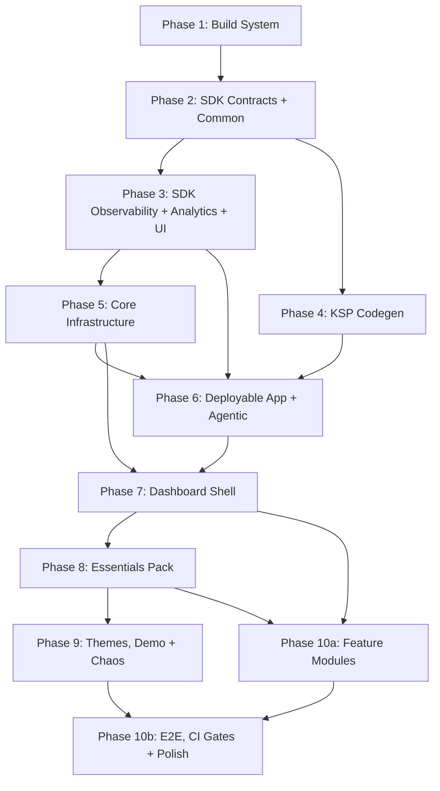

# Roadmap

> Phase index for GSD execution. Each phase maps to detailed deliverables in [MIGRATION.md](MIGRATION.md). Requirement IDs reference [REQUIREMENTS.md](REQUIREMENTS.md).

## Phase 1: Build System Foundation

**Goal:** Gradle infrastructure that all modules depend on. Nothing compiles without this. Stub `build.gradle.kts` for all modules — `settings.gradle.kts` is stable from Phase 1 onward.

**Requirements:** NF35 (build times)

**Success Criteria:**
1. `./gradlew tasks --console=plain` succeeds — all convention plugins resolve, all stub modules parse
2. `./gradlew :build-logic:convention:test` passes — Gradle TestKit configuration assertions (compileSdk/minSdk/targetSdk, Compose enabled where expected, Hilt wired, `dqxn.pack` dependency graph correct)
3. `./gradlew :pack:essentials:dependencies --configuration debugCompileClasspath` shows all `:sdk:*` modules with `implementation` scope
4. `./gradlew :lint-rules:test` passes — all 5 lint rules have positive/negative test cases
5. Version catalog contains all required dependency aliases (verified by assertion test)
6. Proto DataStore toolchain compatibility verified (throwaway module: `compileDebugKotlin` + generated files present)
7. EXTOL SDK throwaway: `assembleDebug` passes (or incompatibility recorded in `STATE.md`)
8. Pack stub compile: `./gradlew :pack:essentials:compileDebugKotlin` succeeds with `dqxn.pack`-wired deps
9. testFixtures throwaway: `testImplementation(testFixtures(project(":sdk:contracts")))` resolves in a consumer module
10. Compose throwaway: module with `dqxn.android.compose` + `@Composable` function compiles (AGP 9 Compose investigation resolved)
11. Spotless check: `./gradlew spotlessCheck` passes on all stub files

All convention plugins defined: `dqxn.android.application`, `dqxn.android.library`, `dqxn.android.compose`, `dqxn.android.hilt`, `dqxn.android.test`, `dqxn.pack`, `dqxn.snapshot`, `dqxn.android.feature`, `dqxn.kotlin.jvm`

**Details:** [MIGRATION.md — Phase 1](MIGRATION.md#phase-1-build-system-foundation)

---

## Phase 2: SDK Contracts + Common

**Goal:** Complete `:sdk:contracts` type surface and `:sdk:common` utilities. Every type that lives in `:sdk:contracts` is defined here — downstream phases consume but never modify it. Biggest architectural transformation: old untyped `DataSnapshot(Map<String, Any?>)` becomes typed `@DashboardSnapshot` subtypes with `KClass`-keyed `WidgetData`.

**Requirements:** F2.1, F2.2, F2.4 (contracts only — rendering in Phase 3), F2.5, F2.11, F2.12 (annotations only — KSP processor in Phase 4), F2.16, F2.19, F2.20, F3.1, F3.2, F3.3, F3.4, F3.5, F3.6, F3.8, F8.3, F9.1–F9.4 (notification type definitions — coordinator implementation in Phase 7)

**Key design decisions:**
- `:sdk:common` is an Android library with Hilt (not pure Kotlin) — `DispatcherModule` requires `@InstallIn(SingletonComponent::class)`
- `:sdk:contracts` uses `compileOnly(libs.compose.runtime)` for `@Composable`/`@Immutable` annotations only — no Compose compiler
- `SetupDefinition` subtypes use string icon names + declarative `ServiceType` enum (no `ImageVector`/`Context`)
- `EntitlementManager` minimal V1 — defer `purchaseProduct()`/`restorePurchases()` to post-launch
- `ThemeSpec` metadata interface only — full `DashboardThemeDefinition` with Compose types in Phase 3 (`:sdk:ui`)
- `WidgetRegistry` and `DataProviderRegistry` interfaces defined here — implementations in Phase 7
- `ProviderPriority` enum (HARDWARE, DEVICE_SENSOR, NETWORK, SIMULATED) on `DataProviderSpec`
- `ActionableProvider` marker interface + `UnitSnapshot` sentinel for action-only providers

**Success Criteria:**
1. `./gradlew :sdk:contracts:compileDebugKotlin` — Kotlin compilation succeeds with `compileOnly(compose.runtime)` resolving
2. `./gradlew :sdk:contracts:assembleDebug` — Android library artifact produced
3. `./gradlew :sdk:common:assembleDebug` — common module compiles with Hilt
4. `WidgetData` multi-slot unit tests pass (slot insertion, retrieval, type safety, jqwik accumulation properties)
5. `Gated.isAccessible()` logic tests pass (null/empty = free, OR-logic)
6. `SettingDefinition` construction and constraint validation tests pass for all 12 subtypes
7. `AppResult<T>` tests pass (9 ported + expanded `onSuccess`/`onFailure`/`errorOrNull`)
8. `ConnectionStateMachineTest` passes — 8 ported + exhaustive 6×7 transition matrix + 5 jqwik property-based tests
9. `ProviderFault` transformation tests pass (7 variants + `TestDataProvider` mid-stream injection)
10. `WidgetRendererContractTest` (14 assertions) and `DataProviderContractTest` (12 assertions) abstract classes in testFixtures produce a JAR
11. Concrete `TestWidgetRendererContractTest` and `TestDataProviderContractTest` execute in Phase 2 — validates abstract test bases run, not just compile
12. testFixtures consumer verification: throwaway `testImplementation(testFixtures(project(":sdk:contracts")))` import succeeds — catches JAR packaging issues 6 phases before Phase 8
13. Test output XML present in `build/test-results/` — confirms JUnit5 platform actually executed (catches silent test skip under AGP 9.0.1)

**Depends on:** Phase 1

**Details:** [MIGRATION.md — Phase 2](MIGRATION.md#phase-2-sdk-contracts--common)

---

## Phase 3: SDK Observability + Analytics + UI

**Goal:** Remaining SDK modules. Observability foundation for all autonomous debugging. `:sdk:ui` defines `DashboardThemeDefinition` (Compose types for theme rendering) and `WidgetContainer` skeleton.

**Requirements:** F12.1, F13.5, F13.6, F13.7, NF36

**Success Criteria:**
1. `:sdk:observability`, `:sdk:analytics`, `:sdk:ui` compile
2. `DqxnLogger` disabled-path zero-allocation test passes
3. `MetricsCollector` ring buffer, `JankDetector` threshold, `CrashEvidenceWriter` persistence, `AnrWatchdog` detection, `DiagnosticSnapshotCapture` rotation pool tests all pass
4. `WidgetContainer` composition tests pass
5. `CrashReporter` and `ErrorReporter` interfaces defined in `:sdk:observability` with `ErrorContext` sealed hierarchy

**Depends on:** Phase 2
**Concurrent with:** Phase 4

**Details:** [MIGRATION.md — Phase 3](MIGRATION.md#phase-3-sdk-observability--analytics--ui)

---

## Phase 4: KSP Codegen

**Goal:** Build-time code generation for pack discovery and agentic command wiring.

**Requirements:** F2.12 (KSP processing), F3.8 (KSP processing)

**Success Criteria:**
1. `:codegen:plugin` and `:codegen:agentic` compile (both pure JVM via `dqxn.kotlin.jvm`)
2. KSP compile-testing: valid `@DashboardWidget` generates `PackManifest` + Hilt module
3. KSP compile-testing: invalid `typeId`, missing `@Immutable`, duplicate `dataType` produce compilation errors
4. `dqxn.pack` applied to stub module resolves expected `:sdk:*` dependency graph (if Phase 3 complete; otherwise defer verification to Phase 6)

**Depends on:** Phase 2
**Concurrent with:** Phase 3

**Details:** [MIGRATION.md — Phase 4](MIGRATION.md#phase-4-ksp-codegen)

---

## Phase 5: Core Infrastructure

**Goal:** Shell internals that features depend on but packs never touch. Proto DataStore schemas, theme engine, thermal management, Firebase implementations.

**Requirements:** F4.1, F4.2, F4.3, F4.4, F4.5, F7.1, F7.2, F7.3, F7.4, F7.5, F7.8, F7.12, NF12, NF13, NF43

**Success Criteria:**
1. `:core:design`, `:core:thermal`, `:data`, `:core:firebase` compile
2. Thermal state transition tests pass (`FakeThermalManager` flow emission)
3. DataStore corruption recovery tests pass (all instances have `ReplaceFileCorruptionHandler`)
4. Layout serialization round-trip tests pass (Proto DataStore) — `DashboardWidgetInstance`, `GridPosition`, `GridSize` survive serialize/deserialize
5. `ThemeAutoSwitchEngine` tests pass with late-binding inputs
6. Repository interfaces (`LayoutRepository`, `UserPreferencesRepository`, `PairedDeviceStore`, `ProviderSettingsStore`, `WidgetStyleStore`) all compile with implementations

**Depends on:** Phase 3

**Details:** [MIGRATION.md — Phase 5](MIGRATION.md#phase-5-core-infrastructure)

---

## Phase 6: Deployable App + Agentic Framework

**Goal:** First deployable APK with agentic debug framework. Every subsequent phase can deploy to device and use `adb shell content call` for autonomous debugging.

**Requirements:** F1.1, F1.13, F1.23, F13.2, F13.4, F13.5, F13.8, F13.9, F13.11, NF20, NF21, NF22, NF23 (BT permission flag in manifest)

**Success Criteria:**
1. `./gradlew :app:installDebug` succeeds — blank canvas renders without crash
2. `adb shell content call --uri content://app.dqxn.android.debug.agentic --method list-commands` returns handler schema
3. `trigger-anomaly` creates diagnostic snapshot; `diagnose-crash` returns crash evidence
4. `./gradlew assembleRelease` succeeds — R8-processed APK installs without `ClassNotFoundException`
5. CI pipeline running `./gradlew assembleDebug test lintDebug`
6. Empty multibinding sets (`Set<WidgetRenderer>`, `Set<DataProvider<*>>`, `Set<ThemeProvider>`, `Set<DataProviderInterceptor>`, `Set<PackManifest>`) resolve — app starts with zero packs

**Depends on:** Phases 4, 5

**Details:** [MIGRATION.md — Phase 6](MIGRATION.md#phase-6-deployable-app--agentic-framework)

---

## Phase 7: Dashboard Shell

**Goal:** Decompose the god-ViewModel into coordinators. Structural transformation, not porting. Highest-risk phase. Overlay composables deferred to Phase 10a — agentic commands provide mutation paths for validation.

**Requirements:** F1.2-F1.17, F1.20-F1.21, F1.23, F1.26-F1.30, F2.3-F2.14, F2.16, F2.18-F2.20, F3.7, F3.9-F3.11, F3.14, F3.15, F9.1-F9.4, F10.4 (touch targets — 76dp in dashboard context), F10.9, NF1-NF8, NF15-NF19, NF38, NF41, NF42

**Success Criteria:**
1. Six coordinators (Layout, EditMode, Theme, WidgetBinding, Notification, Profile) unit tests pass
2. `DashboardViewModel` routes `DashboardCommand` to correct coordinator
3. `DashboardTestHarness` with real coordinators: `AddWidget` → `WidgetBindingCoordinator` creates job → reports ACTIVE
4. Safe mode trigger: 4 crashes in 60s rolling window activates safe mode (cross-widget counting)
5. `dump-semantics` returns widget nodes with test tags after `DashboardLayer` registration
6. On-device: `dump-layout`, `dump-health`, `get-metrics` return valid data
7. `NotificationCoordinator` re-derives banners from singleton state after ViewModel kill
8. `ProfileCoordinator` handles profile create/switch/clone/delete with per-profile canvas independence
9. Content-aware resize preview: `LocalWidgetPreviewUnits` feeds target dimensions during resize gesture

**Depends on:** Phases 5, 6

**Details:** [MIGRATION.md — Phase 7](MIGRATION.md#phase-7-dashboard-shell)

---

## Phase 8: Essentials Pack (Architecture Validation Gate)

**Goal:** First pack migration. Proves entire SDK-to-Pack contract works end-to-end. Cross-boundary snapshot types live in `:pack:essentials:snapshots` sub-module (using `dqxn.snapshot` plugin from Phase 1). Includes 4 greenfield providers (GpsSpeed, Battery, Accelerometer, SpeedLimit).

**Requirements:** F5.1-F5.11, NF14 (sensor batching for greenfield providers)

**Success Criteria (all four required before Phase 9):**
1. **Contract tests green:** 13 widgets pass `WidgetRendererContractTest`, 9 typed data providers pass `DataProviderContractTest` (`CallActionProvider` excluded — implements `ActionableProvider`)
2. **Multi-snapshot wiring:** `SpeedometerRenderer` receives data from 3 providers (Speed + Acceleration + SpeedLimit) via `merge()+scan()` accumulation
3. **End-to-end wiring:** On-device `add-widget` + `dump-health` for each of 13 widget types shows ACTIVE; `query-semantics` confirms visible nodes with non-empty `contentDescription`
4. **Stability soak:** 60-second soak with all 13 widgets — safe mode not triggered
5. **Regression gate:** All Phase 2-7 tests pass with `:pack:essentials` in dependency graph

**Depends on:** Phase 7

**Details:** [MIGRATION.md — Phase 8](MIGRATION.md#phase-8-free-pack-architecture-validation-gate)

---

## Phase 9: Themes, Demo + Chaos

**Goal:** Themes pack, demo pack (deterministic stub providers), chaos testing infrastructure. sg-erp2 contingent on EXTOL SDK compatibility.

**Requirements:** F6.1-F6.4, F13.1

**Success Criteria:**
1. All pack widgets pass contract tests; all providers pass contract tests
2. Demo pack: 8 deterministic stub providers with `ProviderPriority.SIMULATED`
3. `ChaosProviderInterceptor` + `inject-fault` → `list-diagnostics since=` produces correlated snapshot
4. Deterministic chaos: same seed → same fault sequence → same diagnostics
5. Connection state machine exhaustive transition tests pass (`:pack:sg-erp2` if EXTOL compatible)

**Depends on:** Phase 8

**Details:** [MIGRATION.md — Phase 9](MIGRATION.md#phase-9-themes-demo--chaos)

---

## Phase 10a: Feature Modules + Overlay UI

**Goal:** All overlay composables deferred from Phase 7 + feature modules (settings, diagnostics, onboarding). UI work building on coordinator APIs validated by Phase 8.

**Requirements:** F3.13 (provider health dashboard), F4.6-F4.10, F4.12-F4.13, F7.6, F7.7, F8.1-F8.3, F8.5, F8.7-F8.9, F11.1, F11.2, F11.5-F11.7, F12.2-F12.7, F13.3 (session recording), F14.2, F14.4, NF-D1-NF-D3, NF24-NF26, NF27-NF29, NF9, NF10

**Success Criteria:**
1. `OverlayNavHost` route table populated — navigate to each overlay, verify content renders, back navigation returns to dashboard
2. `SettingRowDispatcher` renders all 10 row types from `SettingDefinition` schema
3. `SetupSheet` navigation: multi-step setup with back, permission delegation, completion callback
4. Provider Health dashboard renders provider list with staleness indicators (F3.13)
5. Onboarding first-run flow: theme selection → permission requests → edit mode tour
6. `InlineColorPicker` color conversion tests pass (`colorToHsl`/`colorToHex`/`parseHexToColor`)

**Depends on:** Phases 7, 8

**Details:** [MIGRATION.md — Phase 10a](MIGRATION.md#phase-10a-feature-modules--overlay-ui)

---

## Phase 10b: E2E Integration, CI Gates + Polish

**Goal:** Full system integration testing, CI gate enforcement, performance validation, and launch polish.

**Requirements:** F13.10, NF-P1-NF-P5, NF30, NF32, NF33, NF34, NF39, NF40, NF45, NF46, NF-L1-NF-L3, NF-I1, NF-I2, NF11 (battery drain validation target), NF37 (background battery validation target)

**Success Criteria:**
1. Full E2E: launch → load → bind → render → edit → add/remove/resize → theme switch with semantics verification at each step
2. CI chaos gate: deterministic seed=42 → `assertChaosCorrelation()` passes
3. All 9 CI gates enforced (P50 <8ms, P95 <12ms, P99 <16ms, jank <2%, startup <1.5s, 0 unstable classes in app-owned modules, <=5 non-skippable in `:feature:dashboard`, >90% coordinator coverage, release smoke)
4. Multi-pack validation: essentials + themes + demo loaded simultaneously without conflicts
5. Battery drain < 5% /hour screen-on (NF11 — threshold TBD via baseline), near-zero background drain (NF37)
6. Baseline Profiles generated and included in release build
7. Export My Data (NF-P5): JSON export of all local DataStore data

**Depends on:** Phases 9, 10a

**Details:** [MIGRATION.md — Phase 10b](MIGRATION.md#phase-10b-e2e-integration-ci-gates--polish)

---

## Dependency Graph

Phases 3+4 run concurrently after Phase 2. Phase 6 gates all on-device work. Phase 8 is the architecture validation gate. Phase 10a (feature modules) starts after Phase 8 — settings/diagnostics/onboarding have no dependency on Phase 9's theme/demo/chaos work. Phase 10b (E2E integration, CI gates, polish) needs both Phase 9 (chaos correlation) and Phase 10a (all feature modules functional).
