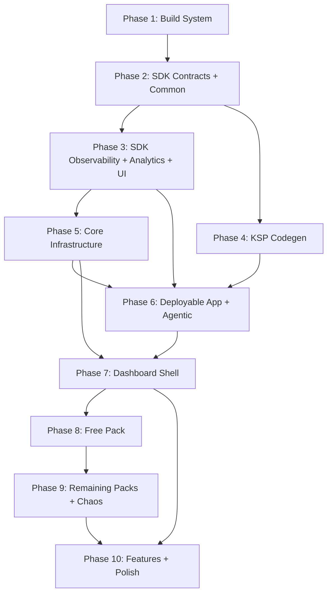

# Roadmap

> Phase index for GSD execution. Each phase maps to detailed deliverables in [MIGRATION.md](MIGRATION.md). Requirement IDs reference [REQUIREMENTS.md](REQUIREMENTS.md).

## Phase 1: Build System Foundation

**Goal:** Gradle infrastructure that all modules depend on. Nothing compiles without this.

**Requirements:** NF35 (build times)

**Success Criteria:**
1. `./gradlew tasks --console=plain` succeeds with all convention plugins resolving
2. Version catalog covers full dependency set (AGP 9.0.1, Kotlin 2.3+, Compose BOM, Hilt, KSP, Proto DataStore, JUnit5, etc.)
3. Proto DataStore toolchain compatibility verified (throwaway module)
4. All convention plugins defined: `dqxn.android.application`, `dqxn.android.library`, `dqxn.android.compose`, `dqxn.android.hilt`, `dqxn.android.test`, `dqxn.pack`, `dqxn.android.feature`

**Details:** [MIGRATION.md — Phase 1](MIGRATION.md#phase-1-build-system-foundation)

---

## Phase 2: SDK Contracts + Common

**Goal:** The API surface that every pack and feature module depends on. Biggest architectural transformation — old untyped contracts become typed.

**Requirements:** F2.1, F2.2, F2.4, F2.12, F2.16, F2.19, F2.20, F3.1, F3.2, F3.3, F3.4, F3.5, F3.6, F3.8, F8.3

**Success Criteria:**
1. `:sdk:contracts` and `:sdk:common` compile
2. `WidgetRendererContractTest` and `DataProviderContractTest` abstract classes in testFixtures produce a JAR
3. `ConnectionStateMachineTest` passes (including jqwik property-based tests)
4. `ProviderFault` transformation tests pass

**Depends on:** Phase 1

**Details:** [MIGRATION.md — Phase 2](MIGRATION.md#phase-2-sdk-contracts--common)

---

## Phase 3: SDK Observability + Analytics + UI

**Goal:** Remaining SDK modules. Observability foundation for all autonomous debugging.

**Requirements:** F12.1, F13.5, F13.6, F13.7, NF36

**Success Criteria:**
1. `:sdk:observability`, `:sdk:analytics`, `:sdk:ui` compile
2. `DqxnLogger` disabled-path zero-allocation test passes
3. `MetricsCollector` ring buffer, `JankDetector` threshold, `CrashEvidenceWriter` persistence, `AnrWatchdog` detection, `DiagnosticSnapshotCapture` rotation pool tests all pass
4. `WidgetScaffold` composition tests pass

**Depends on:** Phase 2
**Concurrent with:** Phase 4

**Details:** [MIGRATION.md — Phase 3](MIGRATION.md#phase-3-sdk-observability--analytics--ui)

---

## Phase 4: KSP Codegen

**Goal:** Build-time code generation for pack discovery and agentic command wiring.

**Requirements:** F2.12 (KSP processing), F3.8 (KSP processing)

**Success Criteria:**
1. `:codegen:plugin` and `:codegen:agentic` compile
2. KSP compile-testing: valid `@DashboardWidget` generates `PackManifest` + Hilt module
3. KSP compile-testing: invalid `typeId`, missing `@Immutable`, duplicate `dataType` produce compilation errors
4. `dqxn.pack` applied to stub module resolves expected `:sdk:*` dependency graph

**Depends on:** Phase 2
**Concurrent with:** Phase 3

**Details:** [MIGRATION.md — Phase 4](MIGRATION.md#phase-4-ksp-codegen)

---

## Phase 5: Core Infrastructure

**Goal:** Shell internals that features depend on but packs never touch.

**Requirements:** F4.1, F4.2, F4.3, F4.4, F4.5, F7.1, F7.2, F7.3, F7.4, F7.5, F7.8, F7.12, NF12, NF13, NF43

**Success Criteria:**
1. `:core:design`, `:core:thermal`, `:data`, `:core:firebase` compile
2. Thermal state transition tests pass (`FakeThermalManager` flow emission)
3. DataStore corruption recovery tests pass (all instances have `ReplaceFileCorruptionHandler`)
4. Layout serialization round-trip tests pass (Proto DataStore)

**Depends on:** Phase 3

**Details:** [MIGRATION.md — Phase 5](MIGRATION.md#phase-5-core-infrastructure)

---

## Phase 6: Deployable App + Agentic Framework

**Goal:** First deployable APK with agentic debug framework. Every subsequent phase can deploy to device and use `adb shell content call` for autonomous debugging.

**Requirements:** F1.1, F1.13, F1.23, F13.2, F13.4, F13.5, F13.8, F13.9, F13.11, NF20, NF21, NF22

**Success Criteria:**
1. `./gradlew :app:installDebug` succeeds — blank canvas renders without crash
2. `adb shell content call --uri content://app.dqxn.android.debug.agentic --method list-commands` returns handler schema
3. `trigger-anomaly` creates diagnostic snapshot; `diagnose-crash` returns crash evidence
4. `./gradlew assembleRelease` succeeds — R8-processed APK installs without `ClassNotFoundException`
5. CI pipeline running `./gradlew assembleDebug test lintDebug`

**Depends on:** Phases 4, 5

**Details:** [MIGRATION.md — Phase 6](MIGRATION.md#phase-6-deployable-app--agentic-framework)

---

## Phase 7: Dashboard Shell

**Goal:** Decompose the god-ViewModel into coordinators. Structural transformation, not porting. Highest-risk phase.

**Requirements:** F1.2-F1.12, F1.14-F1.22, F1.24-F1.31, F2.3-F2.18, F3.7, F3.9-F3.11, F3.14, F3.15, F7.9, F9.1-F9.4, F10.4, F10.9, NF1-NF10, NF15-NF19, NF38, NF41, NF42

**Success Criteria:**
1. Five coordinators (Layout, EditMode, Theme, Binding, WidgetStatus) unit tests pass
2. `DashboardTestHarness` with real coordinators: `AddWidget` → `BindingCoordinator` creates job → `WidgetStatusCoordinator` reports ACTIVE
3. Safe mode trigger: 4 crashes in 60s rolling window activates safe mode
4. `dump-semantics` returns widget nodes with test tags after `DashboardLayer` registration
5. On-device: `dump-layout`, `dump-health`, `get-metrics` return valid data

**Depends on:** Phases 5, 6

**Details:** [MIGRATION.md — Phase 7](MIGRATION.md#phase-7-dashboard-shell)

---

## Phase 8: Free Pack (Architecture Validation Gate)

**Goal:** First pack migration. Proves entire SDK-to-Pack contract works end-to-end.

**Requirements:** F5.1-F5.11

**Success Criteria (all four required before Phase 9):**
1. **Contract tests green:** 11 widgets pass `WidgetRendererContractTest`, 7 providers pass `DataProviderContractTest`
2. **End-to-end wiring:** On-device `add-widget` + `dump-health` for each widget type shows ACTIVE; `query-semantics` confirms visible nodes
3. **Stability soak:** 60-second soak with all 11 widgets — safe mode not triggered
4. **Regression gate:** All Phase 2-7 tests pass with `:pack:free` in dependency graph

**Depends on:** Phase 7

**Details:** [MIGRATION.md — Phase 8](MIGRATION.md#phase-8-free-pack-architecture-validation-gate)

---

## Phase 9: Remaining Packs + Chaos

**Goal:** Plus pack, themes pack, demo pack, chaos testing infrastructure.

**Requirements:** F5B.1-F5B.5, F6.1-F6.4, F13.1

**Success Criteria:**
1. All pack widgets pass contract tests; all providers pass contract tests
2. `ChaosProviderInterceptor` + `inject-fault` → `list-diagnostics since=` produces correlated snapshot
3. Deterministic chaos: same seed → same fault sequence → same diagnostics
4. Connection state machine exhaustive transition tests pass (`:pack:sg-erp2` if EXTOL compatible)

**Depends on:** Phase 8

**Details:** [MIGRATION.md — Phase 9](MIGRATION.md#phase-9-remaining-packs--chaos)

---

## Phase 10: Remaining Features + Polish

**Goal:** Settings, diagnostics, onboarding, entitlements, CI gates, full E2E integration.

**Requirements:** F4.6-F4.13, F7.6, F7.7, F7.10, F7.11, F8.1, F8.2, F8.4-F8.10, F11.1-F11.7, F12.2-F12.7, F13.3, F13.10, F14.1-F14.4, NF-P1-NF-P5, NF-D1-NF-D3, NF24-NF26, NF27-NF29, NF30-NF33, NF34, NF39, NF40, NF44-NF47, NF-L1-NF-L3, NF-I1, NF-I2, NF9, NF10

**Success Criteria:**
1. Full E2E: launch → load → bind → render → edit → add/remove/resize → theme switch with semantics verification at each step
2. CI chaos gate: deterministic seed=42 → `assertChaosCorrelation()` passes
3. All 9 CI gates enforced (P50 <8ms, P95 <12ms, P99 <16ms, jank <2%, startup <1.5s, 0 unstable classes, <=5 non-skippable, >90% coordinator coverage, release smoke)
4. Settings, diagnostics, onboarding feature modules functional

**Depends on:** Phases 7, 9

**Details:** [MIGRATION.md — Phase 10](MIGRATION.md#phase-10-remaining-features--polish)

---

## Dependency Graph

Phases 3+4 run concurrently after Phase 2. Phase 6 gates all on-device work. Phase 8 is the architecture validation gate.
