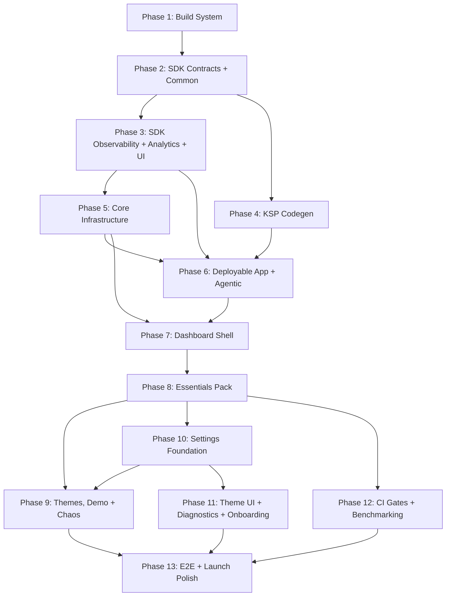

# Roadmap

> Phase index for GSD execution. Each phase maps to detailed deliverables in [MIGRATION.md](MIGRATION.md). Requirement IDs reference [REQUIREMENTS.md](REQUIREMENTS.md).

## Phase 1: Build System Foundation

**Goal:** Gradle infrastructure that all modules depend on. Nothing compiles without this. Stub `build.gradle.kts` for all modules — `settings.gradle.kts` is stable from Phase 1 onward.

**Requirements:** F13.10, NF27, NF28, NF35

**Success Criteria:**
1. `./gradlew tasks --console=plain` succeeds — all convention plugins resolve, all stub modules parse
2. `./gradlew :build-logic:convention:test` passes — Gradle TestKit configuration assertions (compileSdk/minSdk/targetSdk, Compose enabled where expected, Hilt wired, `dqxn.pack` dependency graph correct)
3. `./gradlew :pack:essentials:dependencies --configuration debugCompileClasspath` shows all `:sdk:*` modules with `implementation` scope
4. `./gradlew :lint-rules:test` passes — all 5 lint rules have positive/negative test cases
5. Version catalog contains all required dependency aliases (verified by assertion test)
6. Proto DataStore toolchain compatibility verified (throwaway module: `compileDebugKotlin` + generated files present)
7. EXTOL SDK throwaway: `assembleDebug` passes (or incompatibility recorded in `STATE.md`)
8. Pack stub compile: `./gradlew :pack:essentials:compileDebugKotlin` succeeds with `dqxn.pack`-wired deps
9. testFixtures throwaway: `testImplementation(testFixtures(project(":sdk:contracts")))` resolves in a consumer module
10. Compose throwaway: module with `dqxn.android.compose` + `@Composable` function compiles (AGP 9 Compose investigation resolved)
11. Spotless check: `./gradlew spotlessCheck` passes on all stub files

All convention plugins defined: `dqxn.android.application`, `dqxn.android.library`, `dqxn.android.compose`, `dqxn.android.hilt`, `dqxn.android.test`, `dqxn.pack`, `dqxn.snapshot`, `dqxn.android.feature`, `dqxn.kotlin.jvm`

**Plans:** 4/4 plans complete

Plans:
- [x] 01-01-PLAN.md — Gradle infrastructure + version catalog + all 9 convention plugins
- [x] 01-02-PLAN.md — Module stubs + settings.gradle.kts + Spotless formatting
- [x] 01-03-PLAN.md — Custom lint rules (5 detectors + tests)
- [x] 01-04-PLAN.md — Gradle TestKit validation + throwaway toolchain checks

**Details:** [Phase 1 Details](migration/phase-01.md)

---

## Phase 2: SDK Contracts + Common

**Goal:** Complete `:sdk:contracts` type surface and `:sdk:common` utilities. Every type that lives in `:sdk:contracts` is defined here — downstream phases consume but never modify it. Biggest architectural transformation: old untyped `DataSnapshot(Map<String, Any?>)` becomes typed `@DashboardSnapshot` subtypes with `KClass`-keyed `WidgetData`.

**Requirements:** F2.1, F2.2, F2.4, F2.5, F2.10, F2.11, F2.12, F2.16, F2.19, F2.20, F3.1, F3.2, F3.3, F3.4, F3.5, F3.6, F3.8, F8.1, F8.3, F9.1-F9.4

**Key design decisions:**
- `:sdk:common` is an Android library with Hilt (not pure Kotlin) — `DispatcherModule` requires `@InstallIn(SingletonComponent::class)`
- `:sdk:contracts` uses `compileOnly(libs.compose.runtime)` for `@Composable`/`@Immutable` annotations only — no Compose compiler
- `SetupDefinition` subtypes use string icon names + declarative `ServiceType` enum (no `ImageVector`/`Context`)
- `EntitlementManager` minimal V1 — defer `purchaseProduct()`/`restorePurchases()` to post-launch
- `ThemeSpec` metadata interface only — full `DashboardThemeDefinition` with Compose types in Phase 3 (`:sdk:ui`)
- `WidgetRegistry` and `DataProviderRegistry` interfaces defined here — implementations in Phase 7
- `ProviderPriority` enum (HARDWARE, DEVICE_SENSOR, NETWORK, SIMULATED) on `DataProviderSpec`
- `ActionableProvider` marker interface + `UnitSnapshot` sentinel for action-only providers

**Success Criteria:**
1. `./gradlew :sdk:contracts:compileDebugKotlin` — Kotlin compilation succeeds with `compileOnly(compose.runtime)` resolving
2. `./gradlew :sdk:contracts:assembleDebug` — Android library artifact produced
3. `./gradlew :sdk:common:assembleDebug` — common module compiles with Hilt
4. `WidgetData` multi-slot unit tests pass (slot insertion, retrieval, type safety, jqwik accumulation properties)
5. `Gated.isAccessible()` logic tests pass (null/empty = free, OR-logic)
6. `SettingDefinition` construction and constraint validation tests pass for all 12 subtypes
7. `AppResult<T>` tests pass (9 ported + expanded `onSuccess`/`onFailure`/`errorOrNull`)
8. `ConnectionStateMachineTest` passes — 8 ported + exhaustive 6×7 transition matrix + 5 jqwik property-based tests
9. `ProviderFault` transformation tests pass (7 variants + `TestDataProvider` mid-stream injection)
10. `WidgetRendererContractTest` (14 assertions) and `DataProviderContractTest` (12 assertions) abstract classes in testFixtures produce a JAR
11. Concrete `TestWidgetRendererContractTest` and `TestDataProviderContractTest` execute in Phase 2 — validates abstract test bases run, not just compile
12. testFixtures consumer verification: throwaway `testImplementation(testFixtures(project(":sdk:contracts")))` import succeeds — catches JAR packaging issues 6 phases before Phase 8
13. Test output XML present in `build/test-results/` — confirms JUnit5 platform actually executed (catches silent test skip under AGP 9.0.1)

**Plans:** 5 plans

Plans:
- [ ] 02-01-PLAN.md — `:sdk:common` types + tests (dispatcher qualifiers, AppResult, ConnectionStateMachine, FlowExtensions)
- [ ] 02-02-PLAN.md — `:sdk:contracts` build config + widget/provider/entitlement/annotation/fault types
- [ ] 02-03-PLAN.md — `:sdk:contracts` setup/settings/notification/status/theme/pack/registry types
- [ ] 02-04-PLAN.md — `:sdk:contracts` unit tests (WidgetData, Gated, SettingDefinition, SetupDefinition, ProviderFault)
- [ ] 02-05-PLAN.md — `:sdk:contracts` testFixtures + contract test bases + concrete validation tests

**Depends on:** Phase 1

**Replication Advisory:** §7 (setup/setting definition schemas, three-layer visibility, evaluator semantics, type-prefixed serialization).

**Details:** [Phase 2 Details](migration/phase-02.md)

---

## Phase 3: SDK Observability + Analytics + UI

**Goal:** Remaining SDK modules. Observability foundation for all autonomous debugging. `:sdk:ui` defines `DashboardThemeDefinition` (Compose types for theme rendering) and `WidgetContainer` skeleton.

**Requirements:** F12.1, F13.5, F13.6, F13.7, NF36

**Success Criteria:**
1. `:sdk:observability`, `:sdk:analytics`, `:sdk:ui` compile
2. `DqxnLogger` disabled-path zero-allocation test passes
3. `MetricsCollector` ring buffer, `JankDetector` threshold, `CrashEvidenceWriter` persistence, `AnrWatchdog` detection, `DiagnosticSnapshotCapture` rotation pool tests all pass
4. `WidgetContainer` composition tests pass
5. `CrashReporter` and `ErrorReporter` interfaces defined in `:sdk:observability` with `ErrorContext` sealed hierarchy
6. `InfoCardLayout` tests pass (ported from `core:widget-primitives` — 536 lines, used by 5+ widgets in Phase 8). `SizeOption.toMultiplier()` mapping and normalization calc per layout mode verified
7. `EnumSetting.optionPreviews` replacement mechanism defined (registry or extension pattern for packs to register preview composables)

**Note:** Observability is entirely greenfield — no prior implementation exists in the old codebase.

**Plans:** 3/3 plans complete

Plans:
- [x] 03-01-PLAN.md — Observability primitives: logging, sinks, tracing, crash interfaces, CrashEvidenceWriter, LongArrayRingBuffer
- [ ] 03-02-PLAN.md — MetricsCollector, JankDetector, DiagnosticSnapshotCapture, AnrWatchdog, WidgetHealthMonitor, analytics contracts
- [x] 03-03-PLAN.md — `:sdk:ui`: DashboardThemeDefinition, WidgetContainer, InfoCardLayout, CompositionLocals, EnumPreviewRegistry

**Depends on:** Phase 2
**Concurrent with:** Phase 4

**Replication Advisory:** §5 (6-token color model for DashboardThemeDefinition, emphasis levels, gap: add error/warning/success tokens).

**Details:** [Phase 3 Details](migration/phase-03.md)

---

## Phase 4: KSP Codegen

**Goal:** Build-time code generation for pack discovery and agentic command wiring.

**Requirements:** F2.12, F3.8

**Success Criteria:**
1. `:codegen:plugin` and `:codegen:agentic` compile (both pure JVM via `dqxn.kotlin.jvm`)
2. KSP compile-testing: valid `@DashboardWidget` generates `PackManifest` + Hilt module
3. KSP compile-testing: invalid `typeId`, missing `@Immutable`, duplicate `dataType` produce compilation errors
4. `dqxn.pack` applied to stub module resolves expected `:sdk:*` dependency graph (if Phase 3 complete; otherwise defer verification to Phase 6)

**Plans:** 3/3 plans complete

Plans:
- [ ] 04-01-PLAN.md — `:codegen:plugin` build infrastructure + KSP processor implementation (hub, handlers, generators, validators)
- [ ] 04-02-PLAN.md — `:codegen:plugin` compile-testing (20 tests: positive + negative paths)
- [ ] 04-03-PLAN.md — `:codegen:agentic` processor implementation + compile-testing

**Depends on:** Phase 2
**Concurrent with:** Phase 3

**Details:** [Phase 4 Details](migration/phase-04.md)

---

## Phase 5: Core Infrastructure

**Goal:** Shell internals that features depend on but packs never touch. Proto DataStore schemas, theme engine, thermal management, Firebase implementations.

**Requirements:** F4.1, F4.2, F4.3, F4.4, F4.5, F7.1, F7.2, F7.3, F7.4, F7.5, F7.7, F7.8, F7.12, NF12, NF13, NF43

**Success Criteria:**
1. `:core:design`, `:core:thermal`, `:data`, `:core:firebase` compile
2. Thermal state transition tests pass (`FakeThermalManager` flow emission)
3. DataStore corruption recovery tests pass (all instances have `ReplaceFileCorruptionHandler`)
4. Layout serialization round-trip tests pass (Proto DataStore) — `DashboardWidgetInstance`, `GridPosition`, `GridSize` survive serialize/deserialize
5. `ThemeAutoSwitchEngine` tests pass with late-binding inputs
6. Repository interfaces (`LayoutRepository`, `UserPreferencesRepository`, `PairedDeviceStore`, `ProviderSettingsStore`, `WidgetStyleStore`) all compile with implementations
7. `LayoutRepository` CRUD tests pass — profile create/clone/switch/delete lifecycle, debounced save batching
8. `ProviderSettingsStore` namespaced key format tests pass — `{packId}:{providerId}:{key}` isolation verified
9. Schema migration tests pass — v1→v2 preserves widget positions, chained migration, failure → fallback
10. `PresetLoader` region heuristic and fallback layout tests pass
11. `FramePacer` API branching tests pass (API 34+ vs 31-33 paths)

**Plans:** 5 plans

Plans:
- [ ] 05-01-PLAN.md — Proto DataStore schemas + thermal management module
- [ ] 05-02-PLAN.md — Firebase isolation module (CrashReporter, AnalyticsTracker, PerformanceTracer)
- [ ] 05-03-PLAN.md — `:data` infrastructure + LayoutRepository + UserPreferencesRepository
- [ ] 05-04-PLAN.md — `:data` remaining stores (ProviderSettings, PairedDevice, ConnectionEvent, WidgetStyle) + PresetLoader
- [ ] 05-05-PLAN.md — `:core:design` tokens, motion, ThemeJsonParser, ThemeAutoSwitchEngine

**Depends on:** Phase 3

**Replication Advisory:** §3 (ThemeAutoSwitchEngine modes), §4 (spring configs + named transitions to core:design), §5 (spacing/typography/radii/emphasis to core:design — fix known inconsistencies).

**Details:** [Phase 5 Details](migration/phase-05.md)

---

## Phase 6: Deployable App + Agentic Framework

**Goal:** First deployable APK with agentic debug framework. Every subsequent phase can deploy to device and use `adb shell content call` for autonomous debugging.

**Requirements:** F1.1, F1.13, F1.23, F13.2, F13.4, F13.5, F13.8, F13.9, F13.11, NF20, NF21, NF22, NF23

**Success Criteria:**
1. `./gradlew :app:installDebug` succeeds — blank canvas renders without crash
2. `adb shell content call --uri content://app.dqxn.android.debug.agentic --method list-commands` returns handler schema
3. `trigger-anomaly` creates diagnostic snapshot; `diagnose-crash` returns crash evidence
4. `./gradlew assembleRelease` succeeds — R8-processed APK installs without `ClassNotFoundException`
5. CI pipeline running `./gradlew assembleDebug test lintDebug`
6. Empty multibinding sets (`Set<WidgetRenderer>`, `Set<DataProvider<*>>`, `Set<ThemeProvider>`, `Set<DataProviderInterceptor>`, `Set<PackManifest>`) resolve — app starts with zero packs
7. `ping` command returns `{"status":"ok"}` — E2E startup probe verified
8. `dump-state` command returns aggregated layout + health + widget statuses (available from Phase 7 when coordinators land)

**Plans:** 4/4 plans complete

Plans:
- [x] 06-01-PLAN.md — `:core:agentic` infrastructure (annotation, handler interface, router, semantics holder)
- [x] 06-02-PLAN.md — `:app` shell (Application, Activity, AppModule DI, CrashRecovery, AlertSoundManager, manifest)
- [x] 06-03-PLAN.md — AgenticContentProvider transport + 16 diagnostic command handlers
- [x] 06-04-PLAN.md — Debug overlays + R8 release validation + validation pipeline doc

**Depends on:** Phases 3, 4, 5 (Phase 3 direct: `:app` imports `:sdk:observability`, `:sdk:analytics`, `:sdk:ui`)

**Details:** [Phase 6 Details](migration/phase-06.md)

---

## Phase 7: Dashboard Shell

**Goal:** Decompose the god-ViewModel into coordinators. Structural transformation, not porting. Highest-risk phase. Overlay composables deferred to Phase 10 — agentic commands provide mutation paths for validation.

**Requirements:** F1.2-F1.17, F1.20-F1.21, F1.26-F1.30, F2.3-F2.6, F2.10-F2.14, F2.16, F2.18-F2.20, F3.7, F3.9-F3.11, F3.14, F3.15, F9.1-F9.4, F10.4, F10.7, F10.9, NF1-NF8, NF15-NF19, NF38, NF39, NF41, NF42, NF45, NF46, NF-L1

**Success Criteria:**
1. Six coordinators (Layout, EditMode, Theme, WidgetBinding, Notification, Profile) unit tests pass
2. `DashboardViewModel` routes `DashboardCommand` to correct coordinator
3. `DashboardTestHarness` with real coordinators: `AddWidget` → `WidgetBindingCoordinator` creates job → reports ACTIVE
4. Safe mode trigger: ≥4 crashes in 60s rolling window activates safe mode (cross-widget counting)
5. `dump-semantics` returns semantics tree with `dashboard_grid` test tag after `DashboardLayer` registration (widget-specific node verification deferred to Phase 8)
6. On-device: `dump-layout`, `dump-health`, `get-metrics` return valid data
7. `NotificationCoordinator` re-derives banners from singleton state after ViewModel kill
8. `ProfileCoordinator` handles profile create/switch/clone/delete with per-profile canvas independence
9. Content-aware resize preview: `LocalWidgetPreviewUnits` feeds target dimensions during resize gesture
10. Reduced motion: `animator_duration_scale == 0` disables wiggle, replaces spring with instant transitions

**Plans:** 9 plans (7 original + 2 gap closure)

Plans:
- [x] 07-01-PLAN.md — Foundation types (DashboardCommand, LayoutCoordinator, GridPlacementEngine, SafeModeManager) + DashboardTestHarness testFixtures
- [x] 07-02-PLAN.md — ThemeCoordinator + DashboardHaptics + ReducedMotionHelper
- [x] 07-03-PLAN.md — EditModeCoordinator + WidgetGestureHandler + BlankSpaceGestureHandler + gesture types
- [x] 07-04-PLAN.md — WidgetBindingCoordinator + WidgetDataBinder + registries + StorageMonitor
- [x] 07-05-PLAN.md — ProfileCoordinator + NotificationCoordinator + DashboardModule Hilt wiring
- [x] 07-06-PLAN.md — DashboardGrid + WidgetSlot + DashboardLayer + UI composables (banner hosts, button bar, error fallback)
- [x] 07-07-PLAN.md — DashboardViewModel + DashboardScreen + OverlayNavHost + ProfilePageTransition + integration tests
- [ ] 07-08-PLAN.md — Gap closure: Wire WidgetBindingCoordinator into DashboardTestHarness + fix SC#3 assertion
- [ ] 07-09-PLAN.md — Gap closure: Reduced motion gating for add/remove transitions + profile pager + 3 integration tests

**Depends on:** Phases 5, 6

**Replication Advisory:** §1 (widget preview mode), §2 (jankless navigation), §3 (theme preview — coordinator state), §4 (widget-level animations), §6 (drag/snap/resize/gestures). Densest advisory coverage of any phase.

**Details:** [Phase 7 Details](migration/phase-07.md)

---

## Phase 8: Essentials Pack (Architecture Validation Gate)

**Goal:** First pack migration. Proves entire SDK-to-Pack contract works end-to-end. Cross-boundary snapshot types live in `:pack:essentials:snapshots` sub-module (using `dqxn.snapshot` plugin from Phase 1). **4 greenfield providers** (GpsSpeed, Battery, Accelerometer, SpeedLimit — none have old codebase equivalents: old speed came from OBU/EXTOL, no battery provider existed, no standalone accelerometer or user-configured speed limit provider).

**Requirements:** F5.1-F5.11, NF14, NF40, NF-I2, NF-P1

**Success Criteria (all four required before Phase 9):**
1. **Contract tests green:** 13 widgets pass `WidgetRendererContractTest`, 9 typed data providers pass `DataProviderContractTest` (`CallActionProvider` excluded — implements `ActionableProvider`)
2. **Multi-snapshot wiring:** `SpeedometerRenderer` receives data from 3 providers (Speed + Acceleration + SpeedLimit) via `merge()+scan()` accumulation
3. **End-to-end wiring:** On-device `add-widget` + `dump-health` for each of 13 widget types shows ACTIVE; `query-semantics` confirms visible nodes with non-empty `contentDescription`
4. **Stability soak:** 60-second soak with all 13 widgets — safe mode not triggered
5. **Regression gate:** All Phase 2-7 tests pass with `:pack:essentials` in dependency graph
6. **Widget-specific rendering tests:** At least one rendering behavior test per widget beyond contract base (e.g., speedometer arc angle, compass needle rotation)
7. **Greenfield provider tests:** GpsSpeedProvider, BatteryProvider, AccelerometerProvider, SpeedLimitProvider have provider-specific unit tests beyond DataProviderContractTest

**Plans:** 8 plans across 3 waves

Plans:
- [ ] 08-01-PLAN.md — Snapshot types (6 cross-boundary + 2 pack-local) + build config + WidgetScopeBypass lint rule
- [ ] 08-02-PLAN.md — Simple providers (Time, Orientation, AmbientLight, Battery) + RegionDetector
- [ ] 08-03-PLAN.md — Greenfield providers (GpsSpeed, Accelerometer, SpeedLimit, CallAction)
- [ ] 08-04-PLAN.md — Solar subsystem (SolarCalculator, IanaTimezoneCoordinates, 2 solar providers)
- [ ] 08-05-PLAN.md — Time-family widgets (Clock Digital, Clock Analog, 3 Dates, Battery, AmbientLight)
- [ ] 08-06-PLAN.md — Complex widgets (Compass, SpeedLimit Circle/Rect, Shortcuts, Solar)
- [ ] 08-07-PLAN.md — Speedometer (multi-slot) + theme JSON files (Slate, Minimalist)
- [ ] 08-08-PLAN.md — Integration verification + regression gate

**Depends on:** Phase 7

**Replication Advisory:** §7 (evaluator two-variant semantics, WidgetRenderState overlay states + scrim progressions, visibleWhen empty-map edge case).

**Details:** [Phase 8 Details](migration/phase-08.md)

---

## Phase 9: Themes, Demo + Chaos

**Goal:** Themes pack, demo pack (deterministic stub providers), chaos testing infrastructure. sg-erp2 contingent on EXTOL SDK compatibility.

**Requirements:** F6.1-F6.4, F8.5, F13.1

**Success Criteria:**
1. All pack widgets pass contract tests; all providers pass contract tests
2. Demo pack: 8 deterministic stub providers with `ProviderPriority.SIMULATED`
3. `ChaosProviderInterceptor` + `inject-fault` → `list-diagnostics since=` produces correlated snapshot
4. Deterministic chaos: same seed → same fault sequence → same diagnostics
5. Connection state machine exhaustive transition tests pass (`:pack:sg-erp2` if EXTOL compatible)

**Depends on:** Phases 8, 10 (SetupSheet UI required for sg-erp2 BLE device pairing)

**Details:** [Phase 9 Details](migration/phase-09.md)

---

## Phase 10: Settings Foundation + Setup UI

**Goal:** Schema-driven settings row system, widget/global settings, setup wizard UI, and widget picker. Foundation layer that all other overlay UI depends on. Deliberately sequenced before Phase 9 to unblock sg-erp2's BLE device pairing UI.

**Requirements:** F2.7, F2.8-F2.9, F3.3-F3.5, F3.14, F8.1, F8.7, F8.9, F10.4, F12.5, F14.2, F14.4, NF29

**Success Criteria:**
1. `SettingRowDispatcher` renders all 12 `SettingDefinition` subtypes, value changes propagate to `ProviderSettingsStore`
2. `SetupSheet` navigation: multi-step setup with back, permission delegation, `DeviceScanStateMachine` unit tests pass
3. `WidgetSettingsSheet` 3-tab navigation with schema rendering
4. `MainSettings` renders all 4 sections, `DeleteAllData` clears all DataStore instances
5. `WidgetPicker` displays grouped widgets with entitlement badges
6. Overlay navigation: Phase 10 routes (WidgetPicker, Settings, WidgetSettings, Setup) render and navigate back correctly

**Depends on:** Phase 8

**Replication Advisory:** §1 (preview dismissal), §2 (source-varying transitions, shared elements), §4 (route-level transitions), §5 (design system tokens), §7 (full setup flow, BLE state machine, pickers, dispatchers). Second-densest advisory coverage.

**Details:** [Phase 10 Details](migration/phase-10.md)

---

## Phase 11: Theme UI + Diagnostics + Onboarding

**Goal:** Three independent feature clusters built on Phase 10's settings row system: theme editing/selection UI, diagnostics module (`:feature:diagnostics`), and onboarding flow (`:feature:onboarding`). Completes all `OverlayNavHost` routes.

**Requirements:** F3.13, F4.6-F4.10, F4.12-F4.13, F7.6, F11.1, F11.2, F11.5-F11.7, F12.2-F12.4, F12.5, F12.6-F12.7, F13.3, NF-D1, NF-D3

**Success Criteria:**
1. All 7 `OverlayNavHost` routes populated — navigate to each, verify content renders, back navigation correct
2. `InlineColorPicker` color conversion tests pass (`colorToHsl`/`colorToHex`/`parseHexToColor`)
3. `ThemeSelector`: free-first ordering, preview timeout (60s → revert), entitlement lock icons
4. Provider Health dashboard renders provider list with staleness indicators (F3.13)
5. Onboarding first-run flow: analytics consent → disclaimer → theme selection → edit mode tour
6. Analytics event call sites: events fire after opt-in, suppressed before consent

**Depends on:** Phase 10

**Concurrent with:** Phase 9 (theme UI doesn't need `:pack:themes` to exist — works with free themes only)

**Replication Advisory:** §3 (theme/studio preview lifecycle, race condition fix, auto-save), §4 (route-level transitions for theme overlays).

**Details:** [Phase 11 Details](migration/phase-11.md)

---

## Phase 12: CI Gates + Benchmarking

**Goal:** Performance measurement infrastructure, Compose stability enforcement, CI gate configuration. Starts immediately after Phase 8 — no dependency on overlay UI or additional packs.

**Requirements:** NF1, NF9, NF10, NF34, NF35

**Success Criteria:**
1. Baseline Profiles generated and included in release build
2. `:benchmark` module: P50/P95/P99 frame times measured with 12 widgets
3. NF1 gate: P95 frame time < 16.67ms with 12 active widgets on target device
4. All 9 CI gates configured and enforced
4. Compose stability: 0 unstable classes in app-owned modules
5. APK size: base < 30MB verified
6. Mutation kill rate tracking configured (Pitest setup) — **not enforced as gate at V1**, tracked for post-launch enforcement

**Depends on:** Phase 8

**Concurrent with:** Phases 9, 10, 11

**Details:** [Phase 12 Details](migration/phase-12.md)

---

## Phase 13: E2E Integration + Launch Polish

**Goal:** Full system integration testing, chaos CI gate, performance soak, accessibility audit, privacy features, and app lifecycle features. The convergence point — everything works together.

**Requirements:** NF11, NF24, NF25, NF26, NF30, NF32, NF33, NF37, NF-D2, NF-I1, NF-L2, NF-L3, NF-P3, NF-P4, NF-P5

**Success Criteria:**
1. Full E2E: launch → load → bind → render → edit → add/remove/resize → theme switch → settings with semantics verification at each step
2. CI chaos gate: deterministic seed=42 → `assertChaosCorrelation()` passes
3. Multi-pack validation: essentials + themes + demo loaded simultaneously without conflicts
4. Battery drain < 5%/hour screen-on (NF11), near-zero background drain (NF37)
5. Export My Data (NF-P5): JSON export round-trip verified
6. WCAG AA contrast audit passes for all 24 themes
7. In-app update and review API integration tested with mock managers

**Depends on:** Phases 9, 11, 12

**Details:** [Phase 13 Details](migration/phase-13.md)

---

## Dependency Graph

Phases 3+4 concurrent after Phase 2. Phase 6 gates on-device work (depends on Phases 3, 4, 5 — Phase 3 is a direct dependency, not just transitive through 5). Phase 8 is the architecture validation gate and spawns three parallel streams: Phase 10 (settings/setup — unblocks sg-erp2), Phase 12 (CI/benchmarks — no UI dependency), and Phase 9 (depends on both Phase 8 directly for snapshot types and Phase 10 for SetupSheet). Phase 11 (theme UI, diagnostics, onboarding) follows Phase 10 and runs concurrent with Phase 9. Phase 13 is the convergence point.
