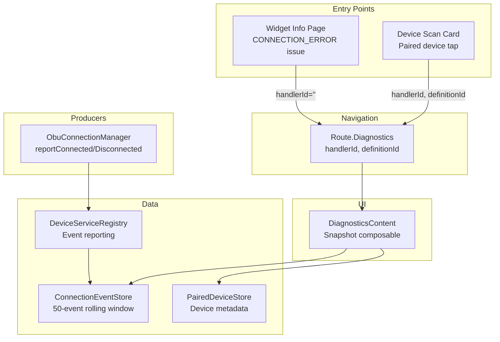

# Old Codebase: feature/driving & feature/diagnostics

**Analysis Date:** 2026-02-23

## Summary

Both `feature/driving/` and `feature/diagnostics/` are **empty module stubs** in the old codebase. They contain only `build.gradle.kts` and `AndroidManifest.xml` with no Kotlin source files. The actual diagnostics functionality lives entirely within `feature/dashboard/` as composables, and driving-specific code was never implemented.

---

## feature/driving

### Status: DEFERRED POST-LAUNCH. NOT MIGRATING FOR V1.

### What Exists

**Module:** `:feature:driving`
- **File:** `feature/driving/build.gradle.kts`
  ```kotlin
  plugins {
      alias(libs.plugins.dqxn.android.feature)
  }
  android {
      namespace = "app.dqxn.android.feature.driving"
  }
  ```
- **File:** `feature/driving/src/main/AndroidManifest.xml` — empty manifest stub
- **Included in:** `settings.gradle.kts` (line 31) and `app/build.gradle.kts` (line 87 — `implementation(project(":feature:driving"))`)
- **No source code whatsoever** — no `src/main/java/` or `src/main/kotlin/` directories with .kt files

### Dependencies

None beyond what `dqxn.android.feature` convention plugin provides.

### Old Codebase Driving-Related References

Zero actual driving mode code exists. A grep for `DrivingMode`, `DrivingSnapshot`, `DrivingModeDetector` across the entire old codebase returns **no results**. The word "driving" only appears in `DashboardGrid.kt` in comments about aspect ratio calculation ("Width is driving", "Height is driving") — unrelated to driving mode.

### Migration Notes

- **Decision:** `:core:driving` removed entirely for V1. Future driving mode is pack-provided, not core.
- **No code to migrate.** The module was a planned placeholder that was never populated.
- **Future reference:** If driving mode is implemented post-launch, it would be a pack module (`:pack:driving` or similar) providing `ProfileDescriptor` + `ProfileTrigger`, not a feature module.

---

## feature/diagnostics

### Status: MAPS TO `:feature:diagnostics` IN NEW ARCHITECTURE

### What Exists in the Module Stub

**Module:** `:feature:diagnostics`
- **File:** `feature/diagnostics/build.gradle.kts`
  ```kotlin
  plugins {
      alias(libs.plugins.dqxn.android.feature)
  }
  android {
      namespace = "app.dqxn.android.feature.diagnostics"
  }
  dependencies {
      implementation(project(":core:plugin-api"))
      implementation(project(":feature:packs:sg-erp2"))
  }
  ```
- **File:** `feature/diagnostics/src/main/AndroidManifest.xml` — empty manifest stub
- **Not included in `settings.gradle.kts`** — module was declared but never wired into the build
- **No source code**

### Actual Diagnostics Implementation (in feature/dashboard/)

All diagnostics functionality lives as composables within `feature/dashboard/setup/`:

#### 1. DiagnosticsContent Composable

**File:** `feature/dashboard/src/main/java/app/dqxn/android/feature/dashboard/setup/DiagnosticsContent.kt`

**Purpose:** Snapshot page (no ViewModel) showing device info, recent errors, and connection history for BLE devices. All data is pre-loaded and passed in as parameters.

**Signature:**
```kotlin
@Composable
fun DiagnosticsContent(
    handlerId: String,           // Filters events by handler (e.g., "sg-erp2:obu")
    events: List<ConnectionEvent>,
    devices: List<PairedDeviceMetadata>,
    theme: DashboardThemeDefinition,
    onClearHistory: () -> Unit,
    modifier: Modifier = Modifier
)
```

**UI Sections:**
1. **Device Info** — Shows each `PairedDeviceMetadata` in a card with Bluetooth icon, device name, MAC address, firmware version, and last connected time
2. **Recent Errors** — Filters `CONNECT_FAILED` events and shows warning icon + error reason + relative timestamp
3. **Connection History** — Full event timeline with type-specific icons (BluetoothConnected, BluetoothDisabled, Warning) and color coding (accent=connected, secondary=disconnected, highlight=failed)
4. **Clear History** — Button to clear events (filtered by handlerId if specified)
5. **Empty State** — Bluetooth icon + "No connection history yet" message

**Private composables:**
- `SectionHeader` — uppercase section label
- `DeviceInfoCard` — card with device metadata (name, MAC, firmware, last connected)
- `ErrorRow` — warning icon + error reason + timestamp
- `ConnectionEventRow` — status-typed row with icon, device name, event type label, timestamp
- `EmptyState` — empty state UI

**Helper:**
- `formatRelativeTime(timestamp: Long): String` — uses `DateUtils.getRelativeTimeSpanString()`

#### 2. Navigation Route

**File:** `app/src/main/java/app/dqxn/android/navigation/Routes.kt`

```kotlin
@Serializable
data class Diagnostics(
    val handlerId: String = "",    // Filter events by handler
    val definitionId: String = ""  // PairedDeviceStore key for device info
) : Route
```

#### 3. Navigation Host Integration

**File:** `app/src/main/java/app/dqxn/android/navigation/OverlayNavHost.kt` (lines 369-422)

The Diagnostics route is a `composable` destination in the overlay NavHost with Hub-style transitions:

```kotlin
composable<Route.Diagnostics>(
    enterTransition = { DashboardMotion.hubEnter },
    exitTransition = { DashboardMotion.hubExit },
    popEnterTransition = { DashboardMotion.hubEnter },
    popExitTransition = { DashboardMotion.hubExit }
) { backStackEntry ->
    val route = backStackEntry.toRoute<Route.Diagnostics>()
    // ... loads events from ConnectionEventStore, devices from PairedDeviceStore
    OverlayScaffold(
        theme = state.currentTheme,
        type = OverlayType.Hub,
        title = "Device Diagnostics",
        onBack = { navController.popBackStack() }
    ) {
        DiagnosticsContent(...)
    }
}
```

**Data loading pattern:** Uses `LaunchedEffect(Unit)` to load data once on composition:
- `connectionEventStore.getRecentEvents()` for events
- `pairedDeviceStore.getAllPairedDevices(definitionId)` for devices (only when definitionId is non-empty)

**Clear history:** Scoped by handlerId — clears handler-specific events or all events.

#### 4. Entry Points to Diagnostics

Diagnostics is reachable from two places:

**A. From DeviceScanCard (Provider Setup)**

**File:** `feature/dashboard/src/main/java/app/dqxn/android/feature/dashboard/setup/DeviceScanCard.kt`

Tapping a paired device card in the device scan UI navigates to diagnostics:
```kotlin
onNavigateToDiagnostics: ((handlerId: String, definitionId: String) -> Unit)? = null
```
This is passed through `SetupDefinitionRenderer` → `DeviceScanCard` → `PreCDMContent` → `PairedDeviceCard(onTap = onNavigateToDiagnostics)`.

Navigation call in OverlayNavHost (ProviderSetup route):
```kotlin
onNavigateToDiagnostics = { handlerId, definitionId ->
    navController.navigate(Route.Diagnostics(handlerId = handlerId, definitionId = definitionId))
}
```

**B. From Widget Info (WidgetSettings)**

**File:** `feature/dashboard/src/main/java/app/dqxn/android/feature/dashboard/ui/common/WidgetInfoContent.kt`

When a widget has a `CONNECTION_ERROR` issue, a "Diagnostics" text button appears as a secondary action:
```kotlin
onSecondaryAction = if (issue.type == WidgetIssue.IssueType.CONNECTION_ERROR && onNavigateToDiagnostics != null) {
    onNavigateToDiagnostics
} else null
```

Navigation call in OverlayNavHost (WidgetSettings route):
```kotlin
onNavigateToDiagnostics = {
    navController.navigate(Route.Diagnostics(handlerId = ""))
}
```
Note: From widget info, handlerId is empty (shows all events), no definitionId (no device info section).

#### 5. Hilt Entry Points

**File:** `app/src/main/java/app/dqxn/android/navigation/SetupEntryPoints.kt`

```kotlin
@EntryPoint
@InstallIn(SingletonComponent::class)
interface SetupEntryPoints {
    fun providerSettingsStore(): ProviderSettingsStore
    fun pairedDeviceStore(): PairedDeviceStore
    fun deviceServiceRegistry(): DeviceServiceRegistry
    fun connectionEventStore(): ConnectionEventStore  // Used by Diagnostics
}
```

Accessed via `EntryPointAccessors.fromApplication()` in composable scope.

### Data Layer Dependencies

#### ConnectionEventStore

**File:** `data/persistence/src/main/java/app/dqxn/android/data/persistence/ConnectionEventStore.kt`

**Interface:**
```kotlin
interface ConnectionEventStore {
    suspend fun logEvent(event: ConnectionEvent)
    suspend fun getRecentEvents(limit: Int = MAX_EVENTS): List<ConnectionEvent>
    suspend fun clearAll()
    suspend fun clearForHandler(handlerId: String)

    companion object {
        const val MAX_EVENTS = 50  // ~25 connect/disconnect cycles
    }
}
```

**Implementation:** `ConnectionEventStoreImpl` — `@Singleton`, backed by Preferences DataStore (`connection_events`). Events serialized as JSON via `kotlinx.serialization`. Rolling window of 50 events, newest first.

**Data class:**
```kotlin
@Serializable
data class ConnectionEvent(
    val timestamp: Long = System.currentTimeMillis(),
    val macAddress: String,
    val deviceName: String?,
    val eventType: EventType,  // CONNECTED | DISCONNECTED | CONNECT_FAILED
    val handlerId: String,
    val reason: String? = null
)
```

#### DeviceServiceRegistry (Reporting Side)

**File:** `core/plugin-api/src/main/java/app/dqxn/android/core/pluginapi/DeviceServiceRegistry.kt`

Providers report connection events to the registry, which logs them to `ConnectionEventStore`:
```kotlin
fun reportConnected(handlerId: String, device: ConnectedDevice)
fun reportDisconnected(handlerId: String, macAddress: String, reason: String?)
fun reportConnectFailed(handlerId: String, macAddress: String, reason: String?)
```

**Implementation:** `DeviceServiceRegistryImpl` (`app/src/main/java/app/dqxn/android/device/DeviceServiceRegistryImpl.kt`)
- `@Singleton`, injected with `ConnectionEventStore` and `ApplicationScope`
- Reports are fired-and-forgotten via `scope.launch { connectionEventStore.logEvent(...) }`
- Also tracks device presence centrally and handles CDM disassociation

#### Supporting UI Components

**PairedDeviceCard**
- **File:** `feature/dashboard/src/main/java/app/dqxn/android/feature/dashboard/setup/PairedDeviceCard.kt`
- Shows paired device with status icon (connected/available/unavailable), name, status text, forget button
- Status-based border color coding
- `onTap` callback navigates to diagnostics when provided

**DeviceLimitCounter**
- **File:** `feature/dashboard/src/main/java/app/dqxn/android/feature/dashboard/setup/DeviceLimitCounter.kt`
- Shows "N of M devices paired" or "Maximum reached" warning
- Only visible when 2+ devices paired

### Migration Notes for Diagnostics

#### What's Reusable

1. **`DiagnosticsContent` composable** — Directly portable. It's a pure composable with no ViewModel dependency. Just needs theme system updates for new codebase.

2. **`ConnectionEvent` data class** — Directly portable. Simple `@Serializable` data class.

3. **`ConnectionEventStore` interface + implementation** — Directly portable. Self-contained DataStore persistence.

4. **`DeviceServiceRegistryImpl` reporting methods** — Pattern is reusable. Maps to new codebase's `DeviceServiceRegistry` in `:sdk:contracts` or `:core:*`.

5. **Navigation pattern** — `Route.Diagnostics(handlerId, definitionId)` as a hub overlay. Same pattern applies in new codebase's overlay navigation.

6. **Entry point pattern** — Diagnostics accessible from both device setup (specific handler) and widget info (general). Both entry points should be preserved.

#### What Needs Changing

1. **Theme system** — Old uses `DashboardThemeDefinition` with extension properties (`theme.InGroupGap`, `theme.CardInternalPadding`). New codebase's theme system may differ.

2. **Typography** — Old uses `DashboardTypography.sectionHeader`, `.itemTitle`, `.description`, `.caption`, `.buttonLabel`. Needs mapping to new typography system.

3. **Card styling** — Old uses `CardSize.MEDIUM.cornerRadius`, `CardInternalPadding`, etc. from dashboard module constants.

4. **Module location** — Old code lives in `feature/dashboard/setup/`. New architecture has a dedicated `:feature:diagnostics` module. The composables should move there.

5. **Hilt entry points** — Old uses `@EntryPoint` interface accessed from composable scope. New codebase should inject via ViewModel or use proper DI.

6. **SetupEntryPoints pattern** — This is a workaround for accessing singletons from composable scope without a ViewModel. Should be refactored to use a `DiagnosticsViewModel` in the new codebase.

#### Recommended New Architecture

```
feature/diagnostics/
├── build.gradle.kts                    # id("dqxn.android.feature")
└── src/main/kotlin/app/dqxn/android/feature/diagnostics/
    ├── DiagnosticsViewModel.kt         # Inject ConnectionEventStore, PairedDeviceStore
    ├── DiagnosticsScreen.kt            # OverlayScaffold + DiagnosticsContent
    ├── ui/
    │   ├── DiagnosticsContent.kt       # Port from old DiagnosticsContent.kt
    │   ├── DeviceInfoCard.kt           # Extract from DiagnosticsContent private composable
    │   ├── ConnectionEventRow.kt       # Extract from DiagnosticsContent private composable
    │   └── ErrorRow.kt                 # Extract from DiagnosticsContent private composable
    └── navigation/
        └── DiagnosticsRoute.kt         # Route definition
```

#### Data Dependencies (already in `:data` or `:sdk:contracts`)

- `ConnectionEvent` — lives in `:data` module
- `ConnectionEventStore` — lives in `:data` module
- `PairedDeviceMetadata` — lives in `:data` module (via `PairedDeviceStore`)
- `DeviceServiceRegistry` — lives in `:sdk:contracts` (reporting interface)

---

## Cross-Feature Relationships



---

*Old codebase analysis: 2026-02-23*
