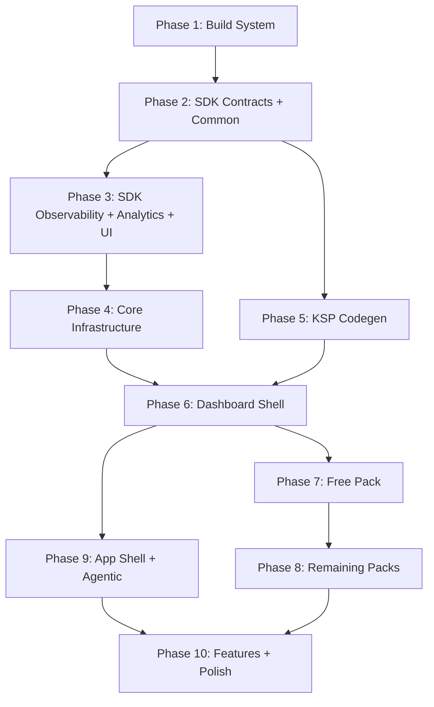

# Migration Plan: dqxn.old → dqxn

Incremental migration of the old codebase into the new architecture. Bottom-up, compile-verified, with observability and tests concurrent at every phase.

## Assessment

**Old codebase:** ~369 Kotlin files, working app. 15 widgets, 15 providers, 28 themes, full dashboard shell, agentic framework, observability, tests.

**New codebase:** Zero implementation code. 10 architecture docs defining a significantly different target architecture.

**The gap is not "copy and adapt" — it's a structural transformation.** The old code has fundamental architectural debt that the new design explicitly fixes:

| Problem in Old | New Design Fix | Migration Impact |
|---|---|---|
| God-object `DashboardState` | Per-coordinator `StateFlow` slices | Dashboard must be decomposed, not ported |
| `Map<String, Any?>` snapshots | Typed sealed `DataSnapshot` subtypes | Every provider + widget changes |
| String-keyed `WidgetData` | `KClass`-keyed `snapshot<T>()` | Every widget data access changes |
| Data passed to `Render()` param | `LocalWidgetData` CompositionLocal | Every widget signature changes |
| Regular `List`/`Map` in UI | `ImmutableList`/`ImmutableMap` | Every UI state surface changes |
| No binding isolation | `SupervisorJob` + `WidgetCoroutineScope` | Binder rewritten from scratch |
| Dashboard imports packs | Shell is pack-blind | Module graph inverted |
| BroadcastReceiver agentic | ContentProvider agentic | Transport layer rewritten |
| `app.dqxn.android` namespace | `app.dqxn.android` (retained) | No change needed |
| Monolithic `core/plugin-api` | Split `sdk/{contracts,common,ui,observability,analytics}` | API surface redistributed |
| No Proto DataStore | Proto for structured data | Persistence layer rewritten |
| JUnit4 only | JUnit5 + contract test fixtures | Test infrastructure rebuilt |

~80% of old code needs structural modification, not just renaming. The remaining ~20% (rendering logic inside widgets, sensor flows in providers, theme JSON, state machine) can be ported with lighter adaptation.

## Guiding Principles

1. **Bottom-up, compile-verified.** Each phase must produce a compiling, tested module before the next starts. No forward references to unbuilt modules.
2. **Old code is reference, not source.** Read `dqxn.old` to understand intent and logic, but write to `dqxn`'s architecture. Don't port-then-refactor — build correctly the first time against the new contracts.
3. **Observability and tests are concurrent, not deferred.** Each phase includes its own test fixtures, logging integration, and metrics hooks. No "add tests later" phase.
4. **One pack proves the architecture.** The free pack migrates first as validation. If the contracts are wrong, fix them before touching other packs.

## Dependency Graph

Phases 2→3 and 2→5 can run concurrently. Phase 4 needs observability from Phase 3. Everything converges at Phase 6 (dashboard shell). Phase 7 is the architecture validation gate.

---

## Phase 1: Build System Foundation

**What:** Gradle infrastructure that all modules depend on. Nothing compiles without this.

**Deliverables:**

- `android/settings.gradle.kts` — module includes, version catalog, `build-logic` includeBuild
- `android/build.gradle.kts` — root project
- `android/gradle/libs.versions.toml` — full version catalog (AGP 9.0.1, Kotlin 2.3+, JDK 25, Compose BOM, Hilt, KSP, kotlinx-collections-immutable, kotlinx.serialization, Proto DataStore, JUnit5, MockK, Turbine, Truth, jqwik, Roborazzi, Robolectric)
- `android/gradle.properties` — configuration cache, KSP incremental, Compose compiler flags
- `android/build-logic/convention/` — all convention plugins:
  - `dqxn.android.application`
  - `dqxn.android.library`
  - `dqxn.android.compose` (separate from library — controls which modules get Compose compiler)
  - `dqxn.android.hilt`
  - `dqxn.android.test` (JUnit5 + MockK + Truth + Turbine)
  - `dqxn.pack` (auto-wires all `:sdk:*` dependencies — packs never manually add them)
  - `dqxn.android.feature`
- Gradle wrapper (9.3.1)

**Ported from old:** Convention plugin structure (4 plugins → 7+, significantly expanded). Version catalog (updated versions, added missing deps like kotlinx-collections-immutable, Proto DataStore, JUnit5, jqwik).

**Validation:** `./gradlew tasks --console=plain` succeeds. No modules to compile yet, but plugin resolution works.

---

## Phase 2: SDK Contracts + Common

**What:** The API surface that every pack and feature module depends on. This is where the biggest architectural transformation lands — old untyped contracts become typed.

### `:sdk:common` (pure Kotlin, no Android, no Compose)

- Utility extensions migrated from `core:common` (flow extensions, etc.)
- `ConnectionStateMachine` + states + events (direct port, already well-structured)
- `Result`/error types shared across modules

### `:sdk:contracts` (pure Kotlin + coroutines, `@Composable` only in `WidgetRenderer.Render()` signature)

- `WidgetRenderer` — new signature with `ImmutableMap<String, Any>` settings, no `widgetData` param
- `DataProvider` — new contract emitting typed `DataSnapshot` subtypes
- `DataSnapshot` sealed interface + typed subtypes (`SpeedSnapshot`, `TimeSnapshot`, `DateSnapshot`, `OrientationSnapshot`, `SolarSnapshot`, `AmbientLightSnapshot`, `BalanceSnapshot`, `TrafficSnapshot`, `HistorySnapshot`, `ChargingSnapshot`, `DeviceSnapshot`, `DrivingSnapshot`, `SpeedLimitSnapshot`, `AccelerationSnapshot`)
- `WidgetData` with `KClass`-keyed multi-slot: `snapshot<T : DataSnapshot>()`
- `WidgetContext`, `WidgetDefaults`, `WidgetStyle`
- `SettingDefinition<T>` sealed interface (port + tighten types)
- `DashboardPackManifest`, `DataTypeDescriptor`
- `ThemeDefinition`, `ThemeProvider`
- `EntitlementManager`, `Gated` interface
- `DashboardWidget` / `DashboardDataProvider` KSP annotations
- `WidgetRendererContractTest` / `DataProviderContractTest` in `testFixtures` source set

**Ported from old:** `core/plugin-api/*` — but every interface changes signature. The `DataSnapshot` transformation from `Map<String, Any?>` to typed sealed subtypes is new design work informed by old data shapes. `SettingDefinition` ports cleanly. `ConnectionStateMachine` ports nearly verbatim.

**Tests:** Contract test abstract classes (in testFixtures), `ConnectionStateMachineTest` (port from old + expand to jqwik property-based).

**Validation:** Module compiles. Contract tests pass. `testFixtures` jar produces.

---

## Phase 3: SDK Observability + Analytics + UI

**What:** Remaining SDK modules that packs and features import.

### `:sdk:observability`

- `DqxnLogger` with inline extensions (migrate from `core:common`, adapt to zero-allocation when disabled)
- `LogTag` as `@JvmInline value class`
- `DqxnTracer` — structured tracing with span IDs
- `MetricsCollector` — per-widget draw time ring buffers, frame histograms, provider latency
- `DiagnosticSnapshotCapture` — anomaly auto-capture with rotation pools
- `CrashEvidenceWriter` — sync SharedPrefs in UncaughtExceptionHandler
- `AnrWatchdog` — dedicated thread, 2-consecutive-miss trigger
- `WidgetHealthMonitor`

### `:sdk:analytics`

- Event tracking contracts (new — old codebase has none)
- Domain-free API surface

### `:sdk:ui` (has Compose compiler)

- `LocalWidgetData` CompositionLocal
- `LocalWidgetScope` CompositionLocal (supervised `WidgetCoroutineScope`)
- `WidgetScaffold` (migrate from `core:widget-primitives`)
- Shared Compose widget components
- Theme-aware drawing utilities

**Ported from old:** `core:common/observability/*` (Logger, Metrics, CrashEvidence, AnrWatchdog — adapt to new module boundaries). `core:widget-primitives/*` → `sdk:ui`. Analytics is entirely new.

**Tests:** Logger tests, MetricsCollector ring buffer tests, AnrWatchdog tests, WidgetScaffold composition tests.

---

## Phase 4: Core Infrastructure

**What:** Shell internals that features depend on but packs never touch.

### `:core:design` (has Compose)

- Material 3 theme wiring
- Color system, typography
- Theme resolution (free → custom → premium ordering)
- Ambient light auto-switch logic (migrate from old theme system)

### `:core:thermal`

- `ThermalManager` → `RenderConfig` (extract from old `feature:dashboard/thermal/`)
- `Window.setFrameRate()` API 34+, emission throttling API 31-33
- `FakeThermalManager` for chaos injection

### `:core:driving` (net-new)

- `DrivingModeDetector` — speed-based safety gate (old `:feature:driving` was Android Auto cruft, not this)
- Implements `DataProvider` emitting `DrivingSnapshot`
- Safety gating interface for shell subscription

### `:data`

- Proto DataStore schemas (`.proto` files for layouts, paired devices, custom themes)
- Preferences DataStore for simple settings
- `ReplaceFileCorruptionHandler` on ALL instances
- Pack-namespaced provider settings: `{packId}:{providerId}:{key}`
- Layout save debouncing (500ms)
- Migration from old Preferences-JSON-blob approach to Proto

### `:core:firebase`

- Firebase SDK isolation module
- Implements observability + analytics interfaces
- Only imported by `:app`

**Ported from old:** `ThermalManager`, `RenderConfig`, `UserPreferencesRepository` (rewritten for Proto), `LayoutDataStore` (rewritten from JSON-in-Preferences to Proto DataStore). Theme JSON loading. `:core:driving` is built from scratch — old `:feature:driving` was Android Auto scaffolding, not a driving mode detector.

**Tests:** Thermal state transition tests, driving mode tests, DataStore corruption recovery tests, layout serialization round-trip tests.

---

## Phase 5: KSP Codegen

**What:** Build-time code generation that packs depend on.

### `:codegen:plugin`

- KSP processor for `@DashboardWidget` / `@DashboardDataProvider`
- Generates `PackManifest` implementations
- Generates Hilt multibinding modules (replaces old manual `@Binds @IntoSet`)
- `typeId` format validation: `{packId}:{widget-name}`

### `:codegen:agentic`

- KSP processor for agentic command annotations
- Generates `CommandDispatcher` wiring

**Ported from old:** `core:plugin-processor` → `:codegen:plugin` (adapt for new annotation shapes, add manifest generation). `core:agentic-processor` → `:codegen:agentic`.

**Tests:** KSP processor tests with compile-testing.

---

## Phase 6: Dashboard Shell

**What:** The hardest phase. The 1040-line god-ViewModel and god-state must be decomposed into coordinators. This is structural transformation, not porting.

### `:feature:dashboard`

**State decomposition** — break `DashboardState` into coordinator-owned slices:

- `LayoutCoordinator` — widget positions, grid state
- `EditModeCoordinator` — edit toggle, drag/resize state
- `ThemeCoordinator` — current theme, theme switching
- `BindingCoordinator` — widget↔provider bindings, `SupervisorJob` isolation
- `WidgetStatusCoordinator` — health tracking, error counts, safe mode

**Core components:**

- `DashboardCommand` sealed interface + `Channel` routing to coordinators
- `WidgetDataBinder` — rewrite with `SupervisorJob`, `CoroutineExceptionHandler`, `widgetStatus` reporting
- `DashboardGrid` — migrate layout logic (custom `MeasurePolicy` ports well), swap data delivery to `LocalWidgetData`, add `graphicsLayer` isolation per widget
- `DashboardCanvas` — Layer 0 + Layer 1 overlay structure (ports with adaptation)
- `OverlayNavHost` — Layer 1 navigation
- Widget error boundary — `WidgetCoroutineScope` via CompositionLocal, crash count → safe mode
- `DashboardTestHarness` — rebuild DSL for new coordinator architecture

**Ported from old:** Grid layout geometry, viewport filtering, gesture handling, drag offset animation — these port with moderate adaptation. The ViewModel, state management, and data binding are rewritten from scratch against the new coordinator pattern. Overlay composables (WidgetPicker, Settings, ThemeSelector, Diagnostics) port with UI adaptation.

**Tests:** Coordinator unit tests, `DashboardTestHarness` DSL tests, grid layout tests (compose-ui-test + Robolectric), drag/resize interaction tests. Visual regression baselines.

---

## Phase 7: Free Pack (Architecture Validation Gate)

**What:** First pack migration. Proves the entire SDK→Pack contract works end-to-end.

### `:pack:free`

**Convention plugin validation** — `dqxn.pack` auto-wires deps, no manual `:sdk:*` imports.

**11 widgets** migrated to new contracts:

| Widget | Snapshot Type | Notes |
|---|---|---|
| `SpeedometerRenderer` | `SpeedSnapshot` | `derivedStateOf` + `drawWithCache` for high-frequency data |
| `ClockDigitalRenderer` | `TimeSnapshot` | |
| `ClockAnalogRenderer` | `TimeSnapshot` | |
| `DateSimpleRenderer` | `DateSnapshot` | |
| `DateStackRenderer` | `DateSnapshot` | |
| `DateGridRenderer` | `DateSnapshot` | |
| `CompassRenderer` | `OrientationSnapshot` | `drawWithCache` for needle rotation |
| `SpeedLimitCircleRenderer` | `SpeedLimitSnapshot` | |
| `SpeedLimitRectRenderer` | `SpeedLimitSnapshot` | |
| `SolarRenderer` | `SolarSnapshot` | |
| `AmbientLightRenderer` | `AmbientLightSnapshot` | |
| `ShortcutsRenderer` | (none — tap actions) | `AppPickerSetting` |

All widgets: `ImmutableMap` settings, `LocalWidgetData.current` data access, `accessibilityDescription()` implemented.

**7 providers** migrated to typed emission:

| Provider | Emits | Notes |
|---|---|---|
| `TimeDataProvider` | `TimeSnapshot` | |
| `DateDataProvider` | `DateSnapshot` | |
| `OrientationDataProvider` | `OrientationSnapshot` | callbackFlow + awaitClose preserved |
| `SolarTimezoneDataProvider` | `SolarSnapshot` | |
| `SolarLocationDataProvider` | `SolarSnapshot` | |
| `AmbientLightDataProvider` | `AmbientLightSnapshot` | callbackFlow |
| `CallActionProvider` | (tap action) | |

**2 free themes** — `slate.theme.json`, `minimalist.theme.json` (port verbatim).

**Ported from old:** Widget rendering logic (Canvas drawing, Compose layouts) ports with moderate adaptation. Provider sensor flows port cleanly (callbackFlow pattern already correct). Theme JSON files port verbatim. Every widget's `Render()` signature changes (no `widgetData` param, add `ImmutableMap`, read from `LocalWidgetData`).

**Tests:** Every widget extends `WidgetRendererContractTest`. Every provider extends `DataProviderContractTest`. Widget-specific rendering tests. Roborazzi visual regression baselines. End-to-end: widget appears on grid, receives data, renders correctly.

**This phase is the gate.** If contracts feel wrong, fix them in Phase 2 before proceeding.

---

## Phase 8: Remaining Packs

### `:pack:themes`

- 26 premium theme JSON files (port verbatim)
- `ThemeProvider` implementation
- Entitlement gating (`themes` entitlement)

### `:pack:demo`

- Stub providers mirroring all data types
- Used for screenshots, testing, development without real hardware

### `:pack:sg-erp2` (contingent on EXTOL SDK compatibility)

- `ObuConnectionManager` wrapping EXTOL SDK
- `ObuConnectionStateMachine` (port — already uses `ConnectionStateMachine` base)
- 8 providers → typed snapshots
- 4 widgets → new contracts
- `CompanionDeviceHandler`

**Tests:** Contract tests for all widgets/providers. Connection state machine exhaustive tests.

---

## Phase 9: App Shell + Agentic

### `:app`

- `MainActivity` — single activity, `enableEdgeToEdge()`, `WindowInsetsControllerCompat`
- `DqxnApplication` — Hilt application
- `AppModule` — DI assembly, all pack modules discovered via multibinding
- Debug overlays (Frame Stats, Widget Health, Thermal Trending)
- ProGuard/R8 rules

### `:core:agentic`

- `AgenticEngine` — command dispatch (migrate from old)
- `AgenticContentProvider` — ContentProvider transport (rewrite from BroadcastReceiver)
- All ~20 handlers migrated to new coordinator APIs
- `Binder.getCallingUid()` security (works correctly on ContentProvider, unlike old BR)

**Tests:** End-to-end app startup, agentic command round-trips, safe mode trigger.

---

## Phase 10: Remaining Features + Polish

### `:feature:settings`

- Schema-driven settings UI
- Per-widget settings via `SettingDefinition` schema

### `:feature:diagnostics`

- Diagnostic snapshot viewer
- Observability data display

### `:feature:onboarding`

- First-run flow

### Integration Testing

- Full E2E: launch → load layout → bind data → render widgets → edit mode → add/remove/resize → theme switch → driving mode gate
- Performance: P99 frame <16ms, startup <1.5s
- Chaos: `ChaosProviderInterceptor` fault injection → verify graceful degradation

---

## What NOT to Port

- Old manual `@Binds @IntoSet` DI wiring (replaced by KSP codegen)
- `DashboardState` god object (decomposed, not migrated)
- `Map<String, Any?>` DataSnapshot (replaced by typed sealed hierarchy)
- String-keyed `WidgetData` (replaced by `KClass`-keyed)
- BroadcastReceiver transport (replaced by ContentProvider)
- JSON-in-Preferences layout storage (replaced by Proto DataStore)
- ~~`app.dqxn.android` package namespace~~ — **retained**, no namespace migration
- Dashboard's direct pack imports (inverted — shell is pack-blind)
- Any `var` in data classes, any `GlobalScope`, any `runBlocking` outside tests/debug-CP

---

## Risk Flags

1. **Phase 6 is the bottleneck.** The dashboard decomposition is the highest-risk, highest-effort phase. The old 1040-line ViewModel carries implicit coupling that won't surface until you try to split it. Budget accordingly.

2. **Typed DataSnapshot design may need iteration.** The sealed hierarchy is designed in docs but untested. The free pack migration (Phase 7) will pressure-test it — be ready to revise contracts.

3. **sg-erp2 pack depends on a proprietary SDK** (`sg.gov.lta:extol`). Verify it builds against AGP 9.0.1 / Kotlin 2.3+ / JDK 25 before committing to porting it. If it doesn't, quarantine it.

4. **Proto DataStore migration needs a data migration story.** Users of the old app (if any) would lose saved layouts. Given this is pre-launch, probably fine — but confirm.
